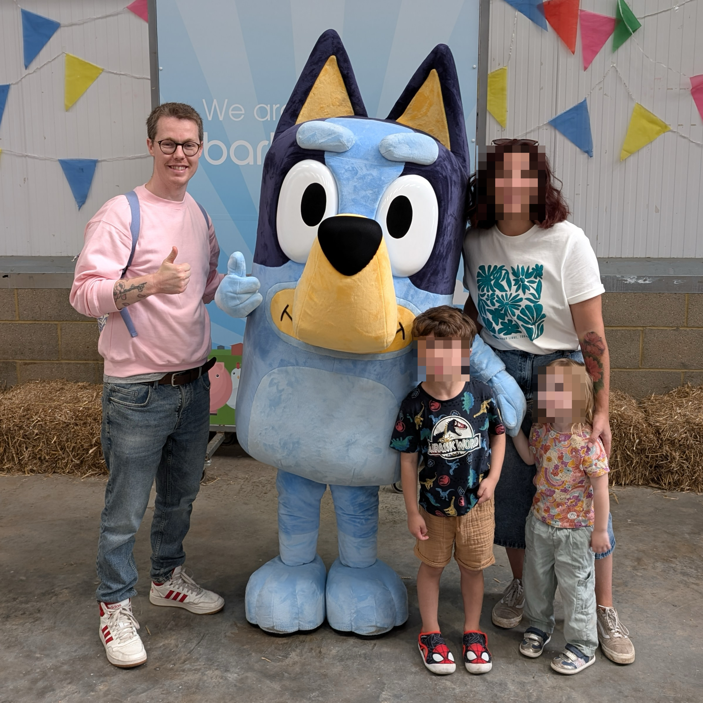

# Resume

## Hello!

Hello, my name is Mark and I work at [Fastly](https://www.fastly.com/) as a Staff Software Engineer.

<small class="image-summary"><b>NOTE:</b> Yes. That is my wife and kids. But I've no idea who the big blue guy is 😉</small>

### Previously

- Staff Software Engineer at [BuzzFeed](http://www.buzzfeed.com/)
- Principal Engineer at [BBCNews](https://www.bbc.co.uk/news)
- Principal Engineer at [StormCreative](http://www.stormcreative.co.uk/)

## Working Together / Testimonials

The following quotes (all very kind) are from people I've worked with. Everything quoted below was unsolicited and unexpected feedback, which is just so lovely! I've never asked anyone to "please write something nice about me". **All of these wonderful comments were genuine and truly appreciated.**

	
Product Support at BuzzFeed

	
<i>"As smart as developers are, they are not always good at explaining things in a way that makes human sense. not you. you are an exception. you are A+"</i>

	
<small>-- Product Support at BuzzFeed.</small>

	
I ❤️ this feedback. It came from someone I was mentoring. She was interested in getting a better understanding of how to design and architect software systems, and also how to know what types of questions she should ask when investigating technical incidents.

	
Her feedback also hints at something bigger which I strive for: to help others to do their best work and to push/promote the good work other engineers do (including those from either a diverse background or minority).

	
Engineering Manager at Fastly

	
<i>"Hi Mark, your name keeps coming up (in a good way 😉) and I wanted to put a face to a name. Folks on the team like working with you. You're responsive and provide good and timely feedback."</i>

	
<small>-- Engineering Manager at Fastly.</small>

	
I always aim to build meaningful relationships with the people I work with across an organisation. In doing so I hope to ensure that we are able to work as a cohesive unit, and provide great value to our users. But ultimately I like to be helpful (it makes me feel good), so this was a nice bit of unexpected feedback ❤️

	
Senior Sales Engineer at Fastly

	
<i>"Thanks, I'm amazed that you always deliver top notch answers."</i>

	
<small>-- Senior Sales Engineer at Fastly.</small>

	
Funnily enough I actually _didn't_ have the answer they needed. I wanted to redirect this person to where I thought would be the best place for them to get a solution (so it included as much historical context, and as many signposts, as I could provide).

	
A kind smile, a compassionate ear, and a bit of effort goes a long way in life.

	
Senior Sales Engineer at Fastly

	
<i>"Hey Man… you are a true powerhouse in fixing issues and handling customers… i’m truly impressed by you! Thanks and keep it up!"</i>

	
<small>-- Senior Sales Engineer at Fastly.</small>

	
I work hard to ensure customers get the support they need. This feedback was the result of another example of my work ethic.

	
Senior Solutions Architect at Fastly

	
<i>Hey Mark, thanks again for releasing the 4.0.0 version, last week! The customer already provided positive feedback. It's a pleasure to work in such a smooth way! 🙇</i>

	
<small>-- Senior Solutions Architect at Fastly.</small>

	
In this case my colleague was unfamiliar with writing Go and he was trying to contribute to a couple of different code bases that I was the core maintainer of, and for which I was helping guide him through and supporting/educating him on the various technical aspects of. It was a small change but one I really appreciated him taking the time to dig in and help implement.

	
Customer + CSE (Customer Support Engineer) at Fastly

	
<i>Thank you for your output and all the information you've provided. We really appreciate it. We have applied your latest release on all our production environments and it's looking great and there are no unexpected diffs in our Terraform plans anymore. Again, thank you for your time and your help to understand and resolve this issue as your insights were really helpful.</i>

	
<small>-- Customer</small>

	
<i>Hey Mark, just wanted to say thanks a lot for helping out with the Terraform issue, really appreciated! 🙂</i>

	
<small>-- CSE (Customer Support Engineer) at Fastly</small>

	
We had a strange bug materialize in the Fastly Terraform provider that was causing some issues for customers. I investigated on behalf of CSE as I'm the core SME (Subject Matter Expert) for Terraform and I not only resolved the specific issue but managed to identify a couple of other unnoticed bugs elsewhere in the system which I worked cross-team to help get resolved.

	
It was important to me that this customer (like all our customers) got their issues resolved as quickly as possible, with frequent updates to keep them in the loop and extra detailed explanations so they were better informed. It was a tough set of bugs to identify but I was pleased for the customer when they confirmed their services were all good again.

	
Director of Community at Fastly

	
<i>I want to call out this great thread in the fastly dev forum and give a huge bravo to @integralist for being there, being responsive, and guiding the customer to the solution. Overall the thread is <code>:chefkiss:</code> because...</i>

	
<i>- It makes for a great image optimization use case/support-driven tutorial.</i> 
	<i>- Is a display of how engaged our dev rel team is with the Community.</i> 
	<i>- Is a display of how smart and kind our users are.</i> 
	<i>- Uses the Fastly platform tools (like <a href="https://fiddle.fastly.dev/" target="_blank">https://fiddle.fastly.dev/</a>) to show our work!</i>

	
<small>-- Director of Community at Fastly</small>

	
This was a really nice (and unexpected) compliment. I like to go the extra mile to ensure customers feel seen/heard and that they're supported (even if it means I can't give them an immediate answer and need to refer to another team's expertise first).

	
Developer Relations Engineer at Fastly

	
<i>I just wanted to say that the care and attention you're putting into this work is making me enjoy my work, and I appreciate you.</i>

	
<small>-- Developer Relations Engineer at Fastly</small>

	
I was touched by this feedback as I had been battling a particularly difficult project and this came at a time where I was emotionally and mentally exhausted. Just the pickup I needed 💖

	
Tier 3 Customer Support Engineer at Fastly

	
<i>I want to thank @integralist for always answering any questions I (or others) have with so much detail and attention. Your answers usually long and full of thought and for that I am extremely grateful!</i>

	
<small>-- Tier 3 Customer Support Engineer at Fastly</small>

	
This was posted in a Fastly #gratitude Slack channel and got lots of nice emoji reactions to go with it 💖

	
Senior Customer Support Engineer at Fastly

	
<i>Thank you so much Mark for going above and beyond. I appreciate the details you provided.</i>

	
<code>later the next day...</code>

	
<i>Wow, this is amazing work Mark! Thank you so much for this thorough analysis.</i>

	
<small>-- Senior Customer Support Engineer at Fastly</small>

	
A customer had reported an issue that we initially were not able to replicate. But after some thorough debugging (through _multiple_ internal systems) I was able to identify, explain, and document the source of the problem, then provide a resolution for the customer.

	
Security Architect at Fastly

	
<i>Man, it’s nice working with you</i>

	
<small>-- Security Architect at Fastly</small>

	
This certainly came out of nowhere 🙂. He needed a bunch of information related to some security work I was doing (I was <a href="https://github.com/fastly/cli/pull/1010" target="_blank">implementing SSO Single Sign-On using an OAuth PKCE flow for Fastly's CLI tool</a>) so I gave it to him whilst also pointing out some oddities about the platform that I felt should be addressed.

	
Senior Principal Sales Engineer / TLS Manager / Sr. Principal Engineer, Core Systems at Fastly

	
<i>I wanted to share feedback from <code>NAME_OF_LARGE_CUSTOMER_IM_NOT_ALLOWED_TO_SHARE</code> to give you positive feedback on our Terraform provider vs <code>COMPETITOR</code>'s:</i>

	
<i>"The team were quite shocked at the difference between <code>COMPETITOR</code>'s Terraform approach and Fastly....Fastly was a lot simpler, and just as powerful. Express my gratitude to the team for making the Terraform provider so awesome!"</i>

	
<small>-- Senior Principal Sales Engineer at Fastly</small>

	
<i>It’s all @Integralist 😅</i>

	
<small>-- TLS Manager at Fastly</small>

	
<i>THIS 🔼</i>

	
<small>-- Sr. Principal Engineer, Core Systems</small>

	
<i>Piling on here with <code>ANOTHER_LARGE_CUSTOMER</code> giving kudos to the TF provider. 🙂</i>

	
<small>-- Cloud Engineering Manager</small>

	
I'm very grateful for this feedback, both from the customer and from my colleagues as I had been working really hard on improving the Terraform provider and up until that point hadn't felt that any one had noticed or cared, and so this helped boost my confidence in what I had been doing. 💛

	
Cloud Engineer at Fastly

	
<i>This level of investigation deserves a medal @integralist. Thank you so much for your time and deduction!</i>

	
<small>-- Cloud Engineer at Fastly.</small>

	
A question was raised, which wasn't relevant to the channel it was brought up in but I didn't want this person to go away without the appropriate support. So as well as redirecting them to the correct channel and explaining why I was redirecting them, I then proceeded to explain the steps/processes I follow when trying to figure out the thing they were asking about. This led to a long thread of details and links to code and documentation. As much as I could provide as a helpful send off.

	
Staff Product Manager at Fastly

	
<i>Your code review is itself a work of art! Is there a hall of fame for code reviews.</i>

	
<small>-- Staff Product Manager at Fastly.</small>

	
I take a lot of care in my PR reviews 😊.

	
Director of Developer Experience at Fastly

	
<i>Look… that was f***ing impressive. 👏</i> Thank you so much!

	
<small>-- Director of Developer Experience at Fastly.</small>

	
A customer was having issues with one of our tools when using Windows. Fastly pulled out all the stops to get me the access I needed to investigate and debug the issue properly and I was able to get a fix in place in a few hours, helping the customer realise what an asset Fastly is to their workflow.

	
Principal Engineer in Edge Networking at Fastly

	
<i>You demonstrate, year in and year out, an excellent capacity to learn new systems and languages, pick up the responsibility of managing and being responsible for parts of our stack and technology and it looks like you work smoothly and effortlessly with our colleagues both in person / zoom and in slack / Jira / pull requests.  Thank you also for your regular, consistent contributions and easy-going working demeanor.  This is the sort of collegial professionalism and competence that makes Fastly a great place to work.</i>

	
<small>Principal Engineer in Edge Networking at Fastly.</small>

	
This particular person was leaving Fastly (to retire) and I reached out to wish them all the best and to let them know what an honour it had been for me to get just a small bit of experience working with them. This was their response to me, totally unexpected last piece of kindness shared by this wonderful individual.

	
Staff Product Manager in Network Services at Fastly

	
<i>I'm sharing a Very, Very Big Shout-Out to @integralist for his work on the Eng side of the Domainr + Fastly systems integration efforts!</i>

	
<code>DETAILS I CANT SHARE</code>

	
<i>This huge milestone will make operating and maintaining the Domainr service much more straightforward for the Domain Services Eng team going forward.</i>

	
<i>Thank you, Mark!</i>

	
<small>-- Staff Product Manager in Network Services at Fastly.</small>

	
<i>I also want to add that @integralist has done an amazing job on both documentation and tooling improvements for on-call.</i>

	
<i>As a member of the domain services team that is now responsible for handling on call and being onboarded to domainr codebase and systems, it has been a huge help in orienting myself.</i>

	
<i>He has also been super helpful in knowledge sharing with active pairing and helping out with presentations too!</i>

	
<i>We appreciate you Mark!</i>

	
<small>-- Staff Software Engineer in Network Management at Fastly.</small>

	
Always nice to get some recognition from your peers for the hard work you put in and the care you have for the projects you work on.

## Summary

I ideally want to get across three fundamental aspects about me:

1. I care. I care about the people I work with, the organisation I work for, and our customers.
1. I'm passionate about programming and the openness of the web
1. I love getting the chance to learn and experience new technology

## Connect

You can find me online at the following locations:

- [integralist.co.uk](http://www.integralist.co.uk/)
- [github.com/integralist](https://github.com/integralist)
- [twitter.com/integralist](http://www.twitter.com/integralist)
- [linkedin.com/mark-mcdonnell](https://www.linkedin.com/in/mark-mcdonnell-08800565)

## Brief History

- [Fastly (2020-present)](#fastly-october-2020-present)
- [BuzzFeed (2016-2020)](#buzzfeed-june-2016-october-2020)
- [BBC (2013-2016)](#bbc-jan-2013-june-2016)
- [Storm Creative (2001-2012)](#storm-creative-feb-2001-dec-2012)

### Fastly (October 2020 - present)

 
Details

	
I was a former customer of Fastly, and had become well known for publishing probably the longest known article on the subject of Varnish, VCL and Fastly's implementation.

	
I joined Fastly to work within its new (at the time) Developer Relations team helping to manage, support and be the core developer for their suite of API clients (inc. orchestration tools such as Terraform and Fastly's own <a href="https://github.com/fastly/terraform-provider-fastly" target="_blank">Terraform provider</a>, and the <a href="https://github.com/fastly/cli" target="_blank">Fastly CLI</a>).

	
While working within the Developer Relations team I had the opportunity to work on critical Rust projects such as https://fiddle.fastly.dev and to work cross-team to develop a new authentication model for customer services.

	
In 2023 it became apparent that the tools I was responsible for maintaining were becoming even more important for our customers and so I was able to move from DevRel into my own dedicated team (Customer Developer Tools) to continue to support them without having to also support the various DevRel related projects and services.

	
In 2024, I was brought into a new team (a team of one for about a year) called "Domain Services" to
		help onboard and integrate a new API Fastly had acquired. This required
	a significant amount of time and effort as (up until this point) I had only
	worked on open-source projects at Fastly and this was my first exposure to
		the internal systems and deployment platform and pipelines.

### BuzzFeed (June 2016 - October 2020)

 
Details

	
I joined as a Senior Software Engineer as part of a new 'core' UK dev team. We were responsible for decommissioning a 10yr+ legacy Perl monolithic application stack over to individual Python and Go services.

	
I was working primarily within BuzzFeed's OO-INFRA group, which sits somewhere in-between traditional infrastructure/operation teams and engineering teams building user facing products. Our motivations were to make the lives of our fellow engineers easier by building tools, services and abstractions that enabled them to work more quickly and efficiently.

	
January 2018 BuzzFeed promoted me to Staff Software Engineer, after helping to design/architect, develop and maintain some of BuzzFeed's key infrastructure and software (CDN, caching strategies, routing behaviours, and security/authentication related concerns).

	
January 2019 I moved over to the Core Infrastructure team (which consists of separate sub teams). I was part of the 'Infra Edge' team, and we were responsible for strengthening and securing our edge infrastructure and applications. The 'edge' is the surface area of our infrastructure that is in direct contact with the public internet. It includes DNS and the various services that accept ingress traffic from the Big Bad Internet. It is essential to our business that our Edge be a resilient and security-focused layer of our infrastructure.

	
Each year I participated in different working groups and mentoring programs, and became part of the 'on-call' rota, and handled interactions with the Hackerone program.

	<blockquote>
		
⚠️  <b>NOTE</b> I'm a remote worker and my team resides primarily in New York, so good communication, focus and work ethic was essential.

	</blockquote>

### BBC (Jan 2013 - June 2016)

 
Details

	
I joined <a href="http://www.bbc.co.uk/news" target="_blank">BBC News</a> as a client-side/mobile specialist within their Core News team. Within the year I had moved into a senior engineering role. The (then) Technical Lead for the BBC News Frameworks team requested I join them in order to help the organisation transition from its current platform over to one built upon the AWS platform.

	
I started in the Frameworks team building and designing back-end architecture for different microservices hosted upon the AWS platform, and we developed these services primarily using JRuby. In October 2014, I was offered the role of Technical Lead.

	
Near the end of 2015 I decided to change roles to Principal Software Engineer, as my previous role involved more meetings and handling line manager duties, whereas I wanted to focus my time more on helping my team solve technical problems.

### Storm Creative (Feb 2001 - Dec 2012)

 
Details

	
I started working at the agency <a href="http://www.stormcreative.co.uk/" target="_blank">Storm Creative</a> straight out of college. I was always focused on learning and improving my skill set - both technical and communication skills - the latter helped me communicate better with both clients and other stakeholders/colleagues.

	
I progressed upwards through the organisation, moving from initially being a client-side web developer (this included doing animations utilising ActionScript 3.0) to becoming a server-side developer (ASP.NET, PHP and Ruby), then onto becoming a Technical Lead across all projects and finally becoming the Digital Media Manager responsible for my own team of four engineers and overseeing all aspects of our projects.

> ⚠️  From here on we get deep into details. It's not necessary to read on unless
> you're really interested in what I've been up to 🙂

## Impact!

I'd like to share the projects I've worked on over the years and the impact/value this work has provided.

**NOTE**: My 'impact' has primarily been as a _remote_ worker. My hope is that the following list demonstrates how I've made a positive impact (both as an IC and as a Team Lead) while also being a 100% remote worker with a family to support and balance against.

- [Impact at Fastly](#impact-fastly)
- [Impact at BuzzFeed](#impact-buzzfeed)
- [Impact at BBC](#impact-bbc)

### 🏢 Fastly

### 2024

- **What**: I wrote a document "Terraform validation for API modifications"
  that proposed a solution for how we can validate API changes against Terraform
  to prevent breaking changes making their way into production.\
  **Why**: There was an incident where a Fastly API introduced a breaking
  change that affected an application I was on-call for. It was a confusing bug
  and took a lot of time to investigate and identify and I was concerned for
  our customers and how they might be affected (especially considering how
  difficult Terraform can be to work with in general).\
  **Impact**: This proposal document kick-started a new initiative to ensure
  Terraform is treated as a first-class citizen within the Fastly ecosystem.

- **What**: Redesigned internal boilerplate project used for create new
  Go services at Fastly.\
  **Why**: As part of my work within a new team (although I was the sole
  engineer for quite a while) I needed to get a new API application onboarded
  with an internal platform that exposes the API to the public internet. The
  recommendation was to use an internal boilerplate project, which turned out to
  be quite stale, un-maintained, and in need of a redesign.\
  **Impact**: Quite a few internal teams were onboarding onto the same
  platform around that time and were able to benefit from not only the improved
  tooling I built, the improved resiliency code I wrote, but also the in-depth
  documentation I wrote to provide context and understanding around how the
  platform itself functioned. Ultimately making it much easier for developers to
  onboard their Go applications.

- **What**: I created a public tool for validating Fastly's Compute cache semantics ([code](https://gist.github.com/Integralist/87118a8f79d47aaf640c21149bf9d687)).\
  **Why**: Customers were having trouble understanding how HTTP cache semantics worked with the Fastly Compute platform (which at the time of writing doesn't have a HTTP cache API like Fastly's VCL product offering).\
  **Impact**: Customers are able to validate and understand how caching works with Compute. They can define a set of HTTP calls and see how they are cached, and can assert against the cacheability of the calls. This work also helped to identify a bug in the underlying HTTP caching implementation.

- **What**: I implemented a complete CI/CD pipeline using GitHub Actions, along with dynamic service creation for multiple environments using Terraform Cloud.\
  **Why**: We wanted to move towards Iac (Infrastructure as Code) and automated releases.\
  **Impact**: We're able to easily spin up environment specific instances of our service(s) and all the benefits of [Continuous Deployment](https://en.wikipedia.org/wiki/Continuous_deployment).

- **What**: I moved into a new team working exclusively on [Domainr](https://domainr.com/).\
  **Why**: It was felt my skill set would be ideal to help not only take over the project as the lead developer but to begin the planning, architecture and development on new features and products based around Domainr and its subject area.\
  **Impact**: Too early to say. But one month in and I'm very excited about the future.

- **What**: Implemented a solution to enable public repo forks to have access to GitHub Actions secrets.\
  **Why**: Fork PRs do not have access to GitHub Action secrets which makes validating the correctness of community contributed code much harder.\
  **Impact**: An authorised user (i.e. a contributor with WRITE access to the repo) can now comment `/ok-to-test sha=<SHA>` and this will trigger the CI to run with the correct secret(s) access.

- **What**: Built an interactive CLI prompt to generate OpenAPI schemas.\
  **Why**: Two reasons: the first was that developers were unfamiliar with OpenAPI and unsure how to write the schemas (the learning curve wasn't steep but substantial for busy devs), and second: we use our schemas for auto-generating API clients and so it was easy for developers to design schemas that would break the code-generation process or produce invalid client code.\
  **Impact**: Consistency in our OpenAPI schema design, which helped to improve the generated client code interface (so a much better developer experience) as well as reduced errors in the API clients overall.

### 2023

- **What**: Implemented production ready Single-Sign On (SSO) implementation in [Fastly CLI](https://github.com/fastly/cli) using [PKCE](https://pragmaticwebsecurity.com/articles/oauthoidc/from-implicit-to-pkce.html) (Proof Key for Code Exchange) OAuth flow (this was a follow-up to an earlier POC which was completely rewritten along with a project wide refactor to better support the integration).\
  **Why**: Part of a larger initiative to upgrade our authentication and authorization model, so that we can offer more features to customers.\
  **Impact**: Customers will get more flexible and advanced sign-in features.

- **What**: Implemented Wasm binary metadata annotations (i.e. data collection).\
  **Why**: Fastly and their customers have a mutual goal of attaining better visibility into what services have been deployed in production.\
  **Impact**: Customers gain insights to dimensionality such as by industry vertical and by scale (e.g. what Rust packages are Compute customers in the commerce industry with over 10k requests/sec using?). They also benefit from improved security vulnerability detection (e.g. Fastly is able to recommend package version upgrades).

- **What**: Asked to lead the internal 'API Versioning' Working Guild.\
  **Why**: Lack of direction meant we weren't making as much progress as the organisation would like.\
  **Impact**: I researched, documented and presented a slide deck that architected a complete (green field) solution for an automated API versioning system that used satellite systems to run a scheduled release cycle with a pull model to acquire individual API application metadata, which inturn would publish a new external consumer API interface version at the appropriate time (yeah, that was a mouthful I know 😄).

- **What**: Moved into a new "Customer Developer Tools" team, responsible for managing, developing and maintaining/supporting the various tools Fastly customers use to interact with our platform.\
  **Why**: My responsibilities were growing beyond the boundaries of the Developer Relations team.\
  **Impact**: I was able to focus more of my time and energy on supporting these critical customer developer tools.

- **What**: Invited to join internal API Working Guild.\
  **Why**: I'm the core maintainer for Fastly's Terraform provider(s), CLI and multiple API clients, so my insight and expertise in those areas were important for ensuring the quality of our new API design.\
  **Impact**: I've been able to help guide the design of the API to account for specialised consumer cases that otherwise would have been neglected.

- **What**: Rewrote Fastly's (very complex) Terraform provider from scratch (https://github.com/Integralist/terraform-provider-fastly-framework).\
  **Why**: New HashiCorp framework was incompatible with their previous SDK and so it was important we started migrating before HashiCorp published a deprecation notice.\
  **Impact**: Customers will benefit from a more modern provider implementation and a whole bunch of long standing bugs resolved.

### 2022

- **What**: Implemented a proof-of-concept [PKCE](https://pragmaticwebsecurity.com/articles/oauthoidc/from-implicit-to-pkce.html) (Proof Key for Code Exchange) OAuth flow for the [Fastly CLI](https://github.com/fastly/cli) ([example gist](https://gist.github.com/Integralist/76f8be7cd5bb6e75587d58146daf0ab5)).\
  **Why**: Part of a larger initiative to upgrade our authentication and authorization model, so that we can offer more features to customers.\
  **Impact**: Customers will get more flexible and advanced sign-in features.

- **What**: Implemented a new code-generated Go API client with the help of [openapi-generator.tech](https://openapi-generator.tech).\
  **Why**: Part of a larger initiative to use the OpenAPI specification to code-generate language API clients.\
  **Impact**: We have a lot of customers interested in Go who are now able to interact with our platform.

- **What**: I was the SME (Subject Matter Expert) on a cross-team collaboration for supporting custom headers in healthchecks for Terraform.\
  **Why**: An important customer required this feature as part of a large-scale event.\
  **Impact**: We completed the project ahead of schedule and the event was a success.

- **What**: Implemented a solution to reduce API calls in the Fastly Terraform provider ([PR](https://github.com/fastly/terraform-provider-fastly/pull/593)).\
  **Why**: The provider was making unnecessary API calls that was causing network and performance problems, and was affecting our platform reliability.\
  **Impact**: I reduced the time for a 'plan' (and the time it takes to run the integration tests) by ~70%! This improves the quality of life for our customers, while also helping to protect the Fastly API, and benefits the developers working on the provider.

- **What**: Implemented a new code-generated Rust API client with the help of [openapi-generator.tech](https://openapi-generator.tech).\
  **Why**: Part of a larger initiative to use the OpenAPI specification to code-generate language API clients.\
  **Impact**: We have a lot of customers interested in Rust who are now able to interact with our platform.

- **What**: Implemented retry behaviour for critical section of [customer facing platform software](https://fiddle.fastlydemo.net).\
  **Why**: A hard to reproduce, and intermittent, network failure was causing services to restart at the infrastructure layer, which was a slow and costly process.\
  **Impact**: Developers wouldn't waste cycles having to manually re-start flaky/failing CI jobs, and a large reduction in service remediation latency.

- **What**: Designed a [PKCE](https://pragmaticwebsecurity.com/articles/oauthoidc/from-implicit-to-pkce.html) (Proof Key for Code Exchange) OAuth flow for existing authentication systems.\
  **Why**: We wanted all our public clients to be able to support OAuth.\
  **Impact**: We increase the security and flexibility of our authentication systems.

- **What**: Designed and developed a CLI based strategy (in [go](https://go.dev/)) for integrating an OAuth user flow. This included co-authoring the relevant Rust work (in a separate internal auth service) to support different Fastly clients (i.e. a client might be one of Fastly's existing web properties like [developer.fastly.com](https://developer.fastly.com) or the [Fastly CLI](https://github.com/fastly/cli)).\
  **Why**: Users of the Fastly CLI could not configure more than one token. This would mean the token typically, for convenience, would be a long-lived token (e.g. no expiry). This was a tedious flow for users as they needed to manually interact with different areas of the Fastly UI before then having to go back to the CLI to apply a token.\
  **Impact**: Users have a slick and easy authentication flow that is more secure and provides better best practices (i.e. using short-lived tokens that regenerate frequently).

- **What**: Developed features and bug fixes for, as well as managed and coordinated, [a major v1.0.0 release of the Fastly Terraform provider](https://github.com/fastly/terraform-provider-fastly/releases/tag/v1.0.0).\
  **Why**: The provider had been at 0.x for the past couple years and more generally was not in a great state.\
  **Impact**: A greatly simplified user experience (UX) via a more consistent interface, the fixing of multitude bugs, and resolving a potential issue that otherwise could trigger data loss, resulted in a much improved product for Fastly customers.

> "This is a HUGE milestone for the provider, it's come a long way since we adopted it and we've always been building up to being able to cut this v1 release.
>
> Congrats to @integralist for his hard work, dedication, and commitment to navigate us through this project."
>
> -- **Principal Engineer @Fastly**

### 2021

- **What**: Migrated from Travis CI to GitHub Actions, which included general refactoring of scripts, implementing reusable jobs and figuring out how to efficiently persist data between jobs (I also added lots of internal documentation).\
  **Why**: To reduce complexity in our CI/CD pipelines.\
  **Impact**: Our CI is much easier to understand, maintain and contribute to for internal staff (I also [wrote about GitHub Actions](/posts/github-actions/) as a side-effect).

- **What**: Published a [best practices guide](https://developer.fastly.com/learning/integrations/orchestration/terraform/) for writing Terraform using the Fastly Terraform provider.\
  **Why**: We noticed an increase in customer support queries related to Terraform and it being a complex topic to understand.\
  **Impact**: Customers reported an appreciation for the official guidance as it helped to elucidate an otherwise confusing combination of tools and concepts.

- **What**: Acted as an ambassador for Fastly support on Stack Overflow ([Fastly Stack Overflow profile](https://stackoverflow.com/users/14849316/integralist)).\
  **Why**: To help the community of Fastly users.\
  **Impact**: We unblocked customers and enabled them to become productive, as well as generally feeling supported.

- **What**: I designed, wrote and coordinated the release of a Terraform training module that also focuses on integration with Fastly.\
  **Why**: We had noticed an ever growing increase in interest with Terraform.\
  **Impact**: Our customers can feel confident and supported when thinking of managing their services using Terraform.

- **What**: Wrote a custom golang program to parse a bunch of OpenAPI schemas and to auto-generate a golang based API client.\
  **Why**: To identify potential problems with our OpenAPI schemas and whether we can offer custom generated API clients to our customers.\
  **Impact**: We have a viable solution that will ensure our API endpoints and API clients stay in-sync with minimal effort/cost.

- **What**: Defined a new retro process.\
  **Why**: There was none defined.\
  **Impact**: We now have effective and valuable retros 🎉.

### 2020

- **What**: Reaching out to our customers (and _potential_ customers).\
  **Why**: To help answer complex questions related to the fastly platform.\
  **Impact**: The fastly organisation is more approachable and better understood from a technical perspective.

- **What**: Coordinated wide net of user feedback (both internally and externally).\
  **Why**: To help drive decisions around which API client libraries we should maintain (or which new languages to support).\
  **Impact**: We have a clearer understanding of where we should focus our resources.

### 🏢 BuzzFeed

### 2020

- **What**: worked across different teams promoting certain patterns to help reduce our logs (e.g. sampling 2xx's & single-log context middleware for http servers).\
  **Why**: we had started to exceed our cost agreements with our metric/log aggregation provider.\
  **Impact**: managed to reach our log production goal, while having the opportunity to work and share ideas with lots of different teams across the org.

- **What**: I was the sole engineer designing, communicating (via RFC process) and building a global rate limiting feature ([read my post about it](/posts/rate-limiting/)) that integrated at different layers of our infrastructure (CDN, Routing + a new 'rate control' service).\
  **Why**: teams across the organization were struggling to handle rate limiting within their services and Core Infrastructure (the team I work in) found through user feedback that this would be a valuable task to take on.\
  **Impact**: I was able to release [a feature](/posts/rate-limiting/) that provided our organization with DoS level protection at 'the edge' (e.g. reduced load on our internal infrastructure) while decoupling rate limiting logic from our critical path, along with granular client identification context to be more useful than a simple IP deny list.

- **What**: spent three weeks tackling problem of metric production across ~600 microservices.\
  **Why**: we had run over our allotted threshold
  **Impact**: we saved the company ~$40k! We also educated ourselves greatly on how our provider determines 'custom metrics' and how to better use distribution metrics over standard histograms.

- **What**: wrote Python script that parsed any metrics produced by our ~600 microservices and cross-referenced them against our ~1000 dashboards and ~1000 monitors to identify which metrics were actually used.\
  **Why**: in the face of the Covid-19 pandemic we needed to reduce our metric costs.\
  **Impact**: teams were able to run the script to efficiently identify unused metrics, and it provided direct links to the relevant monitors and dashboards (and even the specific graphs within those dashboards).

- **What**: Implemented 'graceful shutdown' within shared libraries for HTTP servers written in Go/Python.\
  **Why**: EC2 updates (for servers we manage under ECS) were causing containerized services to fail.\
  **Impact**: The use of graceful shutdowns meant in-flight requests had time to complete once receiving a SIGTERM to the service by EC2.

### 2019

- **What**: Created an RFC for an updated Disaster Recovery plan.\
  **Why**: Our 'Plan Z' (static rendering) approach wasn't clear to some teams/influencers.\
  **Impact**: Summarized our current disaster recovery approach (i.e. in most cases relying on serve-stale) and highlighted the ways we were building confidence in our Plan Z approach by smoke testing the behaviours on a regular basis. As well as documenting possible active:active CDN approaches where an alternative provider supports a programmatic edge comparable to Fastly.

- **What**: Refactored and rewrote our static rendering 'disaster recovery' edge logic/process.\
  **Why**: Modifications to our VCL for serving custom error pages from the edge had broken legacy DR logic that would attempt to pull error pages from AWS S3.\
  **Impact**: Improved maintainability, understanding, effectiveness, resilience.

- **What**: Consolidated different debug headers and query parameters.\
  **Why**: As the list of services along a request path increased (we introduced different proxies) the number of debug entry points increased.\
  **Impact**: Reduced ~4 different debug entry points to 1, allowing engineers to more efficiently access the information they needed.

- **What**: Implemented new endpoint that directs traffic to a custom instance of [httpbin](https://httpbin.org/).\
  **Why**: To enable engineers to test specific scenarios and behaviours of different aspects of our system.\
  **Impact**: Teams are able to debug how different proxies will affect the request flow, and can now test different areas of our CDN logic (such as verifying if we're serving stale when expected).

- **What**: Defined service contracts ([example](https://gist.github.com/524be67b0b33e8087dd67a5a6af9b3c5)).\
  **Why**: Complex services (such as in technical areas teams were unfamiliar with) could behave like black boxes.\
  **Impact**: Provided service consumers with a clear definition of expectations, enabling teams to better understand what a service would do for them.

- **What**: Wrote [a guide to HTTP caching](/posts/http-caching-guide/).\
  **Why**: As engineers we have a responsibility to understand the platform we write software for.\
  **Impact**: Shared understanding of how to properly use HTTP caching directives.

- **What**: Extended OpsBot Slackbot application with `/oncall` command and generate reports that are dynamically added to incident document in Google Drive.\
  **Why**: Seemed like a useful feature to add as part of HackWeek.\
  **Impact**: People 'on-call' can now track what they work on and generate a report which becomes a permanent record.

- **What**: Built (go based) CDN smoke test verification service.\
  **Why**: Migration of behaviours from CDN to new Perimeter service was proving complicated.\
  **Impact**: Able to verify existing behaviours, and deploy more confidently when the smoke tests continue to pass.

- **What**: Documented specific definitions for [SLI, SLO, SLA](https://gist.github.com/b9aa8e225ade0f78fcb57e1852627785).\
  **Why**: To help people understand what these terms mean and why they are useful.\
  **Impact**: Engaged more teams in defining SLA's for their services along with their own internal SLI/SLO's.

- **What**: Planned and designed project to migrate VCL logic from CDN layer to a new 'perimeter' service.\
  **Why**: Reduce the amount of custom routing and behavioural logic within our CDN (which is a 'black box' for most engineers).\
  **Impact**: Enabled BuzzFeed's ability to failover to a different CDN provider, thus avoiding vendor lock-in and improving our CDN resilience.

- **What**: Implemented CLI command for authenticated purging of URLs in Python.\
  **Why**: To enable BuzzFeed staff (inc. tech support) to purge a given URL.\
  **Impact**: Reduced the number of 'blessed' users given direct access to our CDN control panel, thus reducing the scope of potential user mistakes for a critical piece of our infrastructure.

- **What**: Locked down purging of individual CDN URLs to authentication by API key.\
  **Why**: Avoid bad actors engineering a distributed attack of our cache nodes.\
  **Impact**: Increased platform resilience to cache dropping exploits.

- **What**: Moved to 'Core Infra' (specifically the Infra Edge) team.\
  **Why**: To increase the security and resilience of our Edge.\
  **Impact**: Excitement from everyone in Core Infra to have me onboard. Seems my reputation preceded me ❤️

### 2018

- **What**: I replaced BuzzFeed's use of NGINX+ (an expensive commercial product used as part of a critical piece of BuzzFeed's infrastructure) with the open-source version.\
  **Why**: This was a [hack week project](../../pdfs/hackweek_2018_nginx.pdf). It took one day to develop the changes, one day to test and verify behaviours in a staging environment, followed by a quick rollout to production.\
  **Impact**: This saved the organization $60,000 a year in licensing fees.

- **What**: Designed and co-implemented new authentication system built in Python on top of AWS Cognito.\
  **Why**: We needed to decommission a legacy authentication system coupled to a 10yr+ monolithic Perl application.\
  **Impact**: Enabled more services to offer authentication, thus allowing more community driven features across our products.

- **What**: Built a Python package that wraps scrypt.\
  **Why**: Provide a consistent interface when requiring a hashing function.\
  **Impact**: Engineers unfamiliar with security protocols (e.g. hashing mechanisms or the difference between that and encryption) could use hashing without having to understand the implementation.

- **What**: Helped promote the benefits of Kim Scott's 'Radical Candor', Marshall Rosenberg's 'Nonviolent Communication' and Fred Kofman's 'Authentic Communication' to different teams across BuzzFeed.\
  **Why**: Effective, clear and compassionate communication benefits everyone.\
  **Impact**: Teams were becoming more productive with the increased confidence to give the most appropriate and direct feedback necessary to catch both interpersonal issues and address team concerns.

- **What**: Introduced Wednesday lunch videos/presentations.\
  **Why**: To motivate and inspire our development teams.\
  **Impact**: People had fun listening to interesting topics (not all tech related), and having a source of conversation and discussion beyond the lunch hour and in some cases helped to inspire changes that fed back into the company.

- **What**: Designed and implemented a Python Tornado web handler decorator responsible for acquiring/caching/revalidating an asymmetrical public key.\
  **Why**: To protect services from unauthenticated access (the public key used to sign JWTs provided by an authentication proxy we had built in Go).\
  **Impact**: Helped engineers to integrate with our custom built authentication service and provide a consistent experience across the platform.

- **What**: Co-designed and co-implemented a Go based reverse proxy acting as an authentication layer infront of BuzzFeed services.\
  **Why**: Part of a plan to decommission our legacy authentication system.\
  **Impact**: The use of JWTs helped to develop a stateless system for providing authenticated access to services, thus making the system easier to reason about, and enabled teams to decouple themselves from our legacy Perl stack.

### 2017

- **What**: Implemented README validator in Python.\
  **Why**: As part of BuzzFeed's "Better Docs" initiative (of which I was a core member of its Working Group).\
  **Impact**: This helped BuzzFeed to track the success of its new "Doc Day" event, which supports staff across the org in reviewing and improving software documentation.

- **What**: Led the effort to document, improve, and educate others on the state of BuzzFeed's monitoring.\
  **Why**: Our monitoring system was noisy, which made going on-call a much more stressful proposition.\
  **Impact**: I also wrote a [community blog post](/posts/monitoring-best-practices/) sharing and explaining a lot of what we did, along with sharing [a template Runbook](https://docs.google.com/document/d/1eaT9KMam5zq7lT-5OVz9T91RJQUx-qx2q6WnKSvxC_U/edit?usp=sharing) for operational safety.

- **What**: Core member of the BuzzFeed “Better-Docs” Working Group.\
  **Why**: We aim to improve documentation and its discoverability for BuzzFeed Tech.\
  **Impact**: We standardized the doc formats, the creation and maintenance of doc tooling, and continued to educate ourselves and the BF Tech community about the importance of good documentation.

- **What**: Tech Lead for the Site Infra 'Resilience' team.\
  **Why**: Necessary to help improve the stablity and resilience of BuzzFeed's existing services while helping to educate development teams on the best practices.\
  **Impact**: We designed a disaster recovery strategy specific for BuzzFeed's needs (called 'Plan Z') which helped document failure scenarios and failovers for our service providers (alongside that primary task we helped improve the resilience for BuzzFeed services).

- **What**: Built an operations Slackbot in Go.\
  **Why**: I developed this as part of BuzzFeed's 'Hack Week'.\
  **Impact**: Enabled all BuzzFeed staff (whether technical or not) to spin up either a public or private incident channel in Slack, while allowing interested parties to be auto-invited based upon an emoji reaction implementation. The tool also allowed people to search for operational runbooks stored within our organizations Google Drive.

- **What**: Designed and implemented a round-robin, multi-cloud provider nginx solution for serving static assets.\
  **Why**: To help provide greater resilience when serving client-side static assets such as images or scripts.\
  **Impact**: The tooling we built around this implementation helped to make the process of deploying and serving static assets efficiently much easier.

- **What**: Technical Lead and architect for a dynamic video player service.\
  **Why**: To enable asynchronous editor workflows.\
  **Impact**: Enabled flexible video selection for end users, while helping to promote BuzzFeed's own brand of video content away from YouTube (which would otherwise require us to lose potential profit).

- **What**: Designed and implemented [a Go CLI tool for deploying Fastly VCL changes](https://github.com/integralist/go-fastly-cli).\
  **Why**: The existing process for deploying Fastly VCL was manual and time consuming, and prone to mistakes.\
  **Impact**: Helped unblock engineers who needed a more efficient way to rollout changes, while allowing them to diff and validate changes locally without having to sign-in to Fastly's otherwise confusing UI.

- **What**: Refactored existing HTTP Cache Client Python package.\
  **Why**: Original design was a facade around a multi-tiered cache abstraction over a Python HTTP client. This proved to be too limiting for engineers.\
  **Impact**: Utilized an Adapter pattern internally to provide a unified interface, thus making it easier to provide custom HTTP clients instead of locking the caller down to a single client type.

- **What**: Implemented GitHub hook mechanism for detecting API changes and generating updated documentation.\
  **Why**: Documentation would often go stale because engineers would make changes but not re-run the rendering tools to generate new docs.\
  **Impact**: Enabled engineers to make changes without having to think about generating new documentation or having to know how to use the tools for generating documentation.

- **What**: Refactored legacy VCL code and spent time building necessary abstractions.\
  **Why**: Original code was difficult to understand and meant a blessed set of engineers understood how it all worked.\
  **Impact**: Opened up the CDN to more engineers and helped to provide abstractions (such as for logging) to make working with VCL easier for those new to the language.

### 2016

- **What**: Migrated Fastly’s version of varnish/vcl 2.x to standard 4.1.\
  **Why**: Support switching to an alternative backup CDN.\
  **Impact**: Strengthened our relationship with Site Reliability, while also building confidence in a failover CDN.

- **What**: Designed and implemented generic GitHub Pull Request template file.\
  **Why**: Consistency and standardization of how to structure pull requests. We based the final format was on an [old blog post](/posts/github-pull-request-formatting/) I wrote (back before GitHub offered their template feature).\
  **Impact**: Clearer problem/solution descriptions that enabled engineers not familiar with the services to understand the changes proposed.

- **What**: Implemented a smoke test scheduler service in Python.\
  **Why**: Catch regressions with BuzzFeed's primary routing service.\
  **Impact**: Helped engineers to identify integration problems where routing changes would have adverse unexpected effects.

- **What**: Led development across a global team (primarily US based), and the rollout of a new critical routing service.\
  **Why**: The routing behaviours for BuzzFeed was accessible to a set of engineers who understood the CDN and VCL.\
  **Impact**: Enabled the entire engineering department to make routing changes based on complex sets of dynamic input and requirements via a simple config driven workflow.

- **What**: Porting of Perl services over to Python [BFF](http://samnewman.io/patterns/architectural/bff/) services.\
  **Why**: Decommission of 10yr+ monolithic Perl application.\
  **Impact**: Increased BuzzFeed's recruitment opportunities by expanding the amount of services written in Python (compared to hiring Perl developers), as well as improving the code quality of those services migrated.

- **What**: Proposed usage of specific Python linters and related tooling.\
  **Why**: Code consistency and easier debugging of code.\
  **Impact**: Improved code quality.

### 🏢 BBC

### 2016

- **What**: Defined "[The Perfect Developer Qualities](https://gist.github.com/Integralist/3f8089345a1236b374a7a5b8a13591a1)".\
  **Why**: To inspire and motivate my colleagues.\
  **Impact**: Engineers from across the organization reached out to me to share their thoughts, feedback and general appreciation for the time and consideration (as well as the obvious past experience) that led to this ideal list of character traits.

- **What**: Released the open-source project [go-elasticache](https://github.com/Integralist/go-elasticache).\
  **Why**: Share useful tools that would benefit others.\
  **Impact**: Improved the developer experience when working with AWS's ElastiCache service.

- **What**: Led performance testing, analysis and resolution of scaling issues for the BBC's internal "Mozart" platform (written in Ruby).\
  **Why**: Network bottlenecks were causing issues during load testing.\
  **Impact**: Helped to identify specific service within the architecture that resulted in it being rewritten in Go and thus resolving the scaling performance issues.

- **What**: Implemented simple, yet performant, URL monitoring system in Bash called [Bash Watchtower](/posts/bash-watchtower/).\
  **Why**: Previous version was a complicated and over engineered Node application (a colleagues pet project, and no one in the organization used Node at the time). Being full of NPM packages made installing and running it a slow process.\
  **Impact**: Improved deployment speed, helped other engineers understand the code base by using a language they were more familiar with, and simplified the code.

- **What**: Created and led BBC News "Coding and Architecture" working group.\
  **Why**: We were responsible for teams following best practices.\
  **Impact**: Improved the quality of new services developed, and helped us to communicate with a wider range of the organization.

- **What**: Co-designed and co-implemented the BBC News "Mozart" platform.\
  **Why**: Simplify the ability to build up dynamic page composition.\
  **Impact**: Enabled teams to build up complex pages of individual components. It also helped path the way for the organization to move away from internal hosted system to the AWS platform, while enabling developers to use easier languages and tools.

### 2015

- **What**: Represented BBC at AWS' week long re:Invent technical conference in Las Vegas.\
  **Why**: To learn more about the new AWS services that could benefit the organization.\
  **Impact**: Networking with lots of different companies and helping to promote the work that the BBC does (specifically the engineering arm of the organization).

- **What**: Co-designed and co-implemented a Go based CLI tool called "Apollo".\
  **Why**: Abstract away certificate based authentication to internal APIs.\
  **Impact**: Enabled teams to deploy services to the AWS platform.

- **What**: Team Lead for BBC News Frameworks team.\
  **Why**: To help my team grow and to learn.\
  **Impact**: Helped to promote a large segment of my team into senior position roles.

- **What**: Won "Connecting the News" Hack Day event.\
  **Why**: Event for different news organizations to come together around a shared data source (provided by the BBC) and to see what interesting tools and services can enhance that data.\
  **Impact**: Networking with engineering teams across different news platforms helped to inform potential ideas for our own services. Showcased BBC News as a great place to work.

- **What**: Released BBC Newsbeat v2.\
  **Why**: First fully AWS product from BBC News.\
  **Impact**: Started the movement of services from using an internal hosting platform onto the AWS platform.

- **What**: Tech Lead for General Elections.\
  **Why**: The General Elections was a big event for BBC News.\
  **Impact**: Successful build, deploy and monitoring of election reporting platform.

- **What**: Rebuilt and migrated BBC's Market Data to AWS using the BBC's open-source Alephant framework, of which I was a co-author.\
  **Why**: Fix an old and un-maintained, yet critical, data service.\
  **Impact**: Modernized and improved this essential financial market service for its stakeholders and enabled further extension by other engineering teams.

### 2014

- **What**: Designed and implemented "Jello" which was an internal synchronization service between Trello and Jira.\
  **Why**: Teams preferred to use Trello, while the rest of the organization was using an old version of Jira.\
  **Impact**: Teams benefited from the speed and feature set of Trello without having to manually track tasks back into Jira for the rest of the organizations visibility.

- **What**: Won "Most innovative use of Technology" BBC News Award (Docker CI).\
  **Why**: Legacy Jenkins CI required a centralized operations team.\
  **Impact**: Enabled teams to build and deploy software using any language or platform supported by Docker.

- **What**: Won "Best Public Relations of the Year" BBC News Award (Pro Vim).\
  **Why**: I like writing and sharing information that helps people be more proficient with the tools they use.\
  **Impact**: Book was well received and opened the Vim editor to wider range of engineers.

- **What**: Co-designed and co-implemented cloud based distributed load testing tool.\
  **Why**: Existing solutions weren't able to scale with our platform.\
  **Impact**: Enabled engineers to load test their services at scale and identify performance bottlenecks.

- **What**: Organized public speaking event with [Sandi Metz](http://www.sandimetz.com/).\
  **Why**: To build an engineering network event for the London tech community.\
  **Impact**: London tech community got to see an otherwise often unseen internal look at BBC engineering talent and were able to discuss topics of interest.

### 2013

- **What**: Voted "Developer of the Year" at the BBC News awards.\
  **Why**: I had made sure to reach out and affect in a positive way every single aspect of the business and to make a real difference to the developer community within the BBC.\
  **Impact**: A genuine sense of pride that I was able to achieve what I set out to do: make a difference.

- **What**: Led development of the BBC News 'responsive navigation' redesign.\
  **Why**: Part of the new BBC UX rebranding.\
  **Impact**: Resulted in communication with product, design and engineering teams across the entire breadth of the BBC platform. Leading to a new responsive navigation that was able to accommodate all perspectives and requirements.

- **What**: Invited to [speak at Mozilla offices in Paris](https://speakerdeck.com/integralist/bbc-news-responsive-images).\
  **Why**: To discuss the BBC News responsive images technique to browser vendors such as Apple, Microsoft, Opera, Mozilla and Google.\
  **Impact**: I was able to establish myself as a person of interest to this organizations and an expert in the field when it came to client-side development.

- **What**: Implemented new BBC UX framework.\
  **Why**: The BBC brand was undergoing a organization wide redesign.\
  **Impact**: This was a long and deliberate implementation and rollout process that helps re-establish BBC News as a leader in the responsive mobile development space and helped showcase BBC News engineering talents.

- **What**: Implemented new BBC [responsive images solution](https://github.com/BBC-News/Imager.js/).\
  **Why**: Scalable and responsive images was not widely supported by browsers with native APIs, requiring the development of custom solutions.\
  **Impact**: [Public BBC News post](http://responsivenews.co.uk/post/58244240772/imagerjs) proposed our solution to the then difficult problem of how best to serve images in a scalable way to browsers and mobile devices.

- **What**: Introduced the use of [GruntJS](http://gruntjs.com/).\
  **Why**: Using Ruby and Rake although engineers were unfamiliar with the language and were afraid to make changes or to build new tasks.\
  **Impact**: Improved the ability of engineers to automate project tasks using JavaScript.

- **What**: Member of the [BBC's GEL Responsive Working Group](http://www.bbc.co.uk/gel/).\
  **Why**: To hear different engineering perspectives on how best to develop new UX designs.\
  **Impact**: Simplified specific aspects of GELs design.

## Talks

- [Living on the Edge (Video)](https://www.youtube.com/watch?v=Qz-sck-WIUQ): Presentation on our use of Fastly CDN and an internal service golang proxy service I built called "Perimeter".

- [Site Router (Video)](https://www.youtube.com/watch?v=md4de3RyN-8): 80 minute presentation on BuzzFeed HTTP routing service abstraction.

- [BBC Talks (Slides)](https://slides.com/markmcdonnell/): different presentations I gave while at the BBC.

- [Imager.js (Slides)](https://speakerdeck.com/integralist/bbc-news-responsive-images): Talk I gave at the Mozilla offices in Paris (which included speakers from: Google, Apple, Microsoft, Adobe, Opera, W3C and Akamai).

## Interviews

- InfoQ: [How BuzzFeed Migrated from a Perl Monolith to Go and Python Microservices](https://www.infoq.com/articles/buzzfeed-microservices-migration)

## Published

I'm a print published and self-published author; I'm also a tech reviewer and am a published author for different popular online organisations (you'll find lots of technical articles on my own website as well):

### Apress

- [Pro Vim](http://www.apress.com/9781484202517) (Nov 2014)
- [Tmux Taster](http://www.apress.com/gb/book/9781484207765) (Nov 2014)
- [Quick Clojure: Effective Functional Programming](http://www.apress.com/9781484229514) (August 2017)

### Packt

- Tech Reviewer [Grunt Cookbook](https://www.packtpub.com/web-development/grunt-cookbook) (May 2014)
- Tech Reviewer "Troubleshooting Docker" (May 2015)

### LeanPub

- [Programming in Clojure](https://leanpub.com/programming-clojure/) (Jul 2015)
- [Python for Programmers](https://leanpub.com/pythonforprogrammers) (Jun 2016)

### Fastly Blog

**Author Overview**:\
[https://www.fastly.com/blog/mark-mcdonnell](https://www.fastly.com/blog/mark-mcdonnell)

- [How to configure your Fastly services with Terraform](https://www.fastly.com/blog/how-to-configure-your-fastly-services-with-terraform)
- [Bootstrap a Compute@Edge project with Fastly Fiddle](https://www.fastly.com/blog/bootstrap-a-compute-edge-project-with-fastly-fiddle)
- [Compute@Edge: Go support has arrived!](https://www.fastly.com/blog/compute-edge-go-support-has-arrived)

### Fastly dev.to

- [Better Fastly API clients with OpenAPI Generator](https://dev.to/fastly/better-fastly-api-clients-with-openapi-generator-3lno)
- [How Fastly deploys Gatsby CMS websites to GCS using GitHub Actions](https://dev.to/fastly/how-fastly-manages-its-software-with-github-actions-3p0i)

### BuzzFeed Tech

- I wrote a three part series on BuzzFeed's core HTTP routing service (built upon NGINX+) called "Scalable Request Handling: An Odyssey":
  - [Part 1](https://tech.buzzfeed.com/scalable-request-handling-an-odyssey-part-1-d91a295af4d8)
  - [Part 2](https://tech.buzzfeed.com/scalable-request-handling-an-odyssey-part-2-ad2433b2f6ed)
  - [Part 3](https://tech.buzzfeed.com/scalable-request-handling-an-odyssey-part-3-c29aac9c39a)

### InfoQ

- Interview: [How BuzzFeed Migrated from a Perl Monolith to Go and Python Microservices](https://www.infoq.com/articles/buzzfeed-microservices-migration)

### NET Magazine

- [8 ways to improve your grunt set-up](http://www.creativebloq.com/tutorial/8-ways-improve-your-grunt-set-111413407) (Nov 2014) ([PDF](https://dl.dropboxusercontent.com/u/3687270/NetMag%20-%20Grunt.pdf))
- [DalekJS vs CasperJS](https://dl.dropboxusercontent.com/u/3687270/NetMag%20-%20Dalek%20vs%20Casper.pdf) (Nov 2013)

### Smashing Magazine

- [My author page](http://coding.smashingmagazine.com/author/mark-mcdonnell/)
- [Building Software with Make](http://www.smashingmagazine.com/2015/10/building-web-applications-with-make/)
- [How To Build A CLI Tool With Node.js And PhantomJS](http://coding.smashingmagazine.com/2014/02/12/build-cli-tool-nodejs-phantomjs/)
- [How To Build A Ruby Gem With Bundler, TDD, Travis CI & Coveralls, Oh My!](https://www.smashingmagazine.com/2014/04/how-to-build-a-ruby-gem-with-bundler-test-driven-development-travis-ci-and-coveralls-oh-my/)

### NetTuts

- [My author page](http://tutsplus.com/authors/mark-macdonnell)
- [Testing Your Ruby Code With Guard, RSpec & Pry (Part 1 - Ruby/Guard/RSpec)](http://code.tutsplus.com/tutorials/testing-your-ruby-code-with-guard-rspec-pry--cms-19974)
- [Testing Your Ruby Code With Guard, RSpec & Pry (Part 2 - RSpec/Pry/Travis-CI)](http://code.tutsplus.com/tutorials/testing-your-ruby-code-with-guard-rspec-pry-part-2--cms-20290)

## Popular articles

The following links are to some of my more 'popular' articles. My main focus when writing is to take a complicated or confusing topic and attempt to distil it into something that an unfamiliar reader can understand.

- [Go Concurrency Patterns](/posts/go-concurrency-patterns/) (2024)
- [Bitwise Operators in Go](/posts/bitwise-operations-in-go/) (2024)
- [Continuous Integration and Deployment to multiple environments with Terraform Cloud and GitHub Actions](/posts/ci-cd-with-terraform-cloud-and-github-actions/) (2024)
- [The Power of OpenAPI: Simplifying API Design and documentation](/posts/openapi/) (2023)
- [Beginner's guide to creating a Terraform Provider](/posts/terraform-build-a-provider/) (2022)
- [Go Style Guide](/posts/go-style-guide/) (2022)
- [GitHub Actions](/posts/github-actions/) (2021)
- [Infrequent (and advanced) Vim topics, tips and tricks](/posts/vim-advanced/) (2021)
- [Git Internals](/posts/git-internals/) (2020)
- [Python Management and Project Dependencies](/posts/python-app-dependencies/) (2019)
- [Guide to Concurrency in Python with Asyncio](/posts/python-asyncio/) (2019)
- [Staying Anonymous](/posts/anonymity/) (2019)
- [HTTP Caching Guide](/posts/http-caching-guide/) (2019)
- [Algorithmic Complexity in Python](/posts/algorithmic-complexity-in-python/) (2019)
- [Data Types and Data Structures](/posts/data-types-and-data-structures/) (2019)
- [Engineer to Manager](/posts/engineer-to-manager/) (2018)
- [Interview Techniques](/posts/interview-techniques/) (2018)
- [Post Mortems](/posts/post-mortems/) (2018)
- [Thinking about Interfaces in Go](/posts/go-interfaces/) (2018)
- [Multigrain Services](/posts/multigrain-services/) (2018)
- [Authentication with AWS Cognito](/posts/authentication-with-aws-cognito/) (2018)
- [A guide to effective 1:1 meetings](/posts/a-guide-to-effective-1-1-meetings/) (2018)
- [Project Management in Five Minutes](/posts/project-management/) (2018)
- [Interview Topics](/posts/interview-topics/) (2018)
- [Hashing, Encryption and Encoding](/posts/hashing-encryption-encoding/) (2018)
- [Computers 101: terminals, kernels and shells](/posts/computers-101/) (2018)
- [Statistics and Graphs: The Basics](/posts/statistics-basics/) (2017)
- [Observability and Monitoring Best Practices](/posts/monitoring-best-practices/) (2017)
- [Logging 101](/posts/logging-101/) (2017)
- [Fastly Varnish](/posts/fastly-varnish/) (2017)
- [Profiling Go](/posts/profiling-go/) (2017)
- [Profiling Python](/posts/profiling-python/) (2017)
- [Bits Explained (inc. base numbers, ips, cidrs and more)](/posts/bits-and-bytes/) (2016)
- [Terminal Debugging Utilities](/posts/terminal-utils/) (2016)
- [Big O for Beginners](/posts/big-o-for-beginners/) (2016)
- [Git Merge Strategies](/posts/git-merge-strategies/) (2016)
- [HTTP/2](/posts/http2/) (2015)
- [Client Cert Authentication](/posts/client-cert-authentication/) (2015)
- [DNS 101](/posts/dns-101/) (2015)
- [Security basics with GPG, OpenSSH, OpenSSL and Keybase](/posts/security-basics/) (2015)
- [Setting up nginx with Docker](/posts/docker-nginx/) (2015)
- [Building Software with Make](/posts/building-systems-with-make/) (2015)
- [Thread Safe Concurrency](/posts/concurrency/) (2014)
- [GitHub Workflow](/posts/github-workflow/) (2014)
- [Understanding recursion in functional JavaScript programming](/posts/functional-recursive-javascript-programming/) (2014)
- [Refactoring Techniques](/posts/refactoring-techniques/) (2013)
- [MVCP: Model, View, Controller, Presenter](/posts/design-mvcp/) (2013)
- [Basic Shell Scripting](/posts/basic-shell-scripting/) (2013)
- [Object-Oriented Design (OOD)](/posts/design-oop/) (2013)
- [Git Tips](/posts/git-tips/) (2012)
- [JavaScript 101](/posts/javascript-101/) (2012)

## Open-Source

> ⚠️ **NOTE**:\
> I list the following repositories alphabetically (i.e. they are not prioritized)\
> and they're probably very stale at this point too.
>
> The reality of life is that I have a family and so, away from work,\
> I have no time for open-source contributions.
>
> Anything I have worked on has been either done as part of an employer's\
> own motivation to contribute to open-source or something I found\
> 5 minutes to spare to share some code I was hacking together.

- [BBC Alephant](https://github.com/BBC-News/alephant):
  The Alephant framework is a collection of isolated Ruby gems, which interconnect to offer powerful message passing functionality built up around the "Broker" pattern.

- [BBC Imager.js](https://github.com/BBC-News/Imager.js):
  Responsive images while we wait for srcset to finish cooking

- [Bash Headers](https://github.com/Integralist/Bash-Headers):
  CLI tool, written in Bash script, for sorting and filtering HTTP Response Headers

- [Carbon](https://github.com/Integralist/carbon):
  HTTP Response Header Sorting and Filtering written in Go.

- [crs](https://github.com/Integralist/crs):
  HTTP Response Header Sorting and Filtering written in Rust (supersedes Carbon).

- [DOMReady](https://github.com/Integralist/DOMready):
  Cross browser 'DOM ready' function

- [Go ElastiCache](https://github.com/Integralist/go-elasticache):
  Thin abstraction over the Memcache client package [gomemcache](https://github.com/bradfitz/gomemcache) allowing it to support AWS ElastiCache cluster nodes

- [Go Fastly CLI](https://github.com/Integralist/go-fastly-cli):
  CLI tool, built in Go, for interacting with the Fastly API

- [Go Find Root](https://github.com/Integralist/go-findroot):
  Locate the root directory of a project using Git via the command line

- [Go Flags](https://github.com/Integralist/go-flags):
  Abstraction for command-line flag parsing (with no dependencies except for the Standard Library).

- [Go Requester](https://github.com/Integralist/Go-Requester):
  HTTP service that accepts a collection of "components", fans-out requests and returns aggregated content

- [Go Reverse Proxy](https://github.com/Integralist/go-reverse-proxy):
  A configuration-driven reverse proxy written in Go (no dependencies except for the standard library).

- [Go Web Crawler](https://github.com/Integralist/go-web-crawler):
  A simple web crawler built in Go.

- [Grunt Boilerplate](https://github.com/Integralist/Grunt-Boilerplate):
  Original Grunt Boilerplate

- [Image Slider](https://github.com/Integralist/HTML5-Image-Slider-Game):
  HTML5 Canvas Game

- [MVCP](https://github.com/Integralist/MVCP):
  MVC + 'Presenter' pattern in Ruby

- [Terraform Provider Mock](https://github.com/Integralist/terraform-provider-mock):
  An empty boilerplate repository for creating a terraform provider.

- [Sinderella](https://github.com/Integralist/Sinderella):
  Ruby gem for transforming data object for specified time frame

- [Spurious Clojure AWS SDK Helper](https://github.com/Integralist/spurious-clojure-aws-sdk-helper):
  Helper for configuring the AWS SDK to use [Spurious](https://github.com/spurious-io/spurious)

- [Squirrel](https://github.com/Integralist/Squirrel):
  PhantomJS script to automate Application Cache manifest file generation

- [Stark](https://github.com/Integralist/Stark):
  Node Build Script for serving HTML components

## Tools, Languages and Tech

I don't profess mastery, but I'm adept with most of the below, and I have an aptitude towards learning what I need to get the job done right.

> **NOTE**: With any static list, this will go stale. For example, I've not worked with JavaScript for _many_ years (I'm aware of the different client-side platform changes, react, virtual doms etc) and although I was a deep dive expert, that is no longer the case. Take this list with a 'pinch of salt'.

**The _slightly_ more up-to-date list would be**:

- Go
- Rust
- Python
- VCL
- Shell Scripting (Bash)
- GitHub Actions (CI/CD pipelines)
- OpenAPI specifications

**The longer and more stale version**:

- AWS CloudFormation (and the AWS platform in general)
- CSS
- Clojure
- Design Patterns
- Docker
- Functional Programming
- Git
- GitHub Actions (CI/CD)
- Go
- HTML
- JRuby/MRI Ruby
- JavaScript (client-side)
- Jenkins
- Jira
- Make
- Meta Programming (aka Reflection, Macro Systems)
- NGINX
- NSQ
- Node
- PHP
- Python
- Refactoring Techniques
- Regular Expressions
- Rust
- Sass
- Shell Scripting (Bash)
- Terraform
- Tmux
- Trello
- VCL
- Vagrant
- Varnish
- Vim

