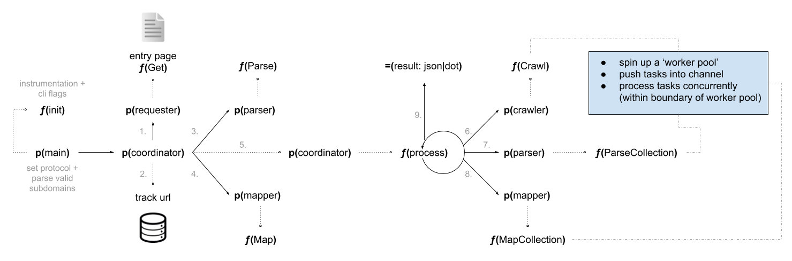

# Calculating Big-O

## Introduction

This post includes a condensed version of the information gleened from the excellent [interactivepython.org](http://interactivepython.org/runestone/static/pythonds/AlgorithmAnalysis/BigONotation.html) section on algorithm analysis. I strongly recommend you read that if you require more detailed information.

The purpose of this post is simply to restructure and simplify the principles offered so I can use it as a quick reference for future practice.

## Algorithm

```py
def sumOfN(n):
   theSum = 0
   for i in range(1,n+1):
       theSum = theSum + i

   return theSum

print(sumOfN(10))  # 55
```

## Analysis Steps

You want to quantify the number of operations (or 'steps') in the algorithm.

To do this:

- Identify the basic unit of computation.
- Track any operational constants (e.g. `theSum = 0`).
- Track repeatable operations (e.g. `theSum = theSum + i`).
- Identify the most 'dominant' portion.

## Explanation

Think about our algorithm `sumOfN`: we have `n` number of items and we're concerned about the time complexity.

If we decide the basic unit of computation is variable assignment, then the formula we would use to express this is `T(1+n)`.

If `T(1+n)` is the 'size of the problem', then using `sumOfN` as our algorithm, we can evaluate it to mean...

```
T(1+n) == 1+n steps
```

The `1` is a constant (i.e. `theSum = 0` happens only once), and `n` is the number of iterations we carry out where a single assignment is made (i.e. `theSum = theSum + i`) within the `sumOfN` function.

A critical part of understanding time complexity is that as the problem gets larger, a portion of `T(1+n)` is likely to overpower the rest and this is where we use the syntax `f(...)` to represent that portion of the algorithm.

Instead of `T(1+n)` we could say the dominant part is `f(n)`, and is also referred to as being 'the order of magnitude' (which is what the 'O' in Big-O stands for).

> Note: 'order of magnitude' describes the part of `T(n)` that increases the _fastest_ as `n` increases.

We can represent the order of magnitude in 'Big-O' syntax like so:

```
O(f(n))
```

Where:

```
f(n) == dominant part of T(n)
```

Typically we'll not include the `f(...)` part of the syntax when using Big-O though. So instead of `O(f(n))` we'll just say `O(n)`.

## Significant or Insignificant?

As `n` gets larger, continuing to use `T(n) = 1+n` as our example, the 'constant' `1` (i.e. the computation that happened once: `theSum = 0`) becomes less and less significant.

Meaning we can drop `1` from our syntax, resulting in just `O(n)` instead of `O(1+n)`, and our approximation is just as accurate without it.

To clarify this further, I'm going to paste verbatim the interactivepython description, as I feel they explain this very well...

> As another example, suppose that for some algorithm, the exact number of steps is `T(n) = 5n2 + 27n + 1005`.
>
> When `n` is small, say `1` or `2`, the constant `1005` seems to be the dominant part of the function.
>
> However, as `n` gets larger, the `n2` term becomes the most important.
>
> In fact, when `n` is really large, the other two terms become insignificant in the role that they play in determining the final result.
>
> Again, to approximate `T(n)` as `n` gets large, we can ignore the other terms and focus on `5n2`.
>
> In addition, the coefficient `5` becomes insignificant as `n` gets large.
>
> We would say then that the function `T(n)` has an order of magnitude `f(n) = n2`, or simply that it is `O(n2)`.

## Example Analysis

```py
a = 5
b = 6
c = 10

for i in range(n):
   for j in range(n):
      x = i * i
      y = j * j
      z = i * j

for k in range(n):
   w = a*k + 45
   v = b*b

d = 33
```

The above code can be calculated as:

```
T(n) == 3 + 3n2 + 2n + 1
```

Which can be condensed slightly, by combining the singular constants, to:

```
T(n) == 3n2 + 2n + 4
```

The constants `3` and `1` are the top level variable assignments: `a=5`, `b=6`, `c=10` and `d=33`.

The `3n2` is because there are three constant variable assignments (`x`, `y` and `z`, hence the `3` in `3n2`) that are occurring within the first set of `for` statements. The top level `for` statement iterates over `n` items, and then does so _again_ hence the `n2` portion of `3n2`.

The `2n` is because there are two constant assignments (`w` and `v`) and they happen `n` times due to the last `for` statement iterating over `n` items.

With this in mind we can say the code is `O(n2)` because when we look at the exponents of each segment of the time analysis (i.e. the condensed version: `3n2 + 2n + 4`) we can see that as `n` grows, the `n2` portion is the most significant.

Think about it: looping over `n` items and making two assignments within each iteration (which is the `2n`) is definitely less complexity than looping over `n` items _twice_ and within each iteration making three assignments (which is the `3n2`).

> Remember: although we write 'Big-O' as `O(...)` the underlying principle is `O(f(...))`, where `f(...)` is the dominant part of `T(...)` and when focusing in on the dominant part of the time complexity we drop the constants -- also known as the _coefficient_ -- (e.g. `3n2` thus becomes `n2`). This is because the constants become _insignificant_ as `n` grows.

## When is Big-O not relevant?

I recently asked in a computer science forum for help in understanding what the Big-O time complexity would be for a 'web crawler'. Specifically I was asking in relation to the following crawler implementation I had built: [go-web-crawler](https://github.com/integralist/go-web-crawler).

The architecture of the program looks something like this:

<a href="../../assets/images/go-web-crawler.png">

</a>

I wasn't sure how to calculate the Big-O for this program because there didn't seem to be any one unit of computation that made sense to use as the foundation of the algorithmic analysis. In the earlier examples it was the variable assignment, but in a web crawler there are so many different moving pieces that make up the whole program.

Also, the implementation between web crawlers will determine different outcomes. So based on my implementation, the running time to handle a list of size `n` containing nested sublists of size `x` appears to be `O(nx)`. I had not seen this type of Big-O analysis before, and is an indication of maybe I'm analysing the wrong things.

> Note: see my previous post for [common examples of Big-O](/posts/algorithmic-complexity-in-python/).

So how did we come to `O(nx)`? Here's the breakdown:

- I'm iterating over each list (there are `n` of them), and each contains `x` items, so you iterate over `nx` items in all.
- The amount of work per item appears to be constant, i.e., `O(1)` (it doesn't appear to depend on `n` or `x`).
- Multiplying those together, we see that the total time to handle that list is `O(nx)`.

The feedback I received was that Big-O might not be useful for analysing a 'system' such as mine because Big-O analysis ignores the constant factors, where as for systems code, we often care about the constant factors a lot.

In other words: I was looking at the system from too high a view. I was looking at the whole rather than picking a specific sub implementation of a particular algorithm.

Another issue is that not all operations are the same, and yet Big-O treats them as such. For example, a variable assignment is not as intensive (computationally or time based) as a network request that can suffer latency and require context switching etc. So in that case Big-O analysis isn't useful for understanding the performance of the system in practice.

So "no", it doesn't make sense to use Big-O all the time. It'll only make sense from a smaller _algorithmic_ perspective.

These are all useful things to keep in mind when thinking about Big-O time complexity analysis.
