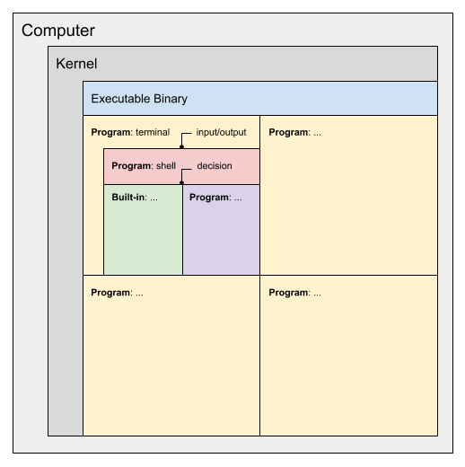

# Computers 101: terminals, kernels and shells

Before we get started, here's a diagram to give you an overview of what we will be covering in this post:

<a href="../../assets/images/terminals-kernals-shells.png">
  
</a>

One thing I want to clarify in the above image is that each box is _within_ the parent box. So for example, The "Program: terminal" is interacting with a contained shell, while the shell then spawns either a "Built-in" or "Program".

> **NOTE**: Nearly four years after this post was published someone else published https://www.poor.dev/blog/terminal-anatomy/ which is an excellent write up that provides a really good animation of how the terminal interacts with the shell, and it goes into much deeper explanation that I do here. So I recommend reading that also.

## Kernel

A computer has a kernel.

The kernel is responsible for managing the computer's system.

The kernel has no user interface.

To interact with the kernel you use an intermediary "program".

## Program

A "[program](https://simple.wikipedia.org/wiki/Computer_program)" is a structured collection of instructions (machine code) that a computer can execute.

Your computer has many programs. One such example would be the 'terminal emulator' program.

> Note: see next section for explanation of what a "terminal" is.

Depending on the programming language used to create the program, either the program is _compiled_ down into binary so it can be understood by the computer, or it'll be _interpreted_ by another program that then generates machine code out of the human readable program.

## Executables

Executables (or 'executable binaries') are programs.

More specifically, an 'executable' is a file that _contains_ a program.

> Note: these are also often referred to as just 'binaries'.

Executables are generally the _result_ of a program being turned into something that can be 'executed' by the computer.

Executables can be found in multiple locations, e.g. look at the `$PATH` environment variable in a terminal.

```
$ echo $PATH

/usr/local/sbin:/usr/local/bin:/usr/bin:/bin:/usr/sbin:/sbin
```

> Note: separate the output by `:` and you see there are six directories

## Terminal

A terminal is an input/output device.

Traditionally terminals would have been a _real_ 'hardware' device that you used to interact with a computer.

e.g. the computer would be a large box in a server room, and the terminal would be a monitor/keyboard connected to the computer.

In modern computing we have _electronic_ terminals.

The modern equivalent of a terminal is known as a 'terminal emulator'.

Terminal emulators ironically (or confusingly) are part of the computer they would have previously been plugged into separately.

If you don't want to use a GUI (graphical user interface) to interact with your computer, you can use a terminal emulator.

## Shell

A shell is a program which is accessed _via_ a terminal emulator.

The terminal accepts input, passes it to the shell, and the shell's output is sent back to the terminal to be displayed.

The shell accepts input as a set of commands.

The available commands vary depending on the shell (e.g. different shells have different commands).

In order to fulfil your instructions, commands are interpreted by the shell and the shell determines if it should either:

- load _another_ program

or

- execute a 'builtin' function

## Shell Builtins

A 'builtin' function is one that is provided by the shell.

If a command is provided and the shell has no corresponding builtin associated with the given command, it will lookup the command via a separate list of available _external_ 'executables'.

A builtin command can affect the internal state of the shell.

This is why a command such as `cd` _must_ be part of the shell (i.e. a builtin), because an external program can't change the current directory of the shell.

Other commands, like `echo`, might be (and are in this case) built into the shell for the sake of performance (it's quicker to call the builtin `echo` than it is to load and manage the external executable `echo`).

## Documentation

Most people are aware of '[manuals](/posts/man-pages/)'.

e.g. `man bash` returns the documentation for the Bash shell.

Manuals do not cover shell builtins.

The `exit` command is a shell builtin, so what happens when looking up a manual for it?

e.g. `man exit` returns a generic 'BUILTIN' documentation page.

If you see that page, then you know the command is a shell builtin.

Another way to tell if a command is a builtin vs an executable is to use the `type` command.

```
$ type exit

exit is a shell builtin
```

One other reason I like to use `type` is when trying to figure out what a shell alias is set to (in case you're unfamiliar, in most shells you can assign a long or hard to remember command to a short variable name). Imagine I've created an alias like so:

```
alias gb="git branch --list 'integralist*'"
```

I can find out later what I assigned to the alias using the `type` command:

```
$ type gb

gb is aliased to `git branch --list 'integralist*''
```

To read the documentation for a builtin, you need to use the `help` command:

```
$ help exit

exit: exit [n]
    Exit the shell.

    Exits the shell with a status of N.  If N is omitted, the exit status
    is that of the last command executed.
```

The `help` command is itself a builtin (hence it knows about builtins, unlike `man` which isn't a builtin).

```
$ type help

help is a shell builtin
```

You can use the `help` command to read its documentation:

```
$ help help

help: help [-dms] [pattern ...]
    Display information about builtin commands.

    Displays brief summaries of builtin commands.  If PATTERN is
    specified, gives detailed help on all commands matching PATTERN,
    otherwise the list of help topics is printed.

    Options:
      -d        output short description for each topic
      -m        display usage in pseudo-manpage format
      -s        output only a short usage synopsis for each topic matching
                PATTERN

    Arguments:
      PATTERN   Pattern specifying a help topic

    Exit Status:
    Returns success unless PATTERN is not found or an invalid option is given.
```

If you run the `help` command by itself you'll see a list of commands that can be passed to `help` (you'll see in the list `exit`, hence why we could run `help exit` earlier):

```
$ help

GNU bash, version 5.0.18(1)-release (x86_64-apple-darwin19.5.0)
These shell commands are defined internally.  Type `help' to see this list.
Type `help name' to find out more about the function `name'.
Use `info bash' to find out more about the shell in general.
Use `man -k' or `info' to find out more about commands not in this list.

A star (*) next to a name means that the command is disabled.

 job_spec [&]                                                                                                           
 (( expression ))                                                                                                       
 . filename [arguments]                                                                                                 
 :                                                                                                                      
 [ arg... ]                                                                                                             
 [[ expression ]]                                                                                                       
 alias [-p] [name[=value] ... ]                                                                                         
 bg [job_spec ...]                                                                                                      
 bind [-lpsvPSVX] [-m keymap] [-f filename] [-q name] [-u name] [-r keyseq] [-x keyseq:shell-command] [keyseq:readlin>  
 break [n]                                                                                                              
 builtin [shell-builtin [arg ...]]                                                                                      
 caller [expr]                                                                                                          
 case WORD in [PATTERN [| PATTERN]...) COMMANDS ;;]... esac                                                             
 cd [-L|[-P [-e]] [-@]] [dir]                                                                                           
 command [-pVv] command [arg ...]                                                                                       
 compgen [-abcdefgjksuv] [-o option] [-A action] [-G globpat] [-W wordlist]  [-F function] [-C command] [-X filterpat>  
 complete [-abcdefgjksuv] [-pr] [-DEI] [-o option] [-A action] [-G globpat] [-W wordlist]  [-F function] [-C command]>  
 compopt [-o|+o option] [-DEI] [name ...]                                                                               
 continue [n]                                                                                                           
 coproc [NAME] command [redirections]                                                                                   
 declare [-aAfFgilnrtux] [-p] [name[=value] ...]                                                                        
 dirs [-clpv] [+N] [-N]                                                                                                 
 disown [-h] [-ar] [jobspec ... | pid ...]                                                                              
 echo [-neE] [arg ...]                                                                                                  
 enable [-a] [-dnps] [-f filename] [name ...]                                                                           
 eval [arg ...]                                                                                                         
 exec [-cl] [-a name] [command [arguments ...]] [redirection ...]                                                       
 exit [n]                                                                                                               
 export [-fn] [name[=value] ...] or export -p                                                                           
 false                                                                                                                  
 fc [-e ename] [-lnr] [first] [last] or fc -s [pat=rep] [command]                                                       
 fg [job_spec]                                                                                                          
 for NAME [in WORDS ... ] ; do COMMANDS; done                                                                           
 for (( exp1; exp2; exp3 )); do COMMANDS; done                                                                          
 function name { COMMANDS ; } or name () { COMMANDS ; }                                                                 
 getopts optstring name [arg]                                                                                           
 hash [-lr] [-p pathname] [-dt] [name ...]                                                                              
 help [-dms] [pattern ...]                                                                                              
 history [-c] [-d offset] [n] or history -anrw [filename] or history -ps arg [arg...]
 if COMMANDS; then COMMANDS; [ elif COMMANDS; then COMMANDS; ]... [ else COMMANDS; ] fi
 jobs [-lnprs] [jobspec ...] or jobs -x command [args]
 kill [-s sigspec | -n signum | -sigspec] pid | jobspec ... or kill -l [sigspec]
 let arg [arg ...]
 local [option] name[=value] ...
 logout [n]
 mapfile [-d delim] [-n count] [-O origin] [-s count] [-t] [-u fd] [-C callback] [-c quantum] [array]
 popd [-n] [+N | -N]
 printf [-v var] format [arguments]
 pushd [-n] [+N | -N | dir]
 pwd [-LP]
 read [-ers] [-a array] [-d delim] [-i text] [-n nchars] [-N nchars] [-p prompt] [-t timeout] [-u fd] [name ...]
 readarray [-d delim] [-n count] [-O origin] [-s count] [-t] [-u fd] [-C callback] [-c quantum] [array]
 readonly [-aAf] [name[=value] ...] or readonly -p
 return [n]
 select NAME [in WORDS ... ;] do COMMANDS; done
 set [-abefhkmnptuvxBCHP] [-o option-name] [--] [arg ...]
 shift [n]
 shopt [-pqsu] [-o] [optname ...]
 source filename [arguments]
 suspend [-f]
 test [expr]
 time [-p] pipeline
 times
 trap [-lp] [[arg] signal_spec ...]
 true
 type [-afptP] name [name ...]
 typeset [-aAfFgilnrtux] [-p] name[=value] ...
 ulimit [-SHabcdefiklmnpqrstuvxPT] [limit]
 umask [-p] [-S] [mode]
 unalias [-a] name [name ...]
 unset [-f] [-v] [-n] [name ...]
 until COMMANDS; do COMMANDS; done
 variables - Names and meanings of some shell variables
 wait [-fn] [id ...]
 while COMMANDS; do COMMANDS; done
 { COMMANDS ; }
```

If we want to see the documentation for the `type` builtin, use `help type`:

```
$ help type

type: type [-afptP] name [name ...]
    Display information about command type.

    For each NAME, indicate how it would be interpreted if used as a
    command name.

    Options:
      -a        display all locations containing an executable named NAME;
                includes aliases, builtins, and functions, if and only if
                the `-p' option is not also used
      -f        suppress shell function lookup
      -P        force a PATH search for each NAME, even if it is an alias,
                builtin, or function, and returns the name of the disk file
                that would be executed
      -p        returns either the name of the disk file that would be executed,
                or nothing if `type -t NAME' would not return `file'
      -t        output a single word which is one of `alias', `keyword',
                `function', `builtin', `file' or `', if NAME is an alias,
                shell reserved word, shell function, shell builtin, disk file,
                or not found, respectively

    Arguments:
      NAME      Command name to be interpreted.

    Exit Status:
    Returns success if all of the NAMEs are found; fails if any are not found.
```

## Explicit Requests

When we used the `type` command earlier on the `exit` command it returned a single response (`exit is a shell builtin`).

Let's try again with a different command (`echo`):

```
$ type echo

echo is a shell builtin
```

But if we also apply the `-a` flag we get _more_ output:

```
$ type -a echo

echo is a shell builtin
echo is /bin/echo
```

This indicates that the shell found a builtin first, but that there was _also_ an external executable called `echo`.

If you were to execute `echo foo` you would be calling the builtin `echo` command.

You could be explicit by executing it via the `builtin` command:

```
$ builtin echo foo

foo
```

You could also explicitly request the executable and not the builtin by using the `command` command:

```
$ command echo foo

foo
```

## Locating programs

To locate a program you use the `which` executable.

We know it's an executable by using the `type` builtin to check it against:

```
$ type -a which

which is /usr/bin/which
```

If we use `which` to lookup the location of the `echo` command, will it find the builtin or the external executable?

```
$ which echo

/bin/echo
```

We can see it only found the external executable.

The `which` command _isn't_ a builtin, and so it has no idea of where to look for builtins.

Because, by nature, builtins are built _into_ the shell itself.

## Hashed Types

If you open a fresh terminal screen and execute `type man` you would see the response `man is /usr/bin/man`.

If you now execute the `man` command (e.g. `man echo`) and try `type man` again you'll see:

```
man is hashed (/usr/bin/man)
```

The reason for this is because in order for the shell to locate the executable it needs to look it up from various locations.

These locations are defined in the `$PATH` (as we saw earlier).

To avoid having to do that lookup every time, it caches the result in a hash table.

If we read the Bash manual (`man bash`) you'll see the following comment:

```
Bash uses a hash table to remember the full pathnames of executable files 
(see hash under SHELL BUILTIN COMMANDS below). 

A full search of the directories in PATH is performed only if the command is not found in the hash table.
```

So it seems there is a `hash` builtin command, let's take a look at that:

```
$ help hash

hash: hash [-lr] [-p pathname] [-dt] [name ...]
    Remember or display program locations.
    
    Determine and remember the full pathname of each command NAME.  If
    no arguments are given, information about remembered commands is displayed.
    
    Options:
      -d	forget the remembered location of each NAME
      -l	display in a format that may be reused as input
      -p pathname	use PATHNAME as the full pathname of NAME
      -r	forget all remembered locations
      -t	print the remembered location of each NAME, preceding
    		each location with the corresponding NAME if multiple
    		NAMEs are given
    Arguments:
      NAME	Each NAME is searched for in $PATH and added to the list
    		of remembered commands.
    
    Exit Status:
    Returns success unless NAME is not found or an invalid option is given.
```

So the documentation informs us of how we can look inside of the shell's hash table by using the `-l` flag:

```
$ hash -l

builtin hash -p /usr/bin/which which
builtin hash -p /usr/bin/man man
builtin hash -p /usr/bin/clear clear
```

From this you can see I've already executed the `which`, `man` and `clear` executables, hence they're now cached.

Also in the Bash manual is the following comment:

```
BASH_CMDS
    An associative array variable whose members correspond to the internal hash table of commands as maintained by the hash builtin.
    Elements added to this array appear in the hash table; 
    however, unsetting array elements currently does not cause command names to be removed from the hash table.  
    If BASH_CMDS is unset, it loses its special properties, even if it is subsequently reset.
```

This informs us that there is another way to view the hash table contents.

In this case we can view the internal array the `hash` builtin appends to:

```
$ declare -p BASH_CMDS

declare -A BASH_CMDS=([which]="/usr/bin/which" [man]="/usr/bin/man" [clear]="/usr/bin/clear" )
```

> Note: it's not as clear to read as the `hash` output, but this is probably more useful for interacting with programatically.

## List of all builtins vs executables

For a list of builtins you can use (in the Bash shell at least):

```
$ enable -a

enable .
enable :
enable [
enable alias
enable bg
enable bind
enable break
enable builtin
enable caller
enable cd
enable command
enable compgen
enable complete
enable compopt
enable continue
enable declare
enable dirs
enable disown
enable echo
enable enable
enable eval
enable exec
enable exit
enable export
enable false
enable fc
enable fg
enable getopts
enable hash
enable help
enable history
enable jobs
enable kill
enable let
enable local
enable logout
enable mapfile
enable popd
enable printf
enable pushd
enable pwd
enable read
enable readarray
enable readonly
enable return
enable set
enable shift
enable shopt
enable source
enable suspend
enable test
enable times
enable trap
enable true
enable type
enable typeset
enable ulimit
enable umask
enable unalias
enable unset
enable wait
```

> Note: an online reference can be found [here](https://www.gnu.org/software/bash/manual/html_node/Bash-Builtins.html#Bash-Builtins)

To list out all available executables is a little more tricky.

First you need to access only those directories you're interested in:

```
$ echo $PATH | tr ':' '\n' | sort | egrep '^/(usr|bin)'

/bin
/usr/bin
/usr/local/bin
/usr/local/sbin
/usr/local/sbin
/usr/local/sbin
/usr/sbin
```

> Note: tweak the regex as you see fit

Then you need to list all the commands within those directories.

The following alias' give you an idea of how you might approach doing that.

```
alias commands_dir='echo $PATH | tr ":" "\n" | sort | egrep "^/(usr|bin)"'
alias commands='for i in $(commands_dir):; do eval "ls -l $i"; done'
```

> Does anyone know of a better way? I'd ❤️ to hear about it
