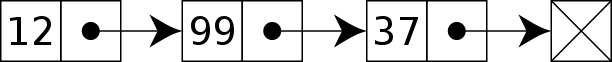
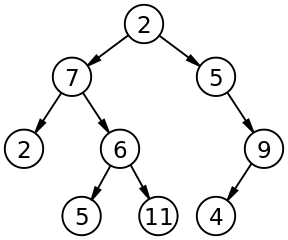
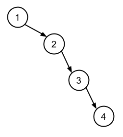
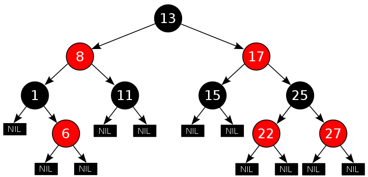
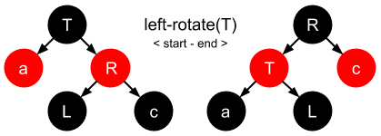
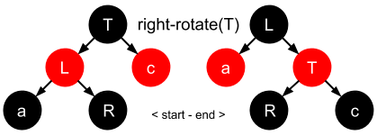
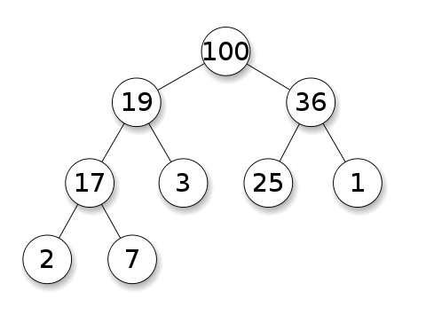
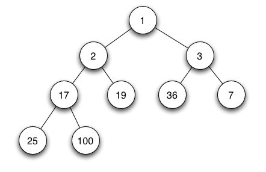
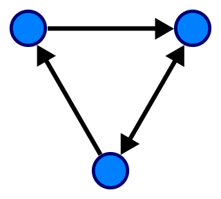

# Data Types and Data Structures

In this post we will be looking briefly at, and at a high-level, the various data types and data structures used in designing software systems, and from which specific types of algorithms can subsequently be built upon and optimized for.

There are _many_ data structures, and even the ones that are covered here have many nuances that make it impossible to cover every possible detail. But my hope is that this will give you an interest to research them further.

## Data Types

A data type is an [attribute](https://english.stackexchange.com/a/28098/334144) of data which tells the compiler (or interpreter) how the programmer intends to use the data.

- **Scalar**: basic building block (boolean, integer, float, char etc.)
- **Composite**: any data type (struct, array, string etc.) composed of scalars or composite types (also referred to as a 'compound' type).
- **Abstract**: data type that is defined by its behaviour (tuple, set, stack, queue, graph etc).

> **NOTE**: You might also have heard of a 'primitive' type, which is sometimes confused with the 'scalar' type. A primitive is typically used to represent a 'value type' (e.g. pass-by-value semantics) and this contrasts with 'reference types' (e.g. pass-by-reference semantics).

If we consider a composite type, such as a 'string', it _describes_ a data structure which contains a sequence of char scalars (characters), and as such is referred to as being a 'composite' type. Whereas the underlying _implementation_ of the string composite type is typically implemented using an array data structure (we'll cover [data structures](#data-structures) shortly).

> Note: in a language like C the length of the string's underlying array will be the number of characters in the string followed by a '[null terminator](/posts/concepts-from-the-c-programming-language/#null-terminator)'.

An abstract data type (ADT) describes the expected _behaviour_ associated with a concrete data structure. For example, a 'list' is an abstract data type which represents a countable number of ordered values, but again the _implementation_ of such a data type could be implemented using a variety of different data structures, one being a '[linked list](https://en.wikipedia.org/wiki/Linked_list)'.

> Note: an ADT describes behaviour from the perspective of a consumer of that type (e.g. it describes certain operations that can be performed on the data itself). For example, a list data type can be considered a sequence of values and so one available operation/behaviour would be that it must be iterable.

## Data Structures

A data structure is a collection of data type 'values' which are stored and organized in such a way that it allows for efficient access and modification. In some cases a data structure can become the underlying implementation for a particular data type.

For example, composite data types are data structures that are composed of scalar data types and/or other composite types, whereas an abstract data type will define a set of behaviours (almost like an 'interface' in a sense) for which a particular data structure can be used as the concrete implementation for that data type.

When we think of data structures, there are generally four forms:

1. **Linear**: arrays, lists
1. **Tree**: binary, heaps, space partitioning etc.
1. **Hash**: distributed hash table, hash tree etc.
1. **Graphs**: decision, directed, acyclic etc.

> Note: for a more complete reference,\
> please see this [Wikipedia article](https://en.wikipedia.org/wiki/List_of_data_structures).

Let's now take a look at the properties that make up a few of the more well known data structures.

## Array

An array is a finite group of data, which is allocated contiguous (i.e. sharing a common border) memory locations, and each element within the array is accessed via an index key (typically numerical, and zero based).

The name assigned to an array is typically a pointer to the first item in the array. Meaning that given an array identifier of `arr` which was assigned the value `["a", "b", "c"]`, in order to access the `"b"` element you would use the index 1 to lookup the value: `arr[1]`.

Arrays are traditionally 'finite' in size, meaning you define their length/size (i.e. memory capacity) up front, but there is a concept known as 'dynamic arrays' (and of which you're likely more familiar with when dealing with certain high-level programmings languages) which supports the _growing_ (or resizing) of an array to allow for more elements to be added to it.

In order to resize an array you first need to allocate a new slot of memory (in order to copy the original array element values over to), and because this type of operation is quite 'expensive' (in terms of computation and performance) you need to be sure you increase the memory capacity just the right amount (typically double the original size) to allow for more elements to be added at a later time without causing the CPU to have to resize the array over and over again unnecessarily.

One consideration that needs to be given is that you don't want the resized memory space to be _too_ large, otherwise finding an appropriate slot of memory becomes more tricky.

When dealing with modifying arrays you also need to be careful because this requires significant overhead due to the way arrays are allocated memory slots.

So if you imagine you have an array and you want to remove an element from the middle of the array, try to think about that in terms of memory allocation: an array needs its indexes to be contiguous, and so we have to re-allocate a new chunk of memory and copy over the elements that were placed _around_ the deleted element.

These types of operations, when done at scale, are the foundation behind why it's important to have an understanding of how data structures are implemented. The reason being, when you're writing an algorithm you will hopefully be able to recognize when you're about to do something (let's say modify an array many times within a loop construct) that could ultimately end up being quite a memory intensive set of operations.

> Note: interestingly I've discovered that in some languages an array (as in the composite data type) has been implemented using a variety of different data structures such as hash table, linked list, and even a search tree.

## Linked List

A linked list is different to an array in that the order of the elements within the list are not determined by a contiguous memory allocation. Instead the elements of the linked list can be sporadically placed in memory due to its design, which is that each element of the list (also referred to as a 'node') consists of two parts:

1. the data
1. a pointer

The data is what you've assigned to that element/node, whereas the pointer is a memory address reference to the next node in the list.



Also unlike an array, there is no index access. So in order to locate a specific piece of data you'll need to traverse the entire list until you find the data you're looking for.

This is one of the key performance characteristics of a linked list, and is why (for most implementations of this data structure) you're not able to _append_ data to the list (because if you think about the performance of such an operation it would require you to traverse the entire list to find the end/last node). Instead linked lists generally will only allow _prepending_ to a list as it's much quicker. The newly added node will then have its pointer set to the original 'head' of the list.

There is also a modified version of this data structure referred to as a 'doubly linked list' which is essentially the same concept but with the exception of a third attribute for each node: a pointer to the _previous_ node (whereas a normal linked list would only have a pointer to the _following_ node).

> Note: again, performance considerations need to be given for the types of operations being made with a doubly linked list, such as the addition or removal of nodes in the list, because you now have not only the pointers to the following node that need to be updated, but also the pointers back to a previous node that now also need to be updated.

## Tree

The concept of a 'tree' in its simplest terms is to represent a hierarchical tree structure, with a root value and subtrees of children (with a parent node), represented as a set of linked nodes.



A tree contains "nodes" (a node has a value associated with it) and each node is connected by a line called an "edge". These lines represent the _relationship_ between the nodes.

The top level node is known as the "root" and a node with no children is a "leaf". If a node is connected to other nodes, then the preceeding node is referred to as the "parent", and nodes following it are "child" nodes.

There are various incarnations of the basic tree structure, each with their own unique characteristics and performance considerations:

- Binary Tree
- Binary Search Tree
- Red-Black Tree
- B-tree
- Weight-balanced Tree
- Heap
- Abstract Syntax Tree

### Binary Tree

A binary tree is a 'rooted tree' and consists of nodes which have, at most, two children. This is as the name suggests (i.e. 'binary': 0 or 1), so _two_ potential values/directions.

Rooted trees suggest a notion of _distance_ (i.e. distance from the 'root' node)

> Note: in some cases you might refer to a binary tree as an 'undirected' graph (we'll look at [graphs](#graph) shortly) if talking in the context of graph theory or mathematics.

Binary trees are the building blocks of _other_ tree data structures (see also: [this reference](https://stackoverflow.com/a/2200588/4288305) for more details), and so when it comes to the performance of certain operations (insertion, deletion etc) consideration needs to be given to the number of 'hops' that need to be made as well as the re-balancing of the tree (much the same way as the pointers for a linked list need to be updated).

### Binary Search Tree

A binary search tree is a 'sorted' tree, and is named as such because it helps to support the use of a 'binary search' algorithm for searching more efficiently for a particular node (more on that later).


To understand the idea of the nodes being 'sorted' (or 'ordered') we need to compare the left node with the right node. The left node should always be a lesser number than the right node, and the parent node should be the decider as to whether a child node is placed to the left or the right.

Consider the example image above, where we can see the root node is `8`. Let's imagine we're going to construct this tree.

We start with `8` as the root node and then we're given the number `3` to insert into the tree. At this point the underlying logic for constructing the tree will know that the number `3` is _less_ than `8` and so it'll first check to see if there is already a left node (there isn't), so in this scenario the logic will determine that the tree should have a new left node under `8` and assign it the value of `3`.

Now if we give the number `6` to be inserted, the logic will find that again it is less than `8` and so it'll check for a left node. There is a left node (it has a value of `3`) and so the value `6` is _greater_ than `3`. This means the logic will now check to see if there is a right node (there isn't) and subsequently creates a new right node and assigns it the value `6`.

This process continues on and on until the tree has been provided all of the relevant numbers to be sorted.

In essence what this sorted tree design facilitates is the means for an operation (such as lookup, insertion, deletion) to only take, on average, time proportional to the [logarithm](https://en.wikipedia.org/wiki/Logarithm) of the number of items stored in the tree.

So if there were 1000 nodes in the tree, and we wanted to find a specific node, then the average case number of comparisons (i.e. comparing left/right nodes) would be `10`.

By using the logarithm to calculate this we get: `log 2(10) = 1024` which is the inverse of the exponentiation `2^10` ("2 raised to the power of 10"), so this says we'll execute 10 comparisons before finding the node we were after.

To break that down a bit further: the exponentiation calculation is `1024 = 2 × 2 × 2 x 2 x 2 x 2 × 2 × 2 x 2 x 2 = 2^10`, so the "logarithm to base 2" of 10 is 1024.

The logarithm (i.e. the inverse function of exponentiation) of 1000 to base 2, in this case abstracted to `n`, is denoted as `log 2 (n)`, but typically the base 2 is omitted to just `log(n)`.

When determining the 'time complexity' for operations on this type of data structure we typically use 'Big O' notation and thus the Big O complexity would be defined as `O(log n)` for the average search case (which is good), but the _worst case_ for searching would still be `O(n)` linear time (which is bad -- and I'll explain why in the next section on [red-black trees](#red-black-tree)).

> Note: I've covered the basics of logarithm and binary search in a [much older post](/posts/big-o-for-beginners/#logarithms) about Big O notation, and so I'll refer you to that for more details.

Similarly when considering complexity for a particular algorithm, we should take into account both 'time' and 'space' complexity. The latter is the amount of memory necessary for the algorithm to execute and is similar to time complexity in that we're interested in how that resource (time vs space) will change and affect the performance depending on the size of the input.

### Red-Black Tree

The performance of a binary search tree is dependant on the height of the tree. Meaning we should aim to keep the tree as 'balanced' as possible, otherwise the logarithm performance is lost in favor of linear time.

To understand why that is, consider the following data stored in an array:

```
[1, 2, 3, 4]
```

If we construct a binary search tree from this data, what we would ultimately end up with is a very 'unbalanced' tree in the sense that all the nodes would be to the right, and none to the left.



When we search this type of tree (which for all purposes is effectively a linked list) we would, worst case, end up with linear time complexity: `O(n)`. To resolve that problem we need a way to balance the nodes in the tree.

This is where the concept of a red-black tree comes in to help us. With a red-black tree (due to it being consistently balanced) we get `O(log n)` for search/insert/delete operations (which is great).

Let's consider the properties of a red-black tree:

- Each node is either red or black.
- The root node is always black.
- All leaves are 'NIL' and should also be black.
- All red nodes should have two black child nodes.
- All paths from given node to NIL must have same num of black nodes.
- New nodes should be red by default (we'll clarify below).

> Note: when counting nodes we don't include the root node, and we count each black node up to (and including) the NIL node.



The height of the tree is referred to as its 'black-height', which is the number of black nodes (not including the root) to the furthest leaf, and should be no longer than twice as long as the length of the shortest path (the nearest NIL).

These properties are what enable the red-black tree to provide the performance characteristics it has (i.e. `O(log n)`), and so whenever changes are made to the tree we want to aim to keep the tree height as short as possible.

On every node insertion, or deletion, we need to ensure we have not violated the red-black properties. If we do, then there are two possible steps that we have to consider in order to keep the tree appropriately balanced (which we'll check in this order):

1. **Recolour the node**\
   in the case of a red node no longer having two black child nodes.
1. **Make a [rotation](https://en.wikipedia.org/wiki/Tree_rotation) (left/right)**\
   in the case where recolouring then requires a structural change.

The goal of a rotation is to decrease the height of the tree. The way we do this is by moving larger subtrees up the tree, and smaller subtrees down the tree. We rotate in the direction of the smaller subtree, so if the smaller side is the right side we'll do a right rotation.

> Note: there is an inconsistency between what node/subtree is affected by a rotation. Does the subtree being moved into the parent position indicate the direction or does the target node affected by the newly moved subtree indicate the direction (I've opted for the latter, as we'll see below, but be aware of this when reading research material).

In essence there are three steps that need to be applied to the target node (`T`) being rotated, and this is the same for either a left rotation or a right rotation. Let's quickly look at both of these rotation movements:

- **Left Rotation**:
  1. `T`'s right node (`R`) is unset & becomes `T`'s parent †
  1. `R`'s _original_ left node `L` is now orphaned.
  1. `T`'s right node is now set to `L`.

> † we now find `R`'s left pointer has to be set to `T` (in order for it to become the parent node), meaning `R`'s original left pointer is orphaned.

- **Right Rotation**:
  1. `T`'s left node (`L`) is unset & becomes `T`'s parent †
  1. `L`'s _original_ right node `R` is now orphaned.
  1. `T`'s left node is now set to `R`.

> † we now find `L`'s right pointer has to be set to `T` (in order for it to become the parent node), meaning `L`'s original right pointer is orphaned.

Let's now visualize the movements for both rotations:

**Left Rotation**



**Right Rotation**



> Note: rotations are confusing, so I recommend watching [this short video](https://www.youtube.com/watch?v=95s3ndZRGbk) for some examples and pseudo-code.

### B-tree

A B-tree is a sorted tree that is very similar in essence to a red-black tree in that it is self-balancing and as such can guarantee logarithmic time for search/insert/delete operations.

A B-tree is useful for large read/writes of data and is commonly used in the design of databases and file systems, but it's important to note that a B-tree is _not_ a binary search tree because it allows more than two child nodes.

The reasoning for allowing multiple children for a node is to ensure the height of the tree is kept as small as possible. The rationale is that B-trees are designed for handling huge amounts of data which itself cannot exist in-memory, and so that data is pulled (in chunks) from external sources.

This type of I/O is expensive and so keeping the tree 'fat' (i.e. to have a very short height instead of lots of node subtrees creating extra length) helps to reduce the amount of disk access.

The design of a B-tree means that all nodes allow a set range for its children but not all nodes will need the full range, meaning that there is a potential for wasted space.

> Note: there are also variants of the B-tree, such as B+ trees and B\* trees (which we'll leave as a research exercise for the reader).

### Weight-balanced Tree

A weight-balanced tree is a form of binary search tree and is similar in spirit to a weighted graph, in that individual nodes are 'weighted' to indicate the more likely successful route with regards to searching for a particular value.

The search performance is the driving motivation for using this data structure, and typically used for implementing sets and dynamic dictionaries.

### Binary Heap

A binary heap tree is a binary tree, not a binary search tree, and so it's not a sorted tree. It has some additional properties that we'll look at in a moment, but in essence the purpose of this data structure is primarily to be used as the underlying implementation for a [priority queue](https://en.wikipedia.org/wiki/Priority_queue).

The additional properties associated with a binary heap are:

- **heap property**: the node value is either greater (or lesser depending on the direction of the heap) or equal to the value of its parent.
- **shape property**: if the last level of the tree is incomplete, the missing nodes are filled.

The insertion and deletion operations yield a time complexity of `O(log n)`.

Below are some examples of a max and min binary heap tree structure.

**Max Heap**:



**Min Heap**:



## Hash Table

A hash table is a data structure which is capable of maping 'keys' to 'values', and you'll typically find this is abstracted and enhanced with additional behaviours by many high-level programming languages such that they behave like an '[associative array](https://en.wikipedia.org/wiki/Associative_array)' abstract data type.

In Python it's called a 'dictionary' and has the following structure (on top of which are functions such as `del`, `get` and `pop` etc that can manipulate the underlying data):

```
table = {'name': 'foobar',
         'number': 123}
```

The keys for the hash table are determined by way of a [hash function](https://en.wikipedia.org/wiki/Hash_function) but implementors need to be mindful of hash 'collisions' which can occur if the hash function isn't able to create a distinct or unique key for the table.

The better the hash generation, the more _distributed_ the keys will be, and thus less likely to collide. Also the size of the underlying array data structure needs to accommodate the type of hash function used for the key generation.

For example, if using modular arithmetic you might find the array needs to be sized to a prime number.

There are many techniques for resolving hashing collisions, but here are two that I've encountered:

1. Separate Chaining
1. Linear Probing

### Separate Chaining

With this option our keys will contain a nested data structure, and we'll use a technique for storing our conflicting values into this nested structure, allowing us to store the same hashed value key in the top level of the array.

### Linear Probing

With this option when a collision is found, the hash table will check to see if the next available index is empty, and if so it'll place the data into that next index.

The rationale behind this technique is that because the hash table keys are typically quite distributed (e.g. they're rarely sequential 0, 1, 2, 3, 4), then it's likely that you'll have many empty empty elements and you can use that empty space to store your colliding data.

> Note: Linear Probing is suggested over Separate Chaining if your data structure is expected to be quite large.

Personally I don't like the idea of the Linear Probing technique as it feels like it'll introduce more complexity and bugs. Also, there is a problem with this technique which is that it relies on the top level data structure being an array. Which is fine if the key we're constructing is numerical, but if you want to have strings for your keys then that wont work very well and so you'll need to be clever with how you implement this.

## Graph

A graph is an abstract data type intended to guide the implementation of a data structure following the principles of [graph theory](https://en.wikipedia.org/wiki/Graph_theory).

The data struture itself is non-linear and it consists of:

- **nodes**: points on the graph (also known as 'vertices').
- **edges**: lines connecting each node.

The following image demonstrates a 'directed' graph (notice the edges have arrows indicating the direction and flow):



> Note: an 'undirected' graph simply has no arrow heads, so the flow between nodes can go in either direction.

Some graphs are 'weighted' which means each 'edge' has a numerical attribute assigned to them. These weights can indicate a stronger preference for a particular flow of direction.

Graphs are used for representing networks (both real and electronic), such as streets on a map or friends on Facebook.

When it comes to searching a graph, there are two methods:

1. Breadth First Search: look at siblings.
1. Depth First Search: look at children.

Which approach you choose depends on the type of values you're searching for. For example, relationship across fields would lend itself to BFS, whereas hierarchical tree searches would be better suited to DFS.

## Conclusion

The discussion of data structures (and the various high-level data types) in computing is a massive topic, and so we cannot hope to try and cover every aspect and detail due to the sheer broad scope.

That said, I hope you found some useful insights and are now able to look at your programming language of choice with a slightly clearer understanding of the possible structures that sit beneath the abstraction surface.
