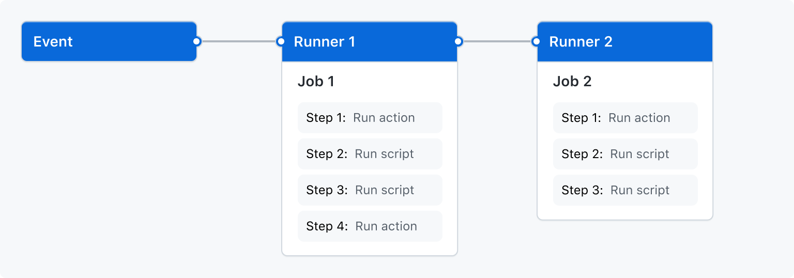

# GitHub Actions

> [GitHub Actions](https://github.com/features/actions) makes it easy to automate all your software workflows, now with world-class CI/CD. Build, test, and deploy your code right from GitHub.

I've been using GitHub Actions a lot recently and I've found it to be immensely flexible and feature rich. I think it's well worth your time learning how to run your CI/CD pipelines via GitHub Actions, and in this post that's exactly what we're going to dig into.

## Terminology

It all starts with a 'workflow'.

A workflow is a yaml configuration file that defines:

- **Jobs**: a job represents a collection of 'steps'.
- **Steps**: each 'step' does something useful (e.g. executes a piece of code).
- **Events**: an event determines when your 'jobs' should run.

GitHub has a nice visualisation of this...

<a href="../../assets/images/overview-actions-simple.png">

</a>
<p></p>

> **NOTE**: Each job you define will run in parallel. If you need jobs to run sequentially, then you'll need to configure a job to depend on another job using the `needs` property (we'll see an example of this later).

## Documentation

I would strongly suggest bookmarking the [official documentation](https://docs.github.com/en/actions/learn-github-actions/understanding-github-actions) because it's very thorough. Unfortunately it's so thorough that it can be a bit overwhelming, but don't worry, once you've gotten familiar with the various concepts you'll start to remember where the important information is located.

The pages I use the most are:

- **[Expressions](https://docs.github.com/en/actions/learn-github-actions/expressions)**: explains how to use GitHub's builtin functions, like `contains()`, `fromJSON()`, and functions like `success()` and `failure()` that tell you the state of previous steps that have run.
- **[Contexts](https://docs.github.com/en/actions/learn-github-actions/contexts)**: there are lots of contextual objects your jobs can use, such as objects for getting information about git (what branch we're dealing with, the commit SHA etc), environment variables, secrets, data exposed by other jobs and lots more.
- **[Syntax](https://docs.github.com/en/actions/learn-github-actions/workflow-syntax-for-github-actions)**: this is the most important page as it details all the yaml configuration syntax (so I come here often).
- **[Commands](https://docs.github.com/en/actions/learn-github-actions/workflow-commands-for-github-actions)**: when executing a shell command (or script) you can use `echo` with a specific format and, depending on the format used, it'll take on special meaning to the workflow runner and can be used (among other things) for displaying rich messaging in the GitHub UI.
- **[Environment variables](https://docs.github.com/en/actions/learn-github-actions/environment-variables)**: most of the 'context' properties are also exposed as environment variables to make it easier for your shell commands/scripts to utilise.
- **[Reusing workflows](https://docs.github.com/en/actions/learn-github-actions/reusing-workflows)**: If you have a bunch of jobs all doing a similar thing (e.g. you've three jobs and each of them setup a specific set of environment variables before installing the rust programming language), then you can move that duplication into a separate workflow file that your main workflow can call out to.

## Experimenting

The best thing to do when it comes to learning GitHub Actions is to create a test repo as a playground, like I did here: https://github.com/Integralist/actions-testing.

You can of course use an existing repo if you want, but I prefer to use something completely decoupled when I'm testing a new tool.

## Workflows

As I mentioned earlier: everything starts with a workflow.

To create a workflow you must save a yaml file into the `.github/workflows` directory of your project's git repo.

In the following example you'll see I have created three separate workflows:

```
├── .github
│   └── workflows
│       ├── my-first-workflow.yaml
│       ├── my-second-workflow.yaml
│       └── my-third-workflow.yaml
```

You can create as many workflows as you need to, and you can name a workflow file anything you like.

## Events

Once we create a workflow file, let's see how we can trigger any jobs that are defined within the workflow. Be aware that in the following example workflow I have not defined any jobs, I'm focusing on the events configuration only:

```yaml
name: My Workflow
on:
  push:
  schedule:
    - cron: "0 0 1 * *"   # https://crontab.guru/every-month
    - cron: "*/5 * * * *" # https://crontab.guru/every-5-minutes
```

So we can see I've given my workflow a name using the `name` key, and I've defined some events using the `on` key:

- `push`: any push to your repo, whether it be to your `main` branch or a pull-request branch, will trigger your job(s) to run.
- `schedule`: run your job(s) on a schedule using cron syntax, which in this example triggers job(s) every five minutes and monthly.

> **NOTE**: https://crontab.guru/ makes dealing with cron syntax easy.

Refer to GitHub's [events documentation](https://docs.github.com/en/actions/learn-github-actions/events-that-trigger-workflows) to learn more about the various events you can configure. For example, you can restrict a workflow to only execute against a specific branch.

## Environment

Each job runs inside its own virtual machine 'runner', which means (just as an example) files you create, or data you produce, will not persist across jobs. This includes things like environment variables.

## Example Job

Let's take a look at a very simple job:

```yaml
name: Test Workflow
on: push
jobs:
  simple-job:
    runs-on: ubuntu-latest
    steps:
      - name: Say Hello
        run: echo 'hello'
```

Let's now break apart this workflow to understand what it's doing...

- `name`: the name for the workflow.
- `on`: the event(s) we want to have trigger our job(s).
- `jobs`: a list of jobs we want to be executed under this workflow.
  - `simple-job`: a job that consists of nested configuration.
    - `runs-on`: the environment I want the job to run in.
    - `steps`: a list of steps to run under the job.
      - `name`: the name of the step, which can be omitted but it makes the output in the GitHub UI nicer.
      - `run`: the shell command/script I want to run (in this example, my command prints the string `hello`).

> **NOTE**: Refer to the GitHub [runner documentation](https://docs.github.com/en/actions/learn-github-actions/workflow-syntax-for-github-actions#github-hosted-runners) to see what other environments are available. Also refer to the [virtual-environments](https://github.com/actions/virtual-environments) repo to see what is installed on each runner's operating system.

As you can see, defining a workflow and its jobs/steps is actually very simple and intuitive. Now we can start looking at using more features and how to take advantage of the platform.

## Environment Variables

GitHub Actions let you configure environment variables in multiple places depending on the scope they should have.

You can define environment variables globally, so they're available to all jobs (and all steps within those jobs), or at a job level (so they can be accessed by all steps within the specific job) or at a step level, meaning only a specific step will have access to them.

I'll demonstrate environment variable configuration in the following example:

```yaml
name: Testing Environment Variables
on: push
env:
  FOO: bar
jobs:
  validate-env-vars:
    runs-on: ubuntu-latest
    env:
      LITERAL: whatever
      INTERPOLATION: ${{ github.ref_name }}
      EXPRESSION: $(echo ${{ github.ref_name }} | perl -pe 's/[^a-zA-Z0-9]+/-/g' | perl -pe 's/(\A-|-\Z)//g' | awk '{print tolower($0)}')
    steps:
      - name: Print Global Environment Variables
        run: echo $FOO
      - name: Print Job Environment Variables
        run: |
          echo ${{ env.LITERAL }}
          echo ${{ env.INTERPOLATION }}
          echo ${{ env.EXPRESSION }}
          echo $LITERAL
          echo $INTERPOLATION
          echo $EXPRESSION
      - name: Print Step Environment Variables:
        env:
          STEPVAR: my step
        run: |
          echo ${{ env.STEPVAR }}
          echo $STEPVAR
```

OK, so there's a few things to unpack from the above example workflow.

The first thing I want to clarify is that when running shell commands/scripts using `steps.run` you can either define multiple steps like so:

```yaml
- run: echo hello
- run: echo world
```

Or alternatively you can use the pipe `|` character to indicate the value spans multiple lines, like so:

```yaml
- run: |
  echo hello
  echo world
```

I would tend towards using separate `run` steps rather than one long multi-line `run` because it's harder to handle errors (or know where an error occurred) in the latter approach.

The next thing to clarify is that there are two ways to access an environment variable:

1. **Interpolation**: `${{ ... }}` (e.g. `echo ${{ env.LITERAL }}`).
1. **Variable reference**: `$VARNAME` (e.g. `echo $LITERAL`).

It's important to understand that although the output between the two approaches is the same, there is still a distinction worth being aware of.

With interpolation the value is acquired by looking up the relevant key within the [`env` context object](https://docs.github.com/en/actions/learn-github-actions/contexts#env-context), and then the value is injected into the shell command to be executed, while the more traditional variable reference approach works by the shell instance looking up the environment variable to access the value.

So when you look at the GitHub Actions GUI (e.g. `https://github.com/<USER>/<REPO>/actions/runs/<ID>`) and you look through the job output for the `LITERAL` example, then you'll see something like:

```bash
echo whatever
echo $LITERAL
```

This is because the first line used interpolation, so really the shell command was just echo'ing the literal value, where as the second line was echo'ing the _result_ of looking up the environment variable.

In our example workflow you can see we defined a global environment variable called `FOO`, we also defined a job level set of environment variables (`LITERAL`, `INTERPOLATED` and `EXPRESSION`), and finally we defined a step level environment variable called `STEPVAR`.

Let's take a moment to clarify the job level environment variables as these demonstrate something important, which is although the `EXPRESSION` variable was assigned a shell command, that command isn't _evaluated_ and so the literal characters are assigned as the value.

If you thought the _result_ of the shell command (e.g. acquire the branch name from the `github` context object, and then do some normalisation of the name using a combination of `perl` and `awk`) would be assigned to the environment variable, then you would have been wrong.

Only the [`steps.run`](https://docs.github.com/en/actions/learn-github-actions/workflow-syntax-for-github-actions#jobsjob_idstepsrun) key will actually evaluate a given shell command/script.

Now if the only way to evaluate a shell command is via `steps.run`, then how can we dynamically assign a value to an environment variable?

Consider this example, you're a [Node.js](https://nodejs.org/en/) developer and you're using the Node version manager `nvm` along with a [`.nvmrc` file](https://github.com/nvm-sh/nvm#nvmrc) to control which version of Node your project uses.

You're also using GitHub actions and you want to use a pre-existing action to manage installing Node on your job runner (we'll dig into third-party actions later, but for now just know that they are a thing).

This is where things get a little funky, because third-party actions can't evaluate shell commands given as inputs. So the most popular third-party action for installing Node is [`actions/setup-node`](https://github.com/actions/setup-node) and it allows you to specify the version of Node to install but it has to be a literal value.

The following example demonstrates how to side-step this restriction by using a `steps.run` to dynamically access the value inside the `.nvmrc` file and to then update the local environment with a new variable holding that value. This means you can then use interpolation to access that value and pass it into the `actions/setup-node` action:

```yaml
name: Testing Dynamic Environment Variable Value
on: push
jobs:
  validate-env-vars:
    runs-on: ubuntu-latest
    steps:
      - name: Generate Dynamic Environment Variable
        run: echo "NODE_VERSION=$(cat .nvmrc)" >> $GITHUB_ENV
      - name: Print NODE_VERSION
        run: |
          echo ${{ env.NODE_VERSION }}
          echo $NODE_VERSION
      - uses: actions/setup-node@v2
        with:
          node-version: "${{ env.NODE_VERSION }}"
```

The trick is to update a GitHub Actions provided environment variable called `$GITHUB_ENV`. All the following steps will then have an environment that includes whatever is in `$GITHUB_ENV`.

> **NOTE**: You could also use the output of a step as the input to the `actions/setup-node` action, but we'll look at that feature later.

## Secrets

The previous Node.js example workflow actually leads us quite nicely into this section about [secrets](https://docs.github.com/en/actions/security-guides/encrypted-secrets#using-encrypted-secrets-in-a-workflow).

Let's see a common solution to accessing a private NPM repository...

```yaml
name: Testing GITHUB_TOKEN access restrictions
on: push
jobs:
  testing:
    runs-on: ubuntu-latest
    steps:
      - name: Acquire Node Version
        run: echo "NODE_VERSION=$(cat .nvmrc)" >> $GITHUB_ENV
      - uses: actions/setup-node@v2
        with:
          node-version: "${{ env.NODE_VERSION }}"
      - name: Authorize access to private packages
        run: echo "//npm.pkg.github.com/:_authToken=${{ secrets.GITHUB_TOKEN }}" > ~/.npmrc
```

What we're doing here is installing Node.js and then modifying a `.npmrc` file so that it knows, when we do an `npm install`, to use an authentication token because the repository we want to use to get at our dependencies is otherwise private.

You'll see we're using a [`secrets` context object](https://docs.github.com/en/actions/security-guides/encrypted-secrets) to access a `GITHUB_TOKEN` value to use as our authentication token. This should be fine, but it doesn't work and our authentication with the private NPM repository fails.

Let's take a moment to learn a bit about GitHub 'secrets'...

In the GitHub UI for a repo/project you can add secrets that are encrypted and made accessible to your workflow via the `secrets` context object. But additionally GitHub Actions provides access to a secret called [`GITHUB_TOKEN`](https://docs.github.com/en/actions/security-guides/automatic-token-authentication#about-the-github_token-secret).

I'll just refer you to the GitHub documentation, as it explains it best:

> At the start of each workflow run, GitHub automatically creates a unique GITHUB_TOKEN secret to use in your workflow. When you enable GitHub Actions, GitHub installs a GitHub App on your repository. The GITHUB_TOKEN secret is a GitHub App installation access token. You can use the installation access token to authenticate on behalf of the GitHub App installed on your repository. The token's permissions are limited to the repository that contains your workflow.

That last sentence is the important bit! What essentially it means is that you can't use `secrets.GITHUB_TOKEN` to access things outside of the project repo.

So to solve our problem we still need to use the `secrets` context object, but instead of using the default `GITHUB_TOKEN` we're going to need to create a new [Personal Access Token](https://docs.github.com/en/authentication/keeping-your-account-and-data-secure/creating-a-personal-access-token) (PAT).

Once you create a PAT, as long as the user account that creates the PAT has access to the private repository, we can paste the PAT into the GitHub secrets UI.

For the sake of an example let's say you create a new secret called `NPM_AUTH_TOKEN` and paste the PAT value into it. We can now reference the secret token value via the `secrets` context object in our workflow file:

```yaml
name: Testing with Personal Access Token
on: push
jobs:
  testing:
    runs-on: ubuntu-latest
    steps:
      - name: Acquire Node Version
        run: echo "NODE_VERSION=$(cat .nvmrc)" >> $GITHUB_ENV
      - uses: actions/setup-node@v2
        with:
          node-version: "${{ env.NODE_VERSION }}"
      - name: Authorize access to private packages
        run: echo "//npm.pkg.github.com/:_authToken=${{ secrets.NPM_AUTH_TOKEN }}" > ~/.npmrc
```

Notice that the workflow file basically hasn't changed, except we swapped `secrets.GITHUB_TOKEN` for `secrets.NPM_AUTH_TOKEN`.

## Third Party Actions

An action is just code that interacts with your repository. It's possible to write your own custom actions and to share them with the community.

If you want to learn more about creating your own actions, then refer to GitHub's "[About custom actions](https://docs.github.com/en/actions/creating-actions/about-custom-actions)".

There are a bunch of third-party actions that you'll see used a lot...

- [`actions/checkout`](https://github.com/actions/checkout)
- [`actions/cache`](https://github.com/actions/cache)
- [`actions/setup-go`](https://github.com/actions/setup-go)
- [`actions/setup-node`](https://github.com/actions/setup-node)
- [`actions-rs/toolchain`](https://github.com/actions-rs/toolchain)

All of the above actions, with the exception of the last, are official GitHub maintained actions. This means they are considered safe to use in your workflows (remember that an action runner will be able to use your `secrets.GITHUB_TOKEN`). See also https://github.com/actions for more official/verified actions you can use.

> **NOTE**: I've no idea why they don't provide a Rust action.

## Conditions

You can use an `if` conditional statement to control whether a job or step is run. It's best to use this feature if you need to _skip_ a job/step apposed to using an exit code from within a `run` shell command/script to stop a job/step that has already started to run.

One important caveat to using `if` in a workflow is that you _must_ use single quotes and not double quotes. Consider the following example, which you might expect to only run the job if the GitHub branch affected is `main`...

```yaml
name: Testing with Double Quotes
on: push
jobs:
  run-if-main:
    if: ${{ github.ref_name == "main" }}
    runs-on: ubuntu-latest
    steps:
      - run: echo hello
```

> **NOTE**: Expressions can omit the surrounding `${{ ... }}` but I tend to include it.

The above example won't work simply because the string `"main"` is using double quotes. You'll find the requirement for using single quotes is mentioned in the GitHub documentation for "[Literals](https://docs.github.com/en/actions/learn-github-actions/expressions#literals)".

If you want to learn more about the available operators, like `==`, `!=` and `&&` etc, then refer to the [operators documentation](https://docs.github.com/en/actions/learn-github-actions/expressions#operators).

## Persisting Data

A GitHub Action job does not persist data by default, as each job runs within its own 'runner'. To persist data we can use either a:

1. Cache ([`actions/cache`](https://github.com/actions/cache))
1. Artifact ([`actions/upload-artifact`](https://github.com/actions/upload-artifact), [`actions/download-artifact`](https://github.com/actions/download-artifact))
1. Job Output ([`outputs` documenation](https://docs.github.com/en/actions/learn-github-actions/workflow-syntax-for-github-actions#jobsjob_idoutputs))

Caching is quick but isn't always ideal as it requires the use of I/O to create files to be cached, and then also we have to coordinate reading values back from disk and parsing the data contained within those files etc. Caching is best used for simple situations such as caching installed programming language dependencies.

Artifacts are slow as they need to upload and download files from GitHub's servers and also this requires two separate external actions to configure, making them not ideal for quick data persistence (and also makes 'simple' data persistence scenarios tedious).

To persist data using a job's output requires a job to produce some data and to expose that data via the job's `outputs` field. A consumer can then use and parse that data however they see fit. This approach can also be useful for dynamically generating job matrix variants using a job's [`strategy.matrix`](https://docs.github.com/en/actions/learn-github-actions/workflow-syntax-for-github-actions#jobsjob_idstrategy) field.

> **NOTE**: A job has an `outputs` field, but also individual steps can access the output from a previous step by way of the same mechanism, which is a step needs to set an `id` field which either another step or the job itself can reference.

The way your `run` code (or an external shell script) can produce data that the GitHub job can reference is to `echo` a specially formatted string:

```bash
echo "::set-output name=<name>::<data>"
```

So in the following example we produce the data `bar` and we make it accessible via the name `foo`:

```bash
echo "::set-output name=foo::bar"
```

Now in the following example our GitHub job has two steps, and the latter step is accessing data produced by the first step:

```yaml
name: Produce Data
on: push
jobs:
  example:
    runs-on: ubuntu-latest
    steps:
      - id: produce-data
        run: echo "::set-output name=foo::bar"
      - run: echo ${{ steps.produce-data.outputs.foo }}
```

> **NOTE**: Be sure to use the `id` field so the second step can use it to reference the first step's output!

### Using shared job data to determine if subsequent job should run

In the following example the `bar` job will not run if the required fields `foo` and `baz` aren't set to `true`.

Notice the data I produce within job `foo` is a simple array/list whose elements are strings who have a format of `key=value`:

```yaml
name: Produce Data To Control Job Run
on: push
jobs:
  foo:
    runs-on: ubuntu-latest
    outputs:
      data: ${{ steps.footest.outputs.data }}
    steps:
      - run: |
          echo "FOO=true" >> $GITHUB_ENV
          echo "BAR=false" >> $GITHUB_ENV
          echo "BAZ=true" >> $GITHUB_ENV
      - id: footest
        run: echo ::set-output name=data::[\"foo=$FOO\", \"bar=$BAR\", \"baz=$BAZ\"]

  bar:
    needs: foo
    if: ${{ contains(needs.foo.outputs.data, 'foo=true') && contains(needs.foo.outputs.data, 'baz=true') }}
    runs-on: ubuntu-latest
    steps:
      - run: echo 'yay! we ran because the fields were set to true'

  build:
    needs: bar
    runs-on: ubuntu-latest
    steps:
      - run: echo 'yay! this job ran as the bar job was successful'
```

The key part to getting job `bar` to determine if it should run is to use an `if` along with one of GitHub's native functions called [`contains()`](https://docs.github.com/en/actions/learn-github-actions/expressions#contains). You can see I use it twice to check if the persisted data contains the values I'm looking for.

> **NOTE**: You'll likely want to use the `needs` property to help make the jobs run sequentially. Otherwise without it the jobs will run in parallel and this means there would be a data race in `bar` trying to access the `foo` job's output which might not yet be available and this would cause both the `bar` job and its dependant `build` job to not be run.

### Persist data using `strategy.matrix`

Below is an example of using JSON data from `job1` and exposing it to `job2`. This approach of using [`fromJSON`](https://docs.github.com/en/actions/learn-github-actions/expressions#fromjson) with data from another job to create a matrix is really cool, but otherwise this approach (as far as data persistence is concerned) isn't ideal because it requires the JSON data produced by the first job to have a very specific structure that the `strategy.matrix` expects. So to reiterate I'm not using `strategy.matrix` in this example because I want a matrix but just to demonstrate a clever way to persist data without having to resort to using either caching or artifacts.

With this in mind I needed to ensure I set the value of each matrix field to be a _list_ type that contains a _single_ entry.

If I didn't use a list type then the `strategy.matrix` would fail to parse my JSON data. I purposely ensure there is only a single value within the list because I don't actually need my data to cause the job to be run multiple times. This is because a `strategy.matrix` is typically used to generate multiple 'variants' of a job. By setting a single value inside a list, we ensure there is only ever one job variant generated (i.e. only one job is created), and that single job can simply reference the fields within the matrix as data points of interest.

```yaml
name: example
on: push
jobs:
  job1:
    runs-on: ubuntu-latest
    outputs:
      matrix: ${{ steps.set-matrix.outputs.matrix }}
    steps:
      - id: set-matrix
        run: echo "::set-output name=matrix::{\"FOO\":["abc"],\"BAR\":["xyz"]}"
  job2:
    needs: job1
    runs-on: ubuntu-latest
    strategy:
      matrix: ${{fromJSON(needs.job1.outputs.matrix)}}
    env:
      FOO: ${{ matrix.FOO }}
      BAR: ${{ matrix.BAR }}
    steps:
      - run: echo ${{ matrix.FOO }} # abc
      - run: echo ${{ matrix.BAR }} # xyz
```

### Clarify the cache action

OK, so as far as data persistence is concerned, we have the `actions/cache` action we can use as an option. It's actually not very obvious how this action works and so I thought I'd take a brief moment to clarify my understanding, which then helped me to better understand how I could use it for data persistence outside of just caching language dependencies (which is what most examples are based on).

The `actions/cache@v2` works like so, you have to define a new step like so:

```yaml
- uses: actions/cache@v2
  with:
    path: path/to/be/cached
    key: ${{ runner.os }}-my-cache-key
```

When the step that implements the action is executed (see above snippet), the cache action simply looks up the cache key (e.g. `Linux-my-cache-key`) and if it finds something in the cache, then it restores the cache to the path you specified (e.g. `path/to/be/cached`).

If the cache action doesn't find anything in the cache, then nothing happens.

Now the important bit: the cache action has a 'post run' event that executes once your job has finished successfully. The cache action will be run again and this time it stores whatever was in your given path into the cache using the key you said it should be stored under.

This means, when it comes to running another job, you need to ensure you define the cache action _again_ (the same as you defined it in your first job). This is so all of what I've just explained will happen again in your second job (i.e. it'll lookup the key but this time it'll find something in the cache thanks to the 'post run' step from the first job). The only difference now in the second job is that in the 'post run' event, when the action gets run again, you'll now see something like...

> Cache hit occurred on the primary key `Linux-my-cache-key`, not saving cache.

Meaning there was nothing else to do. I imagine if there were changes to the files in the given path then it would indicate the cache was updated with the latest files.

## Reusable Workflows

If you have a bunch of setup configuration that is the same between jobs, then you can move that configuration into a separate workflow file that can then be imported and used by each job in your main workflow file.

The following example, demonstrates how to _call_ (i.e. import) a reusable workflow:

```yaml
jobs:
  build:
    ...

  deploy:
    ...

  validate-foo:
    uses: integralist/actions-testing/.github/workflows/resuable-setup@main # install node, rust, setup env vars etc
    steps: 
      - ...

  validate-bar:
    uses: integralist/actions-testing/.github/workflows/resuable-setup@main # install node, rust, setup env vars etc
    steps: 
      - ...
```

An example implementation of a reusable workflow would be:

```yaml
name: Reusable workflow for validation scripts
on:
  workflow_call:
    inputs:
      install_node:
        type: bool
      name:
        required: true
        type: string
      description:
        required: true
        type: string
      script:
        required: true
        type: string

jobs:
  validation:
    runs-on: ubuntu-latest
    steps:
      - uses: actions/checkout@v2
      - if: ${{ github.event_name != 'schedule' }}
        run: exit 1
      - if: ${{ inputs.install_node }}
        name: Environment
        run: |
          echo "NODE_VERSION=$(cat .nvmrc)" >> $GITHUB_ENV
      - if: ${{ inputs.install_node }}
        uses: actions/setup-node@v2
        id: node-yarn
        with:
          node-version: "${{ env.NODE_VERSION }}"
          cache: yarn
      - name: status update
        uses: ouzi-dev/commit-status-updater@v1.1.2
        with:
          name: ${{ inputs.name }}
          description: ${{ inputs.description }}
          status: pending
      - id: validator
        run: ${{ inputs.script }}
      - if: ${{ success() }}
        name: status update
        uses: ouzi-dev/commit-status-updater@v1.1.2
        with:
          name: ${{ inputs.name }}
          description: ${{ steps.validator.outputs.description }}
          status: ${{ steps.validator.outputs.status }}
```

Notice that in the reusable workflow we have a new event `workflow_call` that helps us to define _inputs_ for the job being called.

In this reusable job we define a bunch of inputs which helps us to control whether the steps in the job are run (making the reusable job even more flexible) by utilising a step's `if` condition and interpolating the input value.

For example, we don't always install the Node.js programming language, only if the caller requests it:

```yaml
- if: ${{ inputs.install_node }}
  uses: actions/setup-node@v2
  id: node-yarn
  with:
    node-version: "${{ env.NODE_VERSION }}"
    cache: yarn
```

Now one important consideration is that the reusable workflow will not inherit the parent workflow's environment. This means secrets and environment variables need to be passed in via either `workflow_call.inputs` or `workflow_call.secrets`.

Annoyingly you can't just set an input with `${{ env.FOO }}` because the `env` context object can't be referenced. So if your reusable job is used a lot then you either have to hardcode the value as an `input` to the reusable workflow or you store the environment variable as a secret in the GitHub UI so that you can reference it from the `workflow_call.secrets` property.

## Conclusion

There is so much more to explore with GitHub Actions. The bits I've mentioned here are just the tip of the iceberg. I strongly recommend you read the documentation and have a play around with these, and other features. Let me know on twitter what you think of GitHub Actions and whether you're using it in your projects.
