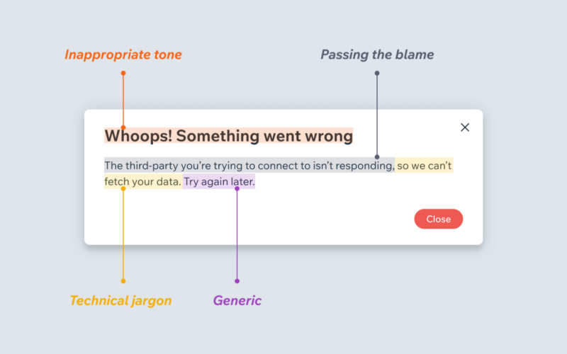
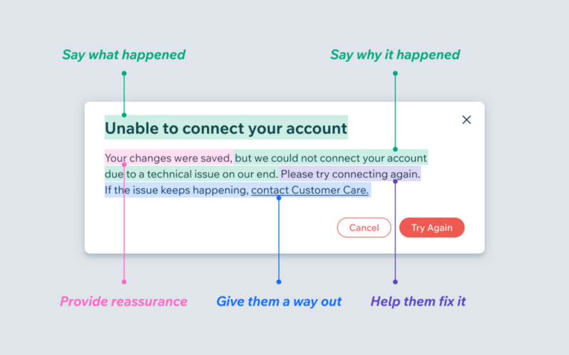

# Go Style Guide

This is my own personal style guide for Go.

## Reference Materials

The following reference materials are my 'go to' whenever I'm unsure of something (they're mostly official resources).

- [Project structure](https://go.dev/doc/modules/layout)
- [Effective Go](https://golang.org/doc/effective_go)
- [Code Review Comments](https://github.com/golang/go/wiki/CodeReviewComments)
- [What's in a name?](https://talks.golang.org/2014/names.slide)
- [Commit messages](https://github.com/golang/go/wiki/CommitMessage)
- [Comments](https://github.com/golang/go/wiki/Comments)
- [Slice Gotchas](https://blogtitle.github.io/go-slices-gotchas/)
- [Thinking about interfaces](https://www.integralist.co.uk/posts/go-interfaces/)
- [Understanding memory allocation](https://gist.github.com/Integralist/22ced4b4700df1e6cbec88c1074c8b2d)
- [Go Concurrency](https://gist.github.com/Integralist/05fb91c42021195b727be5afb28122ec)

> **NOTE**: Refer to the [specification](https://golang.org/ref/spec) if ever confused about what the expected behaviour is.

## Naming

The following is a summary of how to name things in Go, gleaned from either my own experiences over the years or from some of the above reference materials.

- Choose package names that lend meaning to the names they export (see also [Google's Go style guide](https://google.github.io/styleguide/go/) for [examples](https://google.github.io/styleguide/go/decisions.html#package-names)).
- Where types are descriptive, name should be short (1 or 2 char name).
- If longer name required, consider refactoring into smaller functions.
- Commonly used names:
  - Prefer `i` to `index`.
  - Prefer `r` to `reader`.
  - Prefer `buf` to `buffer`.
  - Prefer `cfg` to `config`.
  - Prefer `dst, src` to `destination, source`.
  - Prefer `in, out` when referring to stdin/stdout (more flexible for mocked objects).
  - Prefer `rx, tx` when dealing with channels.
    - i.e. receiver, transmitter.
  - Prefer `data` when referring to file content.
    - Regardless of it being a `string` or `[]byte`.
  - Use `ok` instead of longer alternatives.
- Errors:
  - Types: `<T>Error` (e.g. `type ExitError struct {...}`).
  - Values: `Err<T>` (e.g. `var ErrFoo = errors.New("bar: baz")`).
- Interfaces:
  - When an interface includes multiple methods, choose a name that accurately describes its purpose.
  - Interfaces defining one method are named the same as the method with 'er' appended.
    - Sometimes the result isn't correct English, that's OK.
    - Sometimes we use English to make it nicer.
- Return values on exported functions should only be named for documentation purposes.
  - Side effect is that the variable is initialised at start of function with zero value.
  - This can, in some cases, lead to a nice code design.
- `Set<T>` vs `Register<T>`
  - **Set**: use when flipping a bit (e.g. setting an int, string etc).
  - **Register**: use when operation is going _into_ something (e.g. registering a CLI flag inside a command).
- Tests:
  - Prefer `got, want` over alternatives like `have, want` ([official reference](https://github.com/golang/go/wiki/TestComments#got-before-want)).

> **NOTE**: Refer also to https://github.com/kettanaito/naming-cheatsheet

## Whitespace

The go standard library has no strong conventions or idioms for how to handle whitespace. So try and be concise without leaving the user with a wall of text to digest. Additionally, you can use block syntax `{...}` to help group related logic:

```go
// Simple code is fine to condense the whitespace.
if ... {
  foo
  for x := range y {
    ...
  }
  bar
}

// Complex code could benefit from some whitespace (also separate block syntax for grouping related logic).
if {
  ...

  {
    ...grouping of related logic...
  }

  ...
}
```

## Quick note on Code Design

Not always obvious but be wary of returning concrete types when building a package to be used as a library.

Here is an example of why this might be problematic: we had a library that defined a constructor that returned a struct of type `*T`. This struct had methods attached and inside of those methods were API calls.

The reason the returning of that struct was a problem was because when we built a separate CLI to consume the package library, we realised our CLI's test suite wasn't able to _mock_ the returned type appropriately as some of the fields on the struct were private (these would determine if an attached method would make an API call), and so we were forced to make real API calls!

The solution was for us to return an interface. This made it simple to mock the behaviours we wanted (e.g. we could write our tests to pretend there was an API error, and see how our CLI handled that scenario).

I recommend reading my other post ["Thinking about Interfaces in Go"](https://www.integralist.co.uk/posts/go-interfaces/).

## Quick guide to Errors

When you wrap errors your message **should include**:

- A pointer to where within your method the failure occurred.
- Values that will be useful during debugging (e.g ids).
- (sometimes) Details about why the error occurred.
- Other relevant info the caller doesn't know.

And your message **should NOT include**:

- The name of your function
- Any of the arguments to your function
- Any other information that is already known to the caller

Here is a BAD example where the caller of a function that fails is seeing duplicate information:

```go
// Source
func MightFail(id string) error {
    err := sqlStatement()
    if err != nil {
        return fmt.Errorf("mightFail failed with id %v because of sql: %w", id, err
    }
    ...
    return nil
}

// Caller
func business(ids []string) error {
    for _, id := range ids {
        err := MightFail(id)
        if err != nil {
            return fmt.Errorf("business failed MightFail on id %v: %w", id, err)
        }
    }
}
```

The resolution to the above bad code is: only include information the caller doesn’t have. The caller is free to annotate your errors with information such as the name of your function, arguments they passed in, etc. There is no need for you to provide that information to them, as its obvious up front. If this same logic is applied consistently you'll end up with error messages that are high-signal and to-the-point.

See also the article "[When life gives you lemons, write better error messages](https://scribe.rip/when-life-gives-you-lemons-write-better-error-messages-46c5223e1a2f)", from which the following images are sourced.

**Bad error message**:

<a href="../../assets/images/error-message-bad.png">

</a>
<p></p>

**Good error message**:

<a href="../../assets/images/error-message-good.png">

</a>
<p></p>

Essentially, the error "message" shouldn't necessarily be formatted like "error doing x" or "failed to do x" (as I had been led to believe the former was the standard way of writing an error message). After reviewing "good" examples of Go code (e.g. at the time of writing [this was one such example](https://github.com/search?q=repo%3Agoogle%2Fexposure-notifications-server%20errors.New&type=code)) it seems there is no 'format' for the error message other than to be direct/specific.

## Quick guide to `panic`

- The use of `panic` is reserved for when an error is _unrecoverable_.
- What constitutes an "unrecoverable" error is contentious. Here are some definitions:
  - To indicate that something impossible has happened, such as exiting an infinite loop.
  - During initialization, if the library truly cannot set itself up, it might be reasonable to `panic`.
  - When something internally has fundamentally failed.
  - When a programmer gives something to a function which the function explicitly states is invalid.
- [`bytes.Truncate`](https://github.com/golang/go/blob/8ac6544/src/bytes/buffer.go#L88-L90) is an example of the last sub-point.
  - The above example could be considered _aggressive_.
  - Instead the standard library could have returned an error so the caller could decide the appropriate action to take.
- The use (and conditions) of `panic` should be documented (example: [`bytes.Truncate`](https://github.com/golang/go/blob/8ac6544/src/bytes/buffer.go#L81))
- The use of `recover` is for when you disagree with the library authors.
- Wherever possible avoid `panic` and return an error for the caller to handle.

## Quick guide to slice 'gotchas'

The first gotcha to be aware of is that in Go assigning a new value to a parameter with `=` won't affect the argument in any way. So consider the following simple code that tries to append a value to a slice...

```go
package main

import "fmt"

func addTwo(s []int) {
	s = append(s, 2)
}

func main() {
	mySlice := []int{1}
	addTwo(mySlice)
	fmt.Println(mySlice)
}
```

This will print `[1]`, which is not what we want.

Now if you already understand that a slice is really a pointer to an internal struct type, then this might make this even more confusing because you would be of the understanding that you can modify a argument if it's passed as a pointer.

But in this case, although a slice really is just a pointer to a struct, you have to remember that is an implementation detail and so you still have to explicitly define the parameter as a pointer type and pass it as such...

```go
package main

import "fmt"

func addTwo(s *[]int) {
	*s = append(*s, 2)
}

func main() {
	mySlice := []int{1}
	addTwo(&mySlice)
	fmt.Println(mySlice)
}
```

The above version of the code will now correctly print `[1 2]`.

______________________________________________________________________

When taking a slice of a slice you might stumble into behaviour which appears confusing at first. The `cap`, `len` and `data` fields might change, but the underlying array is not re-allocated, nor copied over and so modifications to the slice will modify the original backing array.

> **NOTE**: There are more examples/explanations in https://blogtitle.github.io/go-slices-gotchas/

### Ghost update 1

The underlying array is modified after updating an element on the slice as there is no re-allocation of the underlying array:

```go
a := []int{1, 2}
b := a[:1]     /* [1]     */
b[0] = 42      /* [42]    */
fmt.Println(a) /* [42, 2] */
```

It's likely you'll want to set the capacity when taking a slice of `a` to assign to `b`. This will cause a new backing array to be created for the `b` slice:

```go
a := []int{1, 2}
b := a[:1:2]   // [1]
b[0] = 42
fmt.Println(a) // [42, 2]
fmt.Println(b) // [42]
```

> **NOTE**: Refer to the golang language specification section on ["full slice expressions"](https://golang.org/ref/spec#Slice_expressions) syntax (`[low : high : max]`) for controlling the capacity of a slice.

### Ghost update 2

When data gets appended to `b` (a slice of the `a` slice), the underlying array has enough capacity to hold two more elements, so `append` will not re-allocate. This means that appending to `b` might not only change `a` but also `c` (a slice of the `a` slice).

```go
a := []int{1, 2, 3, 4}
b := a[:2] /* [1, 2] */
c := a[2:] /* [3, 4] */
b = append(b, 5)
fmt.Println(a) /* [1 2 5 4] */
fmt.Println(b) /* [1 2 5]   */
fmt.Println(c) /* [5 4]     */
```

The 'fix', like shown earlier, is `b := a[:2:2]` which sets the capacity of the `b` slice such that `append` will cause a new array to be allocated. This means `a` will not be modified, nor will the `c` slice of `a`.

## Quick guide to pass-by-value vs pass-by-pointer

> Reference articles: [goinbigdata.com](https://goinbigdata.com/golang-pass-by-pointer-vs-pass-by-value/) and [dave.cheney.net](https://dave.cheney.net/2017/04/29/there-is-no-pass-by-reference-in-go) and [alexedwards.net](https://www.alexedwards.net/blog/demystifying-function-parameters-in-go).

You'll commonly hear people use the phrase 'pass-by-reference'. The behaviour this phrase describes is: "You're not receiving a _copy_ of the thing being passed, you're getting _direct access_ to it".

In Go this behaviour is called 'pass-by-pointer'. Whereas the phrase 'pass by reference' is actually a very _specific_ type of behaviour (not supported in Go), and it's not the same thing as 'pass-by-pointer'.

To understand pass-by-pointer we first thing to understand how arguments are passed to a function.

All the following primitive/basic types in Go are passed as a _value_ (i.e. copied):

- array
- boolean
- float
- int
- string
- struct

Whereas maps, slices, and channels are all passed by pointer.

Now, here's where I need to be more specific (and _accurate_):

> In Go _every_ function operates on a _copy_ of the arguments passed into the function. No exceptions, that is what happens for every type.

With the primitive/basic types, their _value_ is _copied_.

So why is it that maps, slices and channels are passed by pointer?

Well, maps, slices and channels _are_ all pointers (you might not have realised that!). When you create an instance of one of these types, the Go language actually instantiates an _internal_ struct (e.g. a [`runtime.hmap`](https://github.com/golang/go/blob/883f062fc0a097bf561030ad453fd3e300896975/src/runtime/map.go#L117), [`runtime.slice`](https://github.com/golang/go/blob/883f062fc0a097bf561030ad453fd3e300896975/src/runtime/slice.go#L15) or [`runtime.hchan`](https://github.com/golang/go/blob/883f062fc0a097bf561030ad453fd3e300896975/src/runtime/chan.go#L33C6-L33C11)) and returns a pointer to them.

A pointer is something that _points to_ a memory address.

As we've already said, Go will _always_ pass a _copy_ of an argument so Go doesn't pass a pointer. Just like the primitive/basic types, it will create a _copy_ of the pointer and pass that. This still means the receiver can deference the copy of the pointer its given, to get at the underlying memory address (because the underlying address is still the same, even if the pointer is a copy).

Now going back to a phrase that people commonly use when talking about Go: pass-by-reference. Go does not have pass-by-reference semantics because Go does not have 'reference variables', which is something you'd find in C++.

In C++ you can define:

```c++
a = 10
```

Then you can 'alias' `b` to `a`:

```c++
&b = a
```

In C++ this would mean updating `b` would _affect_ `a`. Go doesn't have this behaviour.

In Go, every variable is stored in its own memory space. Meaning, if we had `b := &a` and updated `b` then we wouldn't cause any change to `a`.

In Go, imagine we define a function with a parameter `p` which is of a pointer type:

```go
func changeName(p *Person) {
    //
}
```

Now imagine we pass a pointer to that function:

```go
changeName(&person)
```

We now know that Go will not pass the `&person` pointer, but a _copy_ of the pointer.

So, if the `changeName` function were to modify the `p` argument variable it receives, this would actually cause the `person` variable to be updated.
This happens because although the `&person` pointer was copied into the function argument, the `&person` and `p` are two _different_ pointers to the _same_ struct which is stored at the same memory address. This is quite different to C++'s reference variables.

## Quick guide to functions with large signature

Your functions should have concise/relevant arguments passed in.

Don't, for example, pass in an argument whose type is a large and deeply nested object. Firstly, this means the consuming function has to know the structure well enough to dip into it (and arguably it could be argued that this violates the Law of Demeter). Secondly, it makes testing such a function tedious, and thirdly managing such a data structure is equally tedious. Instead choose a field from the object to pass in as it'll likely have a simpler type (like a `string` or `int`).

Three approaches to dealing with functions that potentially could have a large number of arguments...

1. Make multiple functions to help reduce the number of arguments.
1. Pass in a `<T>Options` struct.
1. Variadic arguments that accept a func type.

I would say go with option 1 whenever possible, and almost never choose option 2 over option 3 as the latter is much more flexible.

The problem with option 2 is that it can become quite cumbersome to construct an object with lots of fields, and more importantly it can be hard to know which fields are _required_ and which are _optional_. Yes it's nice that you can easily omit optional fields easily, but then option 3 also provides that benefit while also solving the problem of knowing what arguments are required vs optional.

Using option 3 can be helpful when you want to make the function signature clear, by accepting a couple of concrete arguments that are _required_ for the function to work, while shifting _optional_ arguments into separate functions, as demonstrated below...

```go
// Client is the complex type that needs to be constructed.
type Client struct {
  host string
  port int
}

// Option is a function that is passed a pointer to the Client type.
// This is so the function can modify the Client.
type Option func(*Client)

// WithPort returns an Option
func WithPort(port int) Option {
  return func(c *Client) { c.port = port }
}

// NewClient will set the 'host' while attempting to call all 'Option' functions.
func NewClient(host string, options ...Option) *Client {
  c := &Client{host: host, port: 80} // default values
  for _, option := range options {
    option(c) // apply the options by calling each one of them

    // Essentially, for this example code, there is noly one Option passed.
    // The Option being called is: 
    // func(c *Client) { c.port = port }
  }
  return c
}

c := NewClient("httpbin.org") // only 'host' is required 
c := NewClient("httpbin.org", WithPort(443)) // WithPort is called and returns an Option type
```
