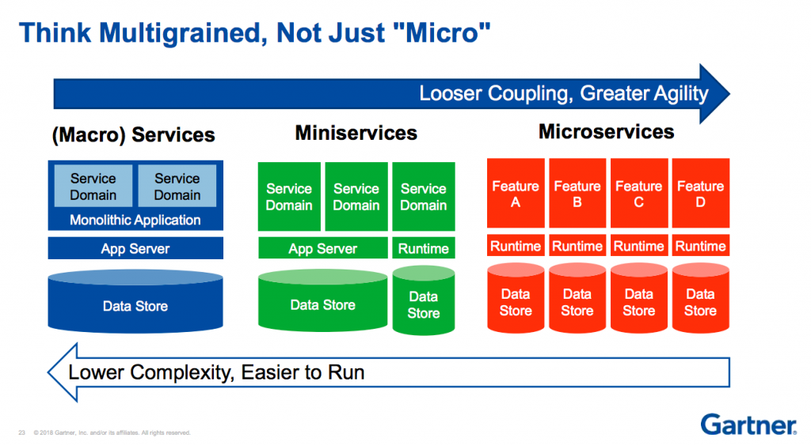

# Multigrain Services

It seems most people are either talking about "monolith applications" or "micro services". But recently I've noticed yet another new buzzword bubbling up across the internet: "mini services".

It's worth mentioning that this _isn't_ a post about which pattern is the most appropriate to use, as they're _all_ appropriate to use, when applied in the right context and scenario.

Below is an image that visualises the concept, and makes understanding these various patterns much easier (at a glance):

<small>[source: thenewstack.io](https://thenewstack.io/miniservices-a-realistic-alternative-to-microservices/)</small>

## A rose by any other name

To me "mini services" isn't anything new, nor do I think it necessarily needs a new term to be applied to it. For me "mini services" are effectively just [SOA](https://en.wikipedia.org/wiki/Service-oriented_architecture) (Service Oriented Architecture), but done right.

People complain about SOA and say it has lots of pain points that make it unusable. I disagree. From what I've read it simply comes down to designing your SOA correctly so that it has proper fault tolerance and resiliency. Not just throwing together some code, seeing certain dependencies break and then crying that SOA is rubbish 🤦‍♂️

Although maybe a new services lexicon † _is_ useful, at least for giving a consistent and modern terminology to these concepts we collectively understand.

> † the vocabulary of a person, language, or branch of knowledge.

## Definitions

Let's breakdown these concepts along with their old/new terminology:

- **Macro Service** (Monolith Application): the traditional architecture model/system design. One big application handling multiple responsibilities and all of them plugged into a single data store.

- **Mini Service** (SOA): an evolution of the monolith where domain 'boundaries' were more clearly defined and made into _separate_ services and data stores. Although these services would still handle multiple responsibilities, those responsibilties were at least _related_.

- **Micro Service**: we breakdown the domain boundaries even further so that services/data stores have very narrow and specific responsibilties. We've moved to 'feature driven' services.

- **Nano Service**: we go to the extremes of boundary definitions and are working at the 'component' level (BBC explain their approach to this [here](https://medium.com/bbc-design-engineering/powering-bbc-online-with-nanoservices-727840ba015b)).

> Micro services are themselves a new'ish concept at ~7 years of age (at the time of writing). The term was first used in 2011.

## Real micro services?

Martin Fowler famously defined microservices as having a very specific design application and that most "micro services" aren't conforming to that. Specifically he says that they should:

- Have a single responsibility
- Be loosely coupled
- Be independently deployable and scalable

But according to Ross Garrett (VP of Marketing Cloud Elements): "an HTTP-build service has to know more about what’s going on around it in order to communicate".

So how do we achieve communication without relying on tried and tested HTTP/REST APIs etc? The answer is the 'observer' design pattern (or pub/sub - publisher, subscriber model).

With the pub/sub model, the micro service publishes notifications whenever something happens and services can subscribe to those notifications. This means the micro service has no awareness of anything outside of itself, it just throws out a notification and there's either someone there to catch it and process it, or there isn't.

> Queue systems like RabbitMQ or SQS etc are used heavily in these cases to allow for that decoupling.

## What do you use?

I tend to gravitate towards the SOA pattern † as it's a nice balance between loose coupling and separation of domain boundaries without descending into the co-ordination and infrastructure madness of micro services.

> † or "mini services" if that's the language you prefer, although I personally don't think I'll ever be able to bring myself to use it over "SOA".
