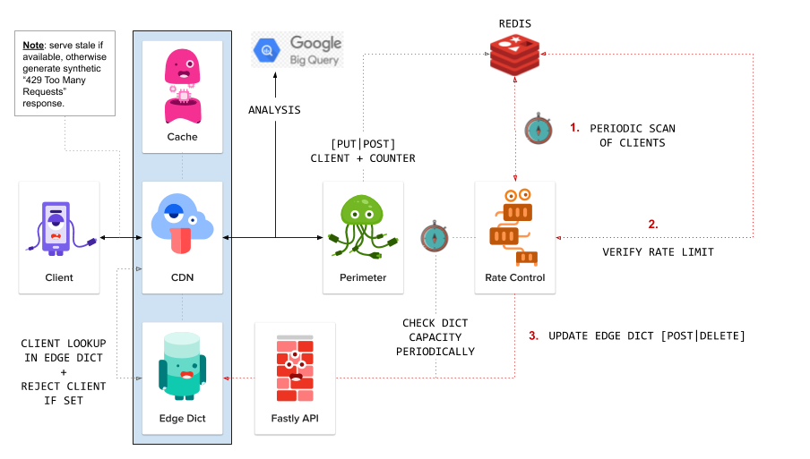

# Rate Limiting at the CDN Edge

## What is Rate Limiting?

Rate Limiting is a technique used to control the rate of requests received.

It exists to help online services to stay up and running even when clients of the service are issuing lots of requests.

Think of an API such as the [GitHub API](https://docs.github.com/en/rest/overview/resources-in-the-rest-api#rate-limiting). If they didn't rate limit their clients, then it's very possible a single client could consume most of their resources (either accidentally or intentionally, i.e. a "bad actor").

## Problems with Rate Limiting

There are two key issues that I needed to address for my employer. The first is very specific to the needs we were trying to solve, and the other is a general issue...

1. our service is public, not private.
1. avoid overloading our internal infrastructure.

Let's consider the first point: most exposed APIs will expect a client to provide a 'key' in order to access the API (this allows the API service to keep a track of individual clients and to ensure they aren't being overly aggressive with their requests).

But I work for a well known online publisher, and so our customers are public users visiting our public website, which means we can't rate limit using a 'key'.

This is because we don't know who our clients are, and so we can't expect them to have signed up to get a key to access our content (unless our content was sat behind a paywall, which it isn't).

This means we have to identify clients another way. The typical approach here is to identify a client by their IP address.

Identifying a client by an IP is problematic for rate limiting because you potentially will end up grouping together multiple clients who all happen to be using the same IP address (e.g. a college campus).

So what can we do to address these two issues?

- [Identify clients more granularly](#identify-clients-more-granularly)
- [Get your CDN to help](#get-your-cdn-to-help)

### Identify clients more granularly

The problem with IP identification is that it's not granular enough. To workaround this issue we create a fingerprint of the client that's actually a hash built from multiple contextual pieces of data:

```
<host>:<path>:<method>:<client-ip>:<user-agent>
```

This means we ultimately are rate limiting clients on a 'path' basis, meaning a client can request `/foo` enough to be rate limited for that path but still be allowed to access `/bar`.

But this doesn't help us with web scrapers and fuzzers who present a potential Denial of Service (DoS) attack by hitting _multiple_ endpoints at a very high rate (this is because the count for a single path could be low while their overall crawling impact could be much larger and damaging).

This forces us to define two types of clients:

1. Standard
1. Broad

The 'standard' clients are those we described originally (they hit a single endpoint at a high rate). An example of this are pentesters trying to compromise a sign-in page.

The 'broad' clients are those who have a less granular fingerprint (specifically `<client-ip>:<user-agent>`), and where we cross reference them against a list of known pentesting/scraper/fuzzer tools.

### Get your CDN to help

The problem we had was that our internal services were struggling to handle the volume of uncacheable requests.

What would be better is if we could leverage the scale of our CDN provider ([Fastly](https://www.fastly.com/)) rather than have our internal infrastructure front the burden.

To do this we needed a way for the CDN to be able to identify a client as one that should be rate limited. But we didn't have enough programmatic access with Fastly to achieve this (their infrastructure is designed around [Varnish](https://varnish-cache.org/) which uses a specialized DSL called [VCL](https://book.varnish-software.com/4.0/chapters/VCL_Basics.html)).

I won't explain _why_ we didn't have enough programmatic access with Fastly, because it requires an understanding of Fastly and their services, which is outside the scope of this post.

> Note: Fastly does have a beta product called [compute@edge](https://www.fastly.com/blog/join-the-beta-new-serverless-compute-environment-at-the-edge) but it's still very early stages and they don't recommend their customers use it for production workloads.

## Architecture

With the above understanding clear in our minds, let's take a look at the architecture I ended up designing/implementing:

- Existing proxy tracks clients via Redis.
- New HTTP service (written in Go):
  - Periodically scans Redis.
  - Identifies if client should be rate limited.
  - Updates Fastly 'edge dictionary' via Fastly API.
- Fastly CDN checks 'edge dictionary' and rejects clients as necessary.

Visually this looks something like...

<a href="../../assets/images/ratelimit.png">
  
</a>

______________________________________________________________________

Two things worth clarifying in the above architecture diagram...

1. We'll attempt to serve a cached response from the CDN otherwise we'll attempt to serve stale (if available), before finally falling back to a synthetic `429 Too Many Requests`.
1. The "Perimeter" service directly behind the CDN was a pre-existing custom built reverse proxy (only slightly modified for the purpose of putting clients into redis).

## Downsides

The biggest downside is that there is a delay in applying rate limits, as processing data isn’t happening at runtime (i.e. the 'Rate Control' service is decoupled from the perimeter proxy).

This additionally introduces some complexity in the sense that we have to limit requests per 'minute' rather than the more traditional 'request per second' (as we need to allow the external service time to process data).

Subsequently this design will allow more requests through to our internal infrastructure before rate limiting will be applied. In practice this hasn't been an issue for us, but it's worth calling out.

Lastly, although this works well for our purposes I appreciate it is not a perfect solution, and is merely a tourniquet.

## Features

OK, so let's review the benefits of this design...

- Verifies if a client requires rate limit restriction.
  - Then notifies CDN to action this behaviour.
- Provides DoS level protection.
- Implements granular level of client identification.
- Supports identification/blocking of common scrapers/fuzzers:
  - http://sqlmap.org
  - https://scrapy.org
  - https://simplepie.org
  - https://nutch.apache.org
  - https://github.com/ffuf/ffuf
  - https://tools.kali.org/web-applications/wfuzz
- Supports reduction of requests handled by our own infrastructure.
- Supports reduction of additional latency.
- Avoids overloading upstream proxy(s) responsibility.
- Provides CLI tooling to:
  - Clear a rate limited client from the Fastly edge dictionary.
  - Toggle on/off rate limiting at the edge.

> Note: although not done yet, I intend on building an internal UI service for 'Rate Control' that will make interfacing with the various components easier (inc. all features currently present in the CLI).

## Example Code

Let's see some example VCL code to understand the CDN edge implementation a bit better...

> Note: for brevity I've removed chunks of logic so we can more easily focus in on the 'control flow'.

```
sub ratelimit_trigger {
  // client is rate limited, so attempt to find cached version of the content
  //
  set req.http.X-Reject = "true";
  return(lookup);
}

sub ratelimit_recv {
  // client_key generates a key from the contextual data we're looking for
  //
  set var.client_hash = digest.hash_sha1(var.client_key);

  if (table.lookup(ratelimit, var.client_hash) == "true") {
    call ratelimit_trigger;
  }

  // if we're unable to find the current key, then before we allow the normal request flow to continue
  // we'll first check if we can find a 'bad actor' (e.g. web scraper/fuzzer) in the rate limit table
  //
  // NOTE: it's at this point we'd change the client_key and regenerate the client_hash.
  //
  if (table.lookup(ratelimit, var.client_hash) == "true") {
    call ratelimit_trigger;
  }
}

sub ratelimit_miss {
  // we were unable to find cached content, so move to vcl_error
  // where we'll attempt to serve stale if it exists, otherwise
  // we'll serve a synthetic '429 Too Many Requests'
  //
  error 601;
}

sub ratelimit_error {
  if (obj.status == 601) {
    if (stale.exists) {
      return(deliver_stale);
    }

    set obj.status = 429;
    set obj.response = "Too Many Requests";
    set obj.http.Content-Type = "text/html";
    synthetic {"<h1>Too Many Requests</h1>"};
    return(deliver);
  }
}
```

The above code would typically be a separate code file which we'd include in our standard VCL file and then call within the relevant state subroutines...

> Note: again I've omitted chunks of code for the sake of brevity.

```
include "rate_limiting"

sub vcl_recv {
  unset req.http.X-Reject;

  call ratelimit_recv;
}

sub vcl_miss {
  if (req.http.X-Reject == "true") {
    call ratelimit_miss;
  }
}

sub vcl_error {
  call ratelimit_error;
}
```
