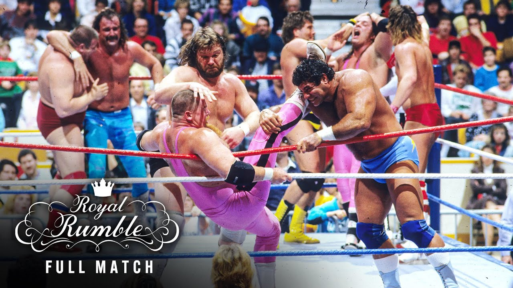
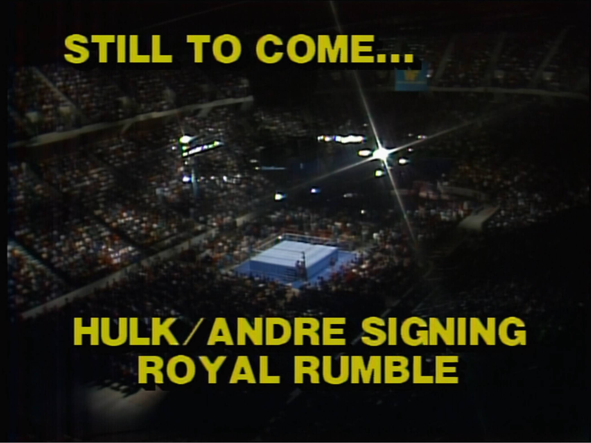
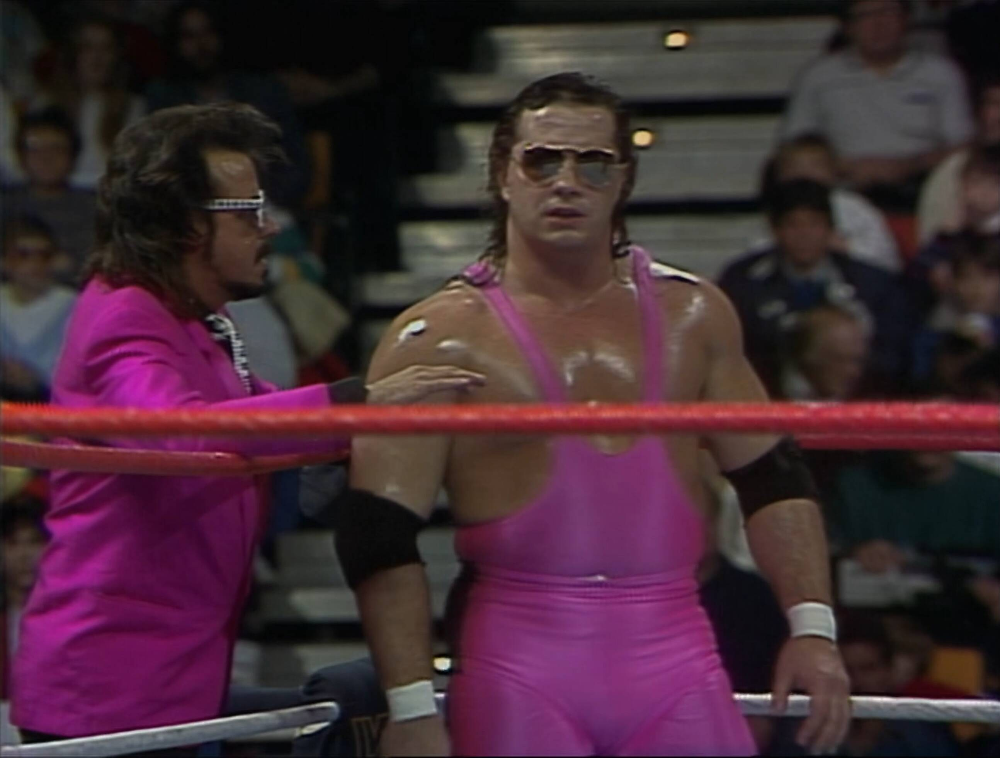
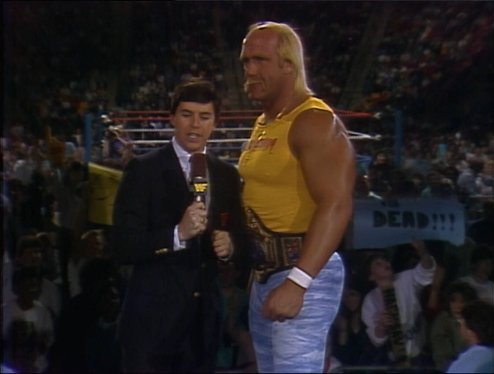

# Royal Rumble 1988

20 men entered, one left standing—and fashion was the real
loser.

> 💡Find all my Royal Rumble 1988 gifs [here on Giphy](https://giphy.com/channel/Integralist/wwf-royal-rumble-1988).

Ah, January 24, 1988—the night the WWF gave us something we didn't even know we
needed: the very first Royal Rumble. Forget your standard matches—this was pure,
unfiltered mayhem, the kind of event that glued us to our TVs and had us
re-enacting over-the-top eliminations on the living room couch (sorry, Mom).
Live from Hamilton, Ontario, the WWF kicked off a tradition that would become a
cornerstone of our wrestling-obsessed childhoods.

And while the Rumble itself stole the spotlight, let's not forget the Women's
Tag Team Championship was on the line too—proving that even in 1988, the WWF
knew how to keep everyone entertained. This wasn't just a night of body slams
and over-the-top rope eliminations; it was a front-row ticket to wrestling
history, with larger-than-life characters, unforgettable moments, and enough
drama to keep us talking on the playground for weeks.

## Watch along notes

As with all my reviews (sarcasm aside) I always start with a _positive_ mindset
(i.e. "this is going to be awesome, I'm going to love watching this"). I think a
lot of reviewers have a preconception of whether something is going to be good
or not (based on their _memory_ of the event or just the more internet-recent
comments on these old events) and they let that affect their review. When really
they should watch the event back like they were kids and try to recall the
things they loved about wrestling. I try the best I can to suspend disbelief,
although I'm guilty of being a smart mark at times.

## Intro

Hmm, we open with some clearly over-dubbed 70's porno music for Rick Rude
(because WWE doesn't like to pay for the rights to the original music which I
assumed they were the people to create in the first place!?). While Rick Rude is
coming into the ring we have Vince McMahon talking us through the card tonight.

So to say it's a little underwhelming would be an understatement. This
immediately has strange, low-key, vibes about it that I didn't expect or
remembered there being. Although I do like the _original_ logo design (very
_royal_). Quite cool and completely different to the design that would follow
for many years after.

Now, if I'm completely honest the card didn't blow me away 😬

The two matches I was interested in were the rumble itself (obviously, it's also
my favourite WWF event, followed closely by the original team Survivor Series)
and the "Rick Rude vs Ricky Steamboat" match. The women's tag match I wasn't
really interested in, nor did I really care about either tag team in "The
Islanders vs The Young Stallions". That said, the card overall was actually
quite good considering the rough and ready talent involved.

We move onto a quick introduction to our hosts for the evening: Vince McMahon
and Jesse Ventura, and boy what an awesome team this was. This is classic WWF to
me, almost as much as Bobby 'The Brain' Heenan and Gorilla Monsoon were.

## Rick Rude vs Ricky Steamboat

The WWF must've thought Rick Rude needed extra time to flex because when we cut
to the ring, he's already there, oiled up and ready to go. But before he can
treat us to one of his patented bicep poses, Ricky "The Dragon" Steamboat makes
his entrance, and the crowd erupts. Seriously, the fans were firmly in
Steamboat's corner from the get-go—because who doesn't love a man with a dragon
motif and a penchant for deep, arm-hook hip tosses?

Now, if you're wondering why these two are squaring off, join the club. The WWF
offered about as much backstory as a random Saturday morning cartoon crossover.
But hey, sometimes you don't need a storyline when you've got The Dragon in the
ring.

The match kicks off with a classic test of strength—Rude initially overpowers
Steamboat, because, well, have you seen Rick Rude? But just when you think
Rude's got the upper hand, Steamboat trips him up, and the crowd goes nuts. It
was a slow start, sure, but Steamboat's methodical approach to dismantling
Rude's arm kept things grounded. He wasn't just working the arm; he was
basically sending it a personal vendetta. Arm drags, locks, and more of those
signature DEEP hip tosses—it was like watching a masterclass in limb-targeting.

Now, you'd think after ten solid minutes of The Dragon turning Rude's arm into
spaghetti, Rude might, you know, sell the injury. But nope. He powers back with
a comeback that completely ignores the fact his arm should be dangling like a
loose thread. Thankfully, Rude finally acknowledges Steamboat's handiwork when
he tries to hit his signature bicep pose and hilariously fails, giving the crowd
something to chew on.

The pace picked up with some nice back-and-forth action—quick pin attempts,
counters, and even an ugly atomic drop from Rude that looked like it hurt
Steamboat in ways he'll be feeling for weeks. Rude slaps on a camel clutch, and
Steamboat starts smacking the mat like he's sending out Morse code for crowd
support. The fans were quiet at times, but every Steamboat kick-out had them
back on their feet.

Things take a chaotic turn when Steamboat hits a crossbody from the top rope,
accidentally wiping out the referee in the process. Rude seizes the opportunity,
locking in a submission hold and thinking he's got this one in the bag. With the
ref groggy, Rude prematurely celebrates like he just won WrestleMania, strutting
around the ring as if Steamboat wasn't still very much in the match. But plot
twist—the referee finally comes to and disqualifies Rude for his earlier antics.

Rude, understandably furious, storms back to argue with the ref, gesturing
wildly while Steamboat is declared the winner by DQ. And then… it just fades to
black. After nearly 20 minutes of solid, methodical wrestling, the broadcast
cuts off like someone accidentally leaned on the remote. No celebration, no
aftermath—just a weirdly abrupt end to a match that felt like it deserved a
little more fanfare.

Was it the most thrilling bout on the card? Maybe not. But Steamboat's technical
mastery and the occasional spark of crowd energy made it a solid addition to the
night's chaos.

## Dino Bravo's World Record Bench Press

Because nothing says Royal Rumble like… a bench press challenge? Yep, sandwiched
between high-octane wrestling action and crowd-popping moments, we got Dino
Bravo attempting to set a world record in bench pressing. And who better to
oversee this spectacle than the dynamic duo of Mean Gene Okerlund and Jesse "The
Body" Ventura—two absolute legends in their own right, trying their best to
inject some life into this unexpected intermission.

Right from the start, it was clear this wasn't going to be your typical
wrestling segment. For one, the crowd was dead. Like, eerily quiet. Not even
polite applause. And to be fair, Dino Bravo—while built like a brick wall—had
all the charisma of a damp towel. Sure, the man was swollen, but muscles alone
can't carry a segment, and Dino wasn't exactly dazzling anyone with his
personality.

But then, in a stroke of accidental brilliance, Dino leans into the mic and
demands complete silence from the crowd before his first lift. And wouldn't you
know it? The fans, previously comatose, suddenly wake up just to spite him.
Bravo 1, Crowd 0.

Now, whether those weights were legit? That's anyone's guess. Rumor has it
(thanks, Bruce Prichard) that Dino couldn't actually lift the full amount, so
they may have played some creative labeling games with the plates. And honestly,
watching this unfold, it's not hard to believe. The whole thing was dragged out
forever. By the time we hit 550 lbs, it felt like we'd been watching for an
hour. And with the supposed world record at over 700 lbs, the pacing was about
as thrilling as waiting for paint to dry.

From a kayfabe standpoint, none of it made sense either. I mean, who in their
right mind warms up by lifting increasingly heavier weights for 20 minutes
straight before going for a record-breaking attempt? It was like watching
someone tire themselves out on purpose. But hey, maybe Dino thought exhaustion
would add some extra drama. Spoiler: it didn't.

To keep the energy (or lack thereof) from flatlining, Mean Gene had to
repeatedly beg the audience for silence (knowing full well, like Dino did, that
this would get them to react in spite of the heel). Meanwhile, Jesse Ventura,
decked out in gloriously over-the-top 80s fashion, provided commentary that was
more entertaining than the actual challenge. At one point, Dino even walked off
mid-segment to build some heat, but all it did was confuse everyone. Like… dude,
are you breaking the record or taking a coffee break?

Finally, after what felt like an eternity, Dino went for the big 715-pound lift.
And surprise, surprise—Jesse "helped" him complete the press, and by "helped," I
mean he basically pulled half the weight (which was likely a shoot save but also
it was part of the storyline, i.e. the crowd could give him shit from now on
about not actually doing the lift properly. Good old classic wrestling heat).

All in all? 20 minutes of awkward silence, questionable lifting, and a crowd
that was more interested in getting to the next match. It was a bold attempt at
something different, but let's just say this segment won't be making anyone's
highlight reel.

## The Jumping Bomb Angels vs The Glamour Girls

In a match that sparkled almost as much as the glint of gold adorning the
Glamour Girls, the atmosphere was electric from the opening bell.

The arena was split between admiration for the youthful, high-flying energy of
the Jumping Bomb Angels and respectful awe of the seasoned, if a bit weathered,
Glamour Girls. Even as commentary buzzed with Jesse Ventura defending earlier
segments—reminding everyone that even Dino's questionable lift was above
board—the focus soon shifted to this captivating tag team clash.

The Bomb Angels wasted no time, showing off their agility and speed as they
zipped around the ring, clearly ready to run rings around their more deliberate
opponents. In contrast, the Glamour Girls, with their vintage look and refined
technique, moved with a stiff yet impressive grace. Their execution was a
reminder that experience, when combined with a touch of class, can still command
attention.

Midway through the bout, the action spilled into a double figure-four leglock
sequence that was pretty cool, and it was at that moment the commentary team
surprised us all (well, definitely me at least, maybe I just hadn't been paying
close enough attention 😬) by announcing that the match would be contested as a
best two-out-of-three falls.

The pace of the match was relentless. At one point, Pink Angel struggled to
execute her submission moves as her Glamour Girl counterpart proved to be just
too overpowering—a stark display of strength versus agility. Not to be outdone,
Red Angel soared off the top rope, only to take a stiff bump that smacked her
head in a way that would have made anyone wince. Yet, every moment was delivered
with unyielding commitment; there was not a wasted effort in that ring.

The Glamour Girls managed to secure the first fall with a big, spinning
powerbomb that left no doubt about their prowess. But the Bomb Angels were not
ready to go quietly. They rallied, turning the tide and capturing the second
fall amid a nail-biting moment when one of the Angels nearly face-planted—a
misstep that drew a collective gasp from the crowd.

Ultimately, the momentum shifted decisively in favor of the Bomb Angels. When
the final bell rang and they clinched the victory, the arena erupted with a
massive pop of cheers. The youthful exuberance and high-energy performance of
the Bomb Angels had won over the crowd, proving that sometimes a little speed
and a lot of heart can outshine even the most polished veteran performance.

It was a match that delivered on thrills, showcasing the raw talent of the Bomb
Angels and the timeless skill of the Glamour Girls, while keeping the audience
thoroughly entertained from start to finish. I honestly didn't expect this to be
a great match, and it wasn't like a clinic or anything, but it _definitely_ was
a good match (thanks to the Japanese talent) so don't skip it thinking it's not
worth a watch, it is.

## Hogan & Andre Signing

In a moment that felt like a nostalgic time warp straight from [WM3], the Royal
Rumble took an unexpected detour into a flashback of epic proportions—setting
the stage for the highly anticipated Hogan and Andre signing for [WM4]. The
segment kicked off with a series of vintage interviews featuring Hogan and Ted
DiBiase, with a delightful cameo from Craig DeGeorge, whose classic interviewer
style brought an extra layer of nostalgia to the proceedings.

The signing unfolded right in the center of the ring, complete with an entourage
that included none other than Jack Tunney, lending an air of official gravitas
to the event. Hogan made his entrance dressed in his signature ~~red and
yellow~~ ...I mean... white and tie-dye blue (???) ensemble. I guess this was
just a subtle reminder that these were, indeed, the everyday threads of the
wrestling icon. Opposite him, Ted DiBiase sported his classic silver and pink
suit, adding a dash of flamboyance to the proceedings (each of Ted's suits have
such a strong hold in my memory, the silver and pink, the green and silver, and
the black and gold, all excellent).

Throughout the segment, Andre the Giant took his time, deliberately dragging out
his entrance before finally settling down, a move that only intensified the
crowd's excitement. The audience was vocally behind Hogan, chanting for him to
take down Andre—a testament to the magnetic pull of Hogan's charisma and those
famously pumped biceps.

As the signing began, Ted played the perfect mouthpiece, goading Hogan by subtly
questioning the legitimacy of his WM3 victory—hinting at that controversial
early surge where some wondered if Andre had clinched the win in just the first
few minutes. Jesse Ventura's lively commentary added a further layer of flavor
to the spectacle, his words painting the scene with both humor and intensity.

The atmosphere in the arena grew even more electric when Ted delivered his
“stamp of approval,” an unmistakable nod to the official nature of the signing.
Hogan falls for this and gets his head suitably slammed into a “solid oak table”
with exaggerated flair that had the crowd shouting their support.

All in all, this segment wasn't just a signing—it was a masterful blend of
nostalgia, theatrics, and in-ring drama that perfectly bridged the gap between
the past and the future of the WWF.

## Royal Rumble Match

From the outset, the arena buzzed with anticipation as Vince and Jesse laid out
the rules for this unique 20-man battle royal—yes, 20 instead of the
now-standard 30—with The Fink opening the match to introduce the first two
participants. The match kicked off with numbers 1 and 2 already in the ring, and
it wasn't long before the action escalated.

Early on, two of the most reliable workers, Bret Hart and Tito Santana, made
their presence felt. Bret, effortlessly cool in his pink gear and aviator
shades.

Bret moved with a calm precision that contrasted sharply with Tito's raw energy.
Though the crowd was initially subdued, a massive pop erupted when Tito gained
the upper hand, proving that even the quieter moments had their sparks. Bret
landed a lovely atomic drop that was executed with his trademark perfection.

I was surprised to see a _yellow_ countdown counter, rather than the more
traditional and familiar white counter. The excitement continued to build as
Natural Butch Reed stormed into the match as entrant number 3—a fan favorite who
instantly injected some much needed beef into the brawl. Butch looked a bit odd
here in his blue trunks. For me I much prefer his look when in the bright yellow
trunks. He just looks too much like a no-name-jobber when he wore blue trunks
with red knee pads.

Soon after, The Anvil made his way into the ring, albeit with a noticeably
absent countdown, setting the stage for what would become a brutal 3-on-1
scenario. In one memorable spot, an awkward two-man hold on Tito left him
vulnerable as Bret soared from the top rope to nail him, much to the crowd's
delight (Butch felt like a total third wheel here, unsure of how to inject
himself into the action).

Then came the arrival of Jake “The Snake,” whose entrance sparked a huge pop. He
quickly disposed of Butch Reed, and any time he signaled for the DDT the crowd
would be red hot (such a heat magnet that move is) and it proves once again why
he was such a magnetic presence in the ring. Harley Race's subsequent
appearance—complete with an out-of-shape look that clashed with his former NWA
glory—was met with mixed reactions, adding another layer of unpredictability to
the match. I personally HATED the king gimmick (on him that is, I loved it on
everyone else: Duggan, Haku, Macho Man, Owen Hart).

The roster of characters continued to expand and it was good to see a comical
moment from Jake the Snake as he taps Bret Hart on the shoulder, making Bret
turn around, and them smacking him in the face.

A surprising pop greeted Killer Bee Jim Bronsel as he made his entrance, while
“Spider-Bret” narrowly escaped a near throw-out by clinging to the ropes like...
well... a spider. Not to be forgotten, Sam Houston—Jake's brother with the
lackluster cowboy gimmick that I absolutely hated (and still do)—entered and was
quickly overshadowed by the more dominant competitors. The Hart Foundation soon
capitalized on the action, eliminating Tito much to fan disapproval.

As the chaos escalated, Dangerous Danny Davis—a compact powerhouse with
bizarrely muscular body—ran into the ring, further fueling the frenzy. Boris
Zhukov's arrival, however, was met with a disinterested silence from the crowd,
a stark reminder that not every character could capture the spotlight. I feel
like although there are lots of _characters_ in this Rumble, there aren't really
a lot of _superstars_. For example, the Hart Foundation, Jake the Snake, Tito
Santana are all _superstars_, but the rest are total mid-card and to be fair
mostly lower than that.

The unpredictable nature of the Rumble was highlighted when Don Muraco and
Nikolai Volkoff both appeared at the same time. While Nikolai lingered outside
seemingly for an eternity, the unusual pairing left fans wondering if it was a
booking oversight or a deliberate attempt to emphasize the Rumble's chaotic
unpredictability.

Amidst this melee, veteran baby-face Duggan made his presence known. The crowd
roared as Duggan re-entered the fray, especially when paired with the
unexpected, albeit awkward, delay in Harley Race's exit. As Duggan made his
move, I realised why it was taking Harley Race so long to leave the ring (and of
course Duggan's going to batter him on his way into the ring). This crowd is
🔥HOT🔥 for Duggan. He would stay a heat magnet as his career progressed but I
think this was his best era. Back when Duggan wasn't a complete goofball but a
rough and tumble brawler who the WWF were even gearing up to be a replacement
for Hogan at one time. I love this version of Duggan best

Jessie couldn't help but repeatedly note Bret Hart's continued survival in the
match, praising him as the first marathon athlete of the Rumble, a title that
would later be claimed by other legends (e.g. The Model Rick Martel, Greg The
Hammer Valentine, Ted DiBiase The Million Dollar Man and more).

Additional colour was provided by the entrance of other notable characters: a
warmly received Brian Blair (the other half of The Killer Bees), while the
ever-energetic “HOOO” chants are going off everywhere as Duggan was getting the
crowd worked up (as a kid I didn't really get him, but now as an adult I
understand what a great _worker_ he was), and the less-celebrated arrival of
Hillbilly Jim—a character many found too goofy for his own good.

Dino's entrance, on the other hand, garnered no reaction. Man, I actually really
like Dino Bravo. I know, I know, crazy. He is just so boring, but there's
_something_ about him I like. I think maybe it's from the later time he spent
being with The Canadian earthquake. I just remember those days (89-90) so
fondly.

Moments of high drama ensued when Sam Houston took a huge bump over the top rope
courtesy of Ron Bass's shoulders. In between the action it suddenly dawned on me
that Duggan was unusually sporting white wrist tape (random comment I know but
it stood out to me). Duggan also stood out among a group of truly beefy
competitors including Dino, Don Muraco, Nikolai, and more to come.

The Warrior gets a pop on his arrival, but it's not a massive pop. I expected
louder and more excitement for sure. Maybe it was still too early into 1988 for
him to have picked up that sort of heat yet (it wouldn't be long after this that
crowds would lose their mind to his entrance). BOOM, Bret finally goes out and
then next thing you know One Man Gang arrives... BEEEEEEF! Gang is nailing
everyone, which is good to see. Put him over strong.

Last entry is the Junk Yard Dog, man the crowd loves this guy.

The elimination sequence began to come in hot. The pace quickened, with a series
of rapid knockouts and near misses, including an elaborate setup for a
clothesline between the Gang and Dino and Don Muraco, which would later in the
match be a spot that Duggan would take advantage of to much applause.

In one of the match's most intense sequences, a 2-on-1 scenario had the crowd
firmly behind Duggan, who ultimately orchestrated a pivotal elimination by
outsmarting a charging opponent.

After a decisive clothesline sent Dino over the top rope, the arena exploded in
approval as Duggan made a final, smart maneuver by falling and pulling down the
top rope, ensuring One Man Gang would fly over the top rope and Duggan would
secure his victory.

In a final twist of nostalgia, the segment briefly cut away to a Hogan
flashback—now decked out in a striking red-and-yellow top paired with baby blue
pants (and a pre winged eagle championship belt)—cementing this as peak
Hulkamania.

The combination of veteran flair, rising stars, and a multitude of
memorable characters made the main Royal Rumble match at the 1988 Royal Rumble
an unforgettable, if chaotic, showcase of the WWF's wildest and most
unpredictable storytelling.

## The Islanders vs The Young Stallions

In a bout that felt more like an afterthought than a marquee match, The
Islanders squared off against The Young Stallions in a 2-out-of-3 falls tag team
encounter. Right from the opening bell, the match's structure and the lackluster
atmosphere hinted that this might be a run-of-the-mill finish to the evening—a
sentiment echoed by a notably quiet crowd and a few half-hearted chirps from the
fans.

The action kicked off with a display of athleticism that briefly stole the
spotlight. Roma, whose aerial skills shined early on, wowed everyone with his
impressive jumps. However, the momentum was disrupted when a hip toss attempt
turned into a fumble. It was Haku, ever the powerhouse, who managed to salvage
the situation by powering through the misstep, keeping the match moving despite
its overall tepid vibe.

Midway through the first fall, things took an unexpected turn. Roma, in an
effort to make an impact, went over the top rope and theatrically sold a knee
injury—so convincingly that it looked like the match might be decided on a
countout. Just when the audience thought that was the end of the round, a
reminder of the 2-out-of-3 falls format brought everyone back to reality. As if
to compound the confusion, a flashback segment to Hogan and Andre, coupled with
a random interview segment, cut in briefly, leaving fans to wonder if they'd
stumbled into a time warp mid-match.

When the action resumed (I always enjoyed the camera shot from behind the
commentators, as it raises up into the sky to show the ring), Roma reentered the
fray alongside his partner, now heavily taped and clearly rattled by his earlier
mishap. Following the odd rule that the final two competitors in a round were
mandated to kick off the next, the bout reset with a level of awkwardness that
matched the overall tone of the encounter. From a favored vantage point behind
the commentators, one could catch an elevated view of the ring that only
accentuated the disjointed nature of the match.

Shortly thereafter, Roma received the hot tag his team desperately needed—but it
left everyone scratching their heads because of course he went straight down due
to the knee injury. It was as if the storyline required constant physical
setbacks to justify The Islanders' eventual dominance. And dominate they did:
one fall after another, the Islanders methodically burying The Young Stallions.
The final blow, delivered with a swift and decisive maneuver, left no doubt that
the Islanders were the more devastating unit, even if the 2-out-of-3 format
seemed entirely unnecessary to make that point.

In the end, what was meant to be a lively tag team showcase turned into a
puzzling sequence of miscommunication, inexplicable injuries, and sporadic
flashbacks—one that left fans wondering about the intended storyline. Was this
an attempt to further build The Islanders as an unstoppable force? Perhaps. But
one thing is certain: despite the odd pacing and confusing narrative choices,
The Islanders emerged victorious, leaving The Young Stallions on the mat and the
audience as bemused as they were quiet.

## Wrap Up

As the final moments of the 1988 Royal Rumble faded into the night, the arena
began to empty—a quiet, almost surreal contrast to the high-octane chaos that
had filled it just hours before. From high up in the rafters, the last view of
the venue showed an unexpectedly empty space, a poignant reminder of a night
steeped in nostalgia and larger-than-life moments.

Back in the ring, Vince and Jesse kept the conversation going, reflecting on the
evening's wild twists and turns. Their lively debate—even if it centered on the
endlessly argued point about Jesse's questionable assist during Dino's
lift—added a touch of humor that encapsulated the unpredictable spirit of the
night. Amid their banter, yet another Hogan-André flashback surfaced, a nod to
the unforgettable memories that have come to define this era of wrestling.

Though the crowd had dispersed, the memories of an event that combined
athleticism, spectacle, and unexpected moments lingered. The 1988 Royal Rumble
might have been a chaotic, sometimes baffling ride, but it remains a cherished
piece of wrestling history—a time when every oddball segment and surprise
entrance contributed to an enduring legacy of fun, drama, and nostalgia.

[wm3]: ../../posts/wrestlemania-3/index.html
[wm4]: ../../posts/wrestlemania-4/index.html
