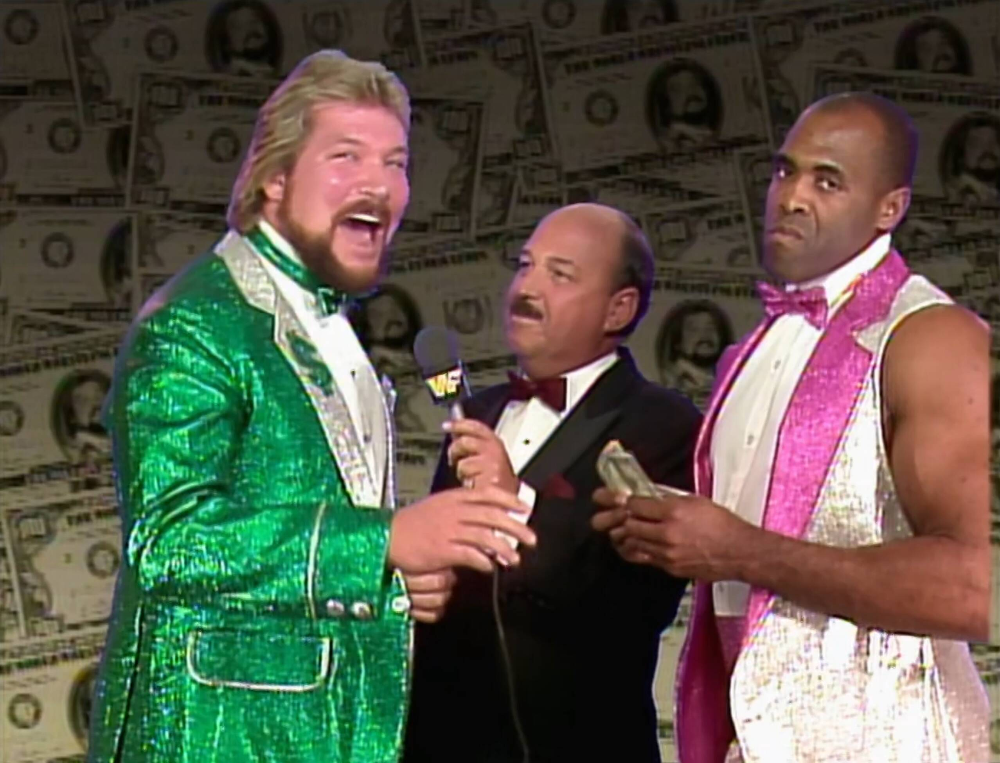

# Royal Rumble 1989

A Bizarre Spectacle Where the Madness Multiplies

> 💡Find all my Royal Rumble 1989 gifs [here on Giphy](https://giphy.com/channel/Integralist/wwf-royal-rumble-1989).

Picture this: it's January 15, 1989, and WWF’s newest creation, the Royal
Rumble, is in full swing. Held in Houston, Texas, this event took the concept of
“let’s just throw everyone in the ring and see what happens” to new heights.
Thirty wrestlers entered, one would leave victorious, and the rest would spend
the evening explaining why they were tossed out of the ring like yesterday's
laundry. The stakes were low, but the drama? The drama was through the roof, and
let me tell you—this event had it all: egos, mullets, body oil, and a whole lot
of spandex. Let's break it down in a way the '80s would appreciate: loud,
ridiculous, and unforgettable.

## Watch along notes

As with all my reviews (sarcasm aside) I always start with a _positive_ mindset
(i.e. "this is going to be awesome, I'm going to love watching this"). I think a
lot of reviewers have a preconception of whether something is going to be good
or not (based on their _memory_ of the event or just the more internet-recent
comments on these old events) and they let that affect their review. When really
they should watch the event back like they were kids and try to recall the
things they loved about wrestling. I try the best I can to suspend disbelief,
although I'm guilty of being a smart mark at times.

## Intro

I love the original graphics for "what the world is watching" and the flashing
WWF logo.\
But the music they dubbed it over with is ...interesting.

Yes, I love this already...\
Vince talking over the classic "square" animation of all the participants in the
Rumble.\
With the sleazy saxophone music. Just pure
nostalgia.

Gorilla and Jesse on commentary. This is going to be great.\
The arena is full and the crowd is hot and loud.

Do you remember: "_it's gonna be a happening_"?\
Gorilla was selling this phrase constantly around this time.

> ⚠️  **NOTE:**
> I didn't bother looking at the card while watching this. So some of my
> comments (like you'll see in a moment) were based on genuine reactions.

## Dino Bravo and The Fabulous Rougeaus vs Hacksaw Jim Duggan and The Hart Foundation

OK, we're not _exactly_ starting off hot. With Dino Bravo and The Fabulous
Rougeaus.\
BUT! here comes the Hart Foundation's music + Hacksaw with them.\
OK, now I'm into it! I've become a real Duggan mark the last few years.

It's a 2 out of 3 falls match. Should be interesting.\
We already know the heels are going to get the first fall.\
But then again... who knows. We'll find out.

🤣 LOL to the crowd screaming "USA" to the Canadian team in the Hart Foundation.
🤦

I noticed Bret wearing some different type of shade?\
Not the original 80s aviators, nor the standard type of shades he would later wear.\
These were like ski goggles?

The two big hogs are starting off in Dino and the Anvil. The crowd pops like
crazy when they run into each other and no one moves.

I laugh because the crowd just popped like crazy for the Anvil clotheslining
Dino. You'd never see a clothesline in today's wrestling.

Hacksaw tagged in and boy the crowd erupts. Even if this match ends up being
terrible you can't deny this crowd. A good crowd can literally make a show
special.

Oh man, Bret is so cool and so agile. He gets Raymond tied up in the smoothest
looking small package, followed straight afterwards with a sunset flip. Jacque
had a nice back flip roll over Bret but Bret nails him with a clothesline while
he's showing off. Nice solid work from Bret (as always).

Oh my, a three man battering ram situation in the corner! This is fun stuff.
They're really off to a good start.

Dirty tactics give the momentum to the heels (Bret straight over the top
rope).\
Dino nails his finisher, the side suplex,\
followed by the Rougeaus' finisher, and the first fall goes to the heels.

Hacksaw gets the crowd fired up again with USA chants and Raymond nails a
beautiful gut wrench suplex. Ooh, always loved Bret sternum bump into the
corner. Looks so devastating. Don't know how he didn't hurt himself with that
bump.

Interesting. Dino has a bear hug on Bret and while holding him, bends over so
Bret's shoulders were down on the mat so the ref could try counting a pin.

Looked like a bit of a botch. Bret comes off the ropes not knowing what he's
doing and Dino misses a clothesline and Bret sells like he got hit even though
it wasn't even a glancing blow.

Bret manages to get the tag but the ref wasn't looking so although the crowd
goes nuts the ref pushes the Anvil back out again. That spot still annoys me
because the ref always conveniently would allow a heel team to get away with a
tag when he didn't see it because he'd claim he "heard" the tag happen. Such
utter nonsense. Hate this spot. But then again, I guess I'm the mark for falling
for it. It's doing its intended job of making me (the audience) be enraged.
It'll thus make the hot tag even more sweeter. So I guess I can't complain.

Jacque does a dirty heel move of slapping Bret in the face multiple times.
Good heat.

Wow, the biggest atomic drop I've ever seen and OMG the crowd popped like I've
never heard. The ROAR of the crowd was immense.

Bit of a botch where Bret has the heel covered but then bails for Hacksaw to
get the pin. Man this crowd is into this big time.

Funny watching Hacksaw swinging fists like a lunatic while being dragged to
the heel corner.

Sneaky Hacksaw nails Dino with the 2x4 and Bret gets the win. The crowd goes
nuts.

**RATING: 8/10**\
This was a great match.\
I highly recommend you find time to watch it.\
Good fun, good energy, with good characters involved.

## Number Picking Segment

Next up we get a classic 'number picking' segment with a big spinning barrel for
the wrestlers to stick their hands inside of to pick out their entry number. We
start with Ted DiBiase who is clearly not happy with the number he drew, and so
he starts to chat with Slick about whether he's happy with the number his guys
(i.e. The Twin Towers) pulled. Obvious to everyone watching, Ted's going to try
and buy a better number from Slick.

A bunch of great characters are shown picking their numbers:\
The Honky Tonk Man, The Bushwhackers, Bad News Brown, Jake the Snake Roberts,
The Rockers.\
I love that the Bushwhackers swap their numbers 😂

## Rockin Robin vs Judy Martin

Oh man, the hillbilly music overdubbed on this entrance for Rockin' Robin is
just horrific.\
This bouncy baby face is so cringy, and somehow she's the champion?\
Well, I guess we'll see what happens. Maybe she'll surprise me with some
incredible charisma and in-ring talent.

Oof, she's up against what can only be described as a back-street biker chick
bar brawler in Judy Martin.\
This might be a rough match (in every sense of the word).

Sherri Martel is in the ring as well, and she is an awesome talent, so I'm
pleased to see her there.\
She's taking the mic and is likely going to be the
best thing we see in this match.

> 💡 **NOTE:**
> This is the first I've actually noticed the classic purple Royal Rumble ring
> apron. So cool and nostalgic.

OK, Sherri didn't tear the house down with that promo. She sounded more like a
5 year old spoilt brat with the way she was talking. Didn't go over as well as I
would have hoped. Especially considering how good she would go on to become not
long after this.

Action already started in the ring and immediately looks like Rockin' Robin
doesn't know how to work or sell. She's just taking straight shots from Judy
Martin and no selling them at all (but not in an obvious "I'm too tough for you"
kinda way, just looks odd like she doesn't know what to do).

Bonus! We're getting Sensation Sherri on commentary with Gorilla and Jesse.
This could perk the match up a bit, as right now Robin and Judy both look a bit
of a joke in the ring. One's over the hill and the other isn't seasoned enough.

Nice cross body catch by Judy Martin. She struggled with it but held it and
slammed her hard down to the mat.

Oh my, Robin gave the worst boston crab I've ever seen.

Judy pulled a pretty sloppy small package. Robin had an interesting counter to a
suplex... she just lands on her feet.

Commentary isn't great from Sherri but it's definitely helping me through this
match.

Robin hits a DDT. Not sure if her (real) brother Jake the Snake allowed her to
steal his move. Either way it didn't get the job done.

A lot of back and forth between these two. Sherri throws our a great line in
"come on somebody win", and then Robin tricks Judy and catches her with a
crossbody off the second rope for the win.

**RATING: 3/10**\
The only reason this isn't a straight up 1/10 is because of Sensational Sherri.

## Ads and Promos

Nice shot of some classic LJN wrestling figures, including Jesse The Body
Ventura and Macho Man.

Add for WrestleMania V pops up. Very colourful.

Excellent. We're getting a promo/interview with Slick and The Twin Towers. I
loved this tag team as a kid. Big and nasty and could easily do a lot of damage
to you. I loved the heel Big Boss Man much more than when he was a baby face,
and Akeem was just so much more fun compared to his original One Man Gang
gimmick. Mix them with Slick and you got a winning combination.

## The Super Pose Down

The Fink introduces Mean Gene for the "super pose down" between The Warrior
and Ravishing Rick Rude.\
Again, they're dubbing over Rude's music. So much so you can't hear the
commentators.

I'm such a mark for Rude. I love that he has an iron bar for getting an extra
pump.\
The Warrior's music hits and here he comes...

Jesse is on fire with the commentary during this segment.\
So is Bobby The Brain Heenan. Such a weasel trying to suck up to the crowd.

Rude's in amazing shape but his biceps just aren't up to the Warrior's level.\
Even by Rude's own definition his biceps are too round, no peak like the
Warrior.

Of course we're getting oil for Rude's abs.\
They're incredible. Rude wins as the Warrior is too thick.\
Of course the crowd is booing the Hell out of Rude and loving the Warrior.

"Remember Houston, we love ya". Bobby was a genius. Heat magnet.\
Boy, Rude looks like he's going to explode on the most muscular pose.\
But let's face it, this pose was always going to go to Warrior.

The Warrior botches Bobby's spot where he sprays oil in his face.\
I think Rude makes him pay for the mistake!\
As it looks like he _kills_ Warrior with that shot to the back of the head.

I know some people would have preferred a match between these two,\
instead of a pose down, but man this was just good old fashion pantomime fun.

## Promos

Nice. More promos. First we get Mr Fuji for the Powers of Pain. Then Elizabeth
who is managing the Mega Powers, and she skirts around who she's supporting.
Jimmy Hart is next for the Honky Tonk Man and Greg The Hammer Valentine.
Interesting, we only see the managers though, we don't see the wrestlers.

## King Haku vs King Harley Race

Time for King Haku. Such a cool gimmick for him. But Harley walks swiftly in to
no music and dumps Haku off his throne and starts battering him in the ring. I
never like Harley Race in WWF as he was way past his physical prime and didn't
look much of a threat.

Oof, Haku gives the loudest chop on Harley.\
Bobby is supporting both guys so he's changing back and forth between who he
wants to win (which is usually whoever IS winning).

They're both heels so the crowd doesn't know who to root for.\
But they seem to be leaning towards Harley. This isn't a terrible match.\
Commentary is holding it together and keeping it interesting, but wrestling wise it's a basic slug fest.

Reverse thrust kick and Haku wins it. Crowd is dead.\
This match up was weird and generally not good.\
Not sure what this means for Harley, maybe it was his way out of the business.

**RATING: 5/10**\
The match is _OK_. The commentary definitely keeps it from being a train wreck.

## Promos

Promo time. Brutus the Barber Beefcake cuts the drizzling shits of a crappy
long promo.\
Culminating in "the tools I need are at the end of these meat slabs boys".\
He doesn't even have a background logo, just a blue black gradient.\
What the hell Brutus. Great gimmick but awful promo.

Here we go we've got Greg the Hammer Valentine.\
A legend amongst legends when it comes to awful promos.\
At least he got a background.

The Powers of Pain spend all their time heavy breathing while Fuji rattles off
a load of nonsense.\
But hey, I love both Fuji and the Powers of Pain so I'm happy with this.

Oh boy, Big John Stud. The blandest one yet!! Trying so hard for the baby face
promo.

Mr Perfect next. Not a bad promo. This is pre-singlet so just a pair of blue
Speedos.

Freak out, freak out. It's the Macho Man. Oh yeah.\
To be honest, more rambling but he's such a character you kinda just go with it.

Mean Gene interviews The Million Dollar Man.\
Apparently, when you're rich you're as lucky as you wanna be.\
So the luck of the draw is clearly on his side.

The Heenan Family up next with Andre the Giant and The Brain Busters.\
Love how Andre just randomly looks at the wrong camera and forces them to switch
angles.\
Then he turns on The Brain Busters ...who just accept it (Understandably).

Hulk Hogan bright as a pineapple with a fresh haircut.\
Talking about taking care of The Twin Towers and Andre the Giant.\
Hulk looking jacked. Classic HULK RULES top reminds me of his first Hasbro
wrestling figure.\
Bizarrely he cuts a heel promo on Macho Man.

## The Royal Rumble Match

The Fink has such a genuine smile when he introduces the Royal Rumble match.
He really did love his job.

No. 1 is Ax from Demolition.\
Annnd No. 2 is... Smash!\
Yes, they're heavily selling the "random" aspect of this match type.\
So cool seeing them going at it.

No. 3 is Andre! Whoa. Love that we got such a strong character this early.\
Really feels like anything could happen.\
Good booking too as Andre can be double teamed by Demolition.\
That sounds bad, but it means he gets to lie down a lot.\
Ax is also a good friend to Andre so a lot of trust there in looking after Andre.

No. 4 is Mr Perfect.\
Well he didn't get the perfect number this time (although in the 1990 Royal
Rumble he would).\
Now although he has always had the "perfect" gimmick since joining the WWF,\
for me, it doesn't _FEEL_ like Mr Perfect until he starts wearing the singlet.\
Here at the start of his WWF run he's just wearing boring blue trunks.\
It's like he didn't change his look at all from his AWA days.

And just like that Smash is eliminated by the giant!

Man it's brutal watching Andre getting beat up like this by two guys.\
More so because I know he's in a lot of pain in this period of his life.\
I wonder if some of the talent is taking liberties with him here or not.\
Probably not but it sure looks like some of those shots are landing stiff.

Andre almost headbutts Mr Perfect out of the ring.\
I love how Perfect would over sell for people.

No. 5 is Rugged Ronnie Garvin.\
The first 'nobody' to enter the ring. No one cares about him.\
But the crowd perks up when all the guys start lifting Andre up.\
Obviously he isn't going out like this.

The over selling for Andre was always so fun to watch, especially Perfect's
back flips.

No. 6 is Greg the Hammer.\
Boom straight after Andre. But Andre batters them all back.\
Out goes Garvin! With a big hip toss.

Great close up shot of Andre choking Ax in the corner.\
So menacing with those horrible teeth that he apparently NEVER brushed 😬

No. 7 is Jake the Snake and oh boy Andre just dominated him completely.\
No offence at all. Again, great camera angles upwards making Andre look even bigger.\
Choking Jake out with the bottom rope and then stepping on his stomach.\
Then choking him with his singlet strap, and boom Jake's out! That was just brutal.

No. 8 is The Outlaw Ron Bass.\
Completely bald because he just finished a feud with Brutus the Barber Beefcake.

I gotta say, Andre is doing really well moving around considering the pain he
would have been in at this time.

No. 9 is Shawn Michaels and the women in the crowd SCREAM for him, and loudly!\
Soon after Mr Perfect eliminates Ax.

Whoa, Shawn thrown over the top rope by Mr Perfect but he manages to scramble
back inside by "skinning the cat" (how the hell did they name that move?) and
then he takes it to Perfect and almost eliminates him with a dropkick.

No. 10 is Butch the Bushwhacker but straight behind him is Jake with his snake
and Andre eliminates himself as he's terrified of snakes. Years later when Macho
Man would ACCIDENTALLY eliminate himself by jumping over the top rope (something
that was just part of his regular set of moves) they would claim he was still in
the Rumble because you can't eliminate yourself 😒

Andre going out is a big deal!\
He was a strong contender to win (kayfabe that is).\
No. 11 arrives and it's my man The Honky Tonk Man!\
Come on Honky! Love this guy.\
It's good to see Perfect attacking Honky.\
Unlike the 1988 Rumble where no baby faces fought each other or heels either.

Rhythm and Blues (before they were officially named that) almost have Shawn
out.\
Next Mr Perfect almost throws out Honky and the crowd is going nuts.\
They love to hate Honky.

No. 12 is Tito (Chico) Santana. Someone I've only come to appreciate in recent
years.\
As a child I just thought he was so boring.\
I didn't realise what a great worker he really was (similar to Jim Duggan).

Huge backdrop from Ron Bass on Shawn Michaels. He was always good at getting
air.

No. 13 is Bad News Brown.\
He arrives and immediately blends in.\
No big spots, just lost in the shuffle of bodies.\
Feels like a waste of an entry to be honest.

Then from out of nowhere Honky is out! Noooooo.

No. 14 is Marty Jannetty, so know we have The Rockers let's see what damage they
do...\
BOOM! Double dropkick eliminates Ron Bass.\
It's funny because Mr. Perfect almost screws up the spot by punching Marty in
the boob 😂

No. 15 is the Macho Man!\
In he comes with bandana and sunglasses.\
Quick as lightning, and so bright and colourful.\
The crowd is going crazy for Macho.

Just as No. 16 arrives (Arn Anderson), out goes The Hammer by the hands of Macho.\
Then Macho teams with Arn to eliminate Shawn Michaels!

No. 17 is Tully Blanchard, so now we have The Brain Busters in there.\
No teaming up though surprisingly? That's a missed opportunity.\
We get there eventually though with a beautiful spine buster followed with double elbows.

No. 18 is Hulk Hogan, straight to the rescue of Macho.\
Eliminates Perfect, then starts battering Bad News.

No. 19 is Luke the Bushwhacker. But out goes Butch.\
Now Macho and Hulk trying to dump out Bad News.

No. 20 is Koko B Ware. Looking Hella colourful with red yellows and blues.\
Luke Bushwhacker is all over Hogan, which is an interesting pairing.

Hogan eliminates both Koko and Luke! Then both The Brain Busters!\
Now the Warlord (No. 21) who's only just arrived!!\
Now Hogan clears both Bad News and Macho! Macho is hot about this.

Down runs Elizabeth to sort them out.\
They shake hands and here comes No. 22 Big Boss Man.

Love the commentary. Jesse is amazed that Boss Man is getting the better of
Hogan.\
While Gorilla tries to defend Hogan by saying he's been out there a half hour.\
But Jesse's having none of it and saying:\
"_oh don't be ridiculous, Hogan's been out there about 5 minutes_".\
Brilliant stuff.

Uh-oh. No. 23 is Akeem. That means The Twin Towers can double team Hogan.\
Annnd Hulks out! But Hogan (the heel he is) pulls out Boss man!

No. 24 is Brutus and Brutus jumps Akeem from the outside.\
Boss Man is allowed back in and Hogan again is behaving like a heel and causes Boss Man to be eliminated.

No. 25 is The Red Rooster and no one could care less.

No. 26 is The Barbarian. BEEEEEEF!\
He stupidly stops Rooster and Beefcake from eliminating Akeem, but then _attacks_ Akeem?\
He should have helped get out Akeem.\
Or maybe he's much smarter than I realised?\
Because if he helped eliminate Akeem, then he would've had two baby faces in the ring with him.\
So it's likely they both would double team him.

No. 27 is Big John Studd. The crowd is dead for his arrival.\
They don't give a shit. Understandable. He's just so bland and boring.

No. 28 is Hercules. A little pop for him but he's hardly a mega star.\
So it's a real rag tag group of guys in there.

No. 29 is Rick Martel.\
Man this really is a strange mid-card range of talent to finish up this Rumble.\
We know Ted DiBiase is 30 and he's the only top-of-card talent.

No. 30 arrives but surprisingly is an underwhelming entry.\
The crowd doesn't really care.\
Ted gets to work eliminating the Rooster. But he takes a whooping from Hercules.

Hercules and Brutus go out at the same time thanks to the Barbarian and
DiBiase.

Martel takes a beating from Barbarian but surprises everyone by eliminating
him!

Akeem catches Martel and dumps him out. Leaving DiBiase, Akeem and Studd.

Akeem accidentally squashes DiBiase and is then eliminated by Studd.\
Studd gives Ted a nasty looking clothesline where Ted folds back up on his neck.

Just like that Ted's out.\
Big John gives Virgil a pasting too.

The crowd is up and cheering and clapping.\
But this was definitely a strange person to choose for the Rumble winner.\
And that's it. We have a montage to wrap us up.

**RATING: 8/10**\
All in all this was a good Royal Rumble.\
Very nostalgic with lots of classic characters and story lines.\
I strongly recommend watching this back with a few drinks.\
Kick back, relax and enjoy a couple of hours of old skool fun.

## The Aftermath: A Beautiful Mess of Wrestlers and Their Futures

So what came out of this chaotic royal mess? Well, for starters, Big John
Studd’s victory didn’t amount to much. He would soon fade into the background,
proving that not every Royal Rumble winner is destined for greatness. Meanwhile,
Hulk Hogan and Randy Savage’s Mega Powers would continue to implode, leading to
one of the most dramatic matches in WrestleMania history later that year.

Andre the Giant’s fear of snakes became a thing (as it should), and Jake Roberts
would continue terrorizing people with his reptilian sidekick. Ted DiBiase, the
Million Dollar Man, didn’t let his Rumble loss get him down. After all, when you
have that much money, does losing a wrestling match really matter?

The Royal Rumble itself would go on to become one of the WWF’s most beloved
traditions, a place where careers could be made (or broken) in the span of one
chaotic hour. Sure, the Rumble was a spectacle—one giant, sweaty mess of bodies,
egos, and bad decisions—but isn’t that what we loved about it?

## The Nostalgia: Why We Love the Royal Rumble

Looking back at Royal Rumble 1989, it's impossible not to feel a wave of
nostalgia. This was WWF at its campiest, its loudest, and its most fun. The
Rumble wasn’t about subtlety or technical mastery—it was about personalities. It
was about watching the cartoonish characters we grew up with getting tossed over
the top rope in the most dramatic fashion possible.

Sure, wrestling has changed a lot since then. But there’s something about these
early Rumbles that makes you smile. It was simpler, more over-the-top, and
honestly? That’s what made it magical. No matter how many times you watch Hogan
flex, Macho Man rant, or Andre glare, you still feel the joy of a bygone era. An
era where it was totally normal to see a snake terrorizing a 7-foot giant, or a
grown man swinging a 2x4 like he was trying to fix a barn in the middle of a
wrestling ring. And we loved every second of it. The Royal Rumble was the
ultimate playground for these larger-than-life personalities, a place where egos
collided, friendships were betrayed, and alliances were as flimsy as Rick Rude's
tights.

Looking back at Royal Rumble 1989, it's clear that this was more than just a
match—it was an experience. A moment in time when wrestling wasn't trying to be
anything other than a ridiculous spectacle, and we as fans weren't asking for
anything more. The drama, the chaos, the sheer unpredictability—it's what made
us tune in, and what still makes us rewatch it all these years later.
