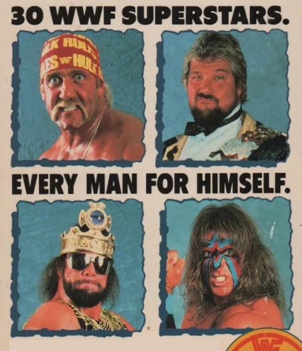

# Royal Rumble 1990

The Event Where Everything (and Nothing) Happened

The Royal Rumble of 1990 was everything you'd expect from WWF in this glorious
era. It was over-the-top, chaotic, and sprinkled with enough mullets and
outrageous fashion to make even the most seasoned wrestling fans cringe with
joy. Let's dive into this wild ride, match by match, and embrace the glorious
absurdity that was the Royal Rumble 1990.

## Watch along notes

As with all my reviews (sarcasm aside) I always start with a _positive_ mindset
(i.e. "this is going to be awesome, I'm going to love watching this"). I think a
lot of reviewers have a preconception of whether something is going to be good
or not (based on their _memory_ of the event or just the more internet-recent
comments on these old events) and they let that affect their review. When really
they should watch the event back like they were kids and try to recall the
things they loved about wrestling (suspend disbelief and don't be such a smart
mark).

Below you'll find a quick summary of the match in my sarcastic approach,
followed by more honest bullet point thoughts.

## Intro

**Watch along notes**

- Great opening with Vince's voice roaring out each competitor's name.
- Love the old school visuals of all the wrestlers in-action while this
  happens.
- The crowd is very excited for this event! They can be a bit up and down, but
  for the most part they're HOT for the Rumble.

## Paul Roma vs. The Brooklyn Brawler (Dark Match)

Before the main card kicked off, the fans in attendance got to witness the
legendary (okay, maybe that's a stretch) Paul Roma square off against The
Brooklyn Brawler in a dark match. Ah, the Brawler — the man who made losing an
art form. Roma pulled off the victory, not that anyone noticed or even
remembered five minutes later. It was the warm-up act that screamed, "We’re
setting the bar low, folks, so you can only go up from here!"

**Watch along notes**

- This was a dark match so I didn't get to see it (thank God!).

## The Bushwhackers vs. The Fabulous Rougeaus (with Jimmy Hart)

Next, we had The Bushwhackers — the masters of unorthodox, bizarre offense —
facing off against The Fabulous Rougeaus, who were more "fabulous" in their
matching outfits than in their chances of winning this match. Jacques and
Raymond did their best to keep things classy with their French-Canadian charm,
but let's be honest: they were no match for the licking, arm-swinging mayhem
that Luke and Butch brought to the ring. The Bushwhackers bumbled and stumbled
their way to victory in a match that was about as technical as a barroom
brawl... and somehow even more entertaining.

**Watch along notes**

- The Rougeaus are great heels.
- I didn't understand why when I was a kid, but as an adult I totally get it.
- Man oh man do these people LOVE the Bushwhackers.
- I should add that Jacque looks strange sporting a full beard.
- This is the only time I recall him having one and it looked so odd
- A bit like a child had glued on a fake beard to their face to make
  themselves look grown up.
- Jacque also looks a bit out of shape, but that said this is the end of their
  run in the WWF.
- Match begins, as you would expect, with LOTS of silly antics and biting
  (they wouldn't stop with the biting).
- The crowd goes nuts whenever Jimmy Hart gets attacked. He was so good for
  getting heat. I love it.
- This was a long match but to be fair it wasn't that bad! It was in fact
  quite entertaining.
- When the Bushwhackers win the crowd erupts with joy. This crowd is digging
  it.
- Seems like everyone has forgiven (i.e. forgotten about) Danny Davis the
  crooked ref from 1987.
- Before we move to the next match we get a Million Dollar Man interview.
- Funny hearing Mean Gene give Ted grief about not being able to _buy_ the
  number 30 spot again this year.
- Ted then messes up and says "opportumity" 🤣

## Brutus Beefcake vs. The Genius (Double Disqualification)

Oh, what a spectacle. Brutus "The Barber" Beefcake, with his clippers and
obsession with hair, took on The Genius, whose poetic insults were as sharp as
his airbrushed robes. This match was a collision of style and substance —
except, it had no substance. It ended in a double disqualification because, of
course, it did. You can’t have two titans of nonsense clashing without it
devolving into chaos. Beefcake tried to give The Genius a haircut post-match,
and while he didn’t succeed, he did solidify his reputation as the WWF’s own
Edward Scissorhands.

**Watch along notes**

- The crowd HATES the Genius. He's got some good heat here.
- Unsurprising really considering his gimmick.
- I never liked the Genius, not because he was a heel but because he was
  boring.
- Unfortunately, watching this back as an adult hasn't improved the situation.
- Brutus' music hits and out he comes cuttin' and struttin' and the crowd goes
  wild.
- It's been said on various shoot interviews and podcasts before, but Brutus
  is MEGA OVER!
- There's been a lot of great crowd shots so far. Really cool getting high
  views of the packed out arena.
- Now I'm an 80's kid so I'm not sensitive, but Brutus making fun of the
  Genius being gay would not fly today.
- The Genius plays up the camp character and I just find it irritating.
- It's really affecting my enjoyment of the match.
- End of the match Brutus cuts the Genius' hair and I recall Macho Man (his
  real-life brother) was HOT about this.
- Apparently Brutus cut a little too much off and Randy thought he had taken
  advantage of his brother.
- And here comes my hero, my fav heel Mr. Perfect to save the day.
- Oof, those chair shots to the ribs actually look pretty nasty.
- I loved Perfect's outfit but always hated when the arrow on the back had
  split colours (just looked shit).
- I'm glad this match is over.
- Before we move to the next match we get a Heenan Family interview.
- We get Ravishing Rick Rude (him and Perfect were my favourites) and The
  Colossal Connection (Haku and Andre).
- Heenan is hilarious trying to stop everyone fighting over who will win the
  Rumble.
- Rude is in _phenomenal_ shape, the best I've seen him.

## Ronnie Garvin vs. Greg Valentine (with Jimmy Hart)

Now, here’s a match for the purists. Ronnie Garvin and Greg "The Hammer"
Valentine put on a hard-hitting slugfest that had fans wondering if they were
watching a wrestling match or an attempt to break every bone in their bodies.
This wasn’t about high-flying antics or fancy maneuvers; it was about Garvin and
Valentine pounding each other into oblivion. After what felt like an eternity of
stiff chops and leg locks, Garvin picked up the win, leaving "The Hammer" to
regroup and, presumably, seek medical attention for his battered limbs. A true
'wrestling clinic' for those who enjoy watching two guys clobber each other
until one falls down.

**Watch along notes**

- Now I'm really going to try and enjoy this if I can. On paper it sounds like
  garbage though 😬
- You gotta remember at this time the WWF had so many cool characters. Ronnie
  nor Greg had _any_ character/personality.
- Of course The Fink has to explain the rules of the submission match.
- Shame the wrestlers weren't paying attention because for some reason they
  keep forgetting.
- To add to the drama Ronnie is wearing a "Hammer Jammer" (a shield around his
  leg to protect against the Figure 4 leg-lock).
- The crowd is _noticeably_ quiet!
- Yup, you guessed it, each wrestler attempts pin-falls _multiple_ times
  during this "submission" match 🤦
- On the plus side they beat the living piss out of each other (that's old
  school _wrasslin'_ for yer).
- It's all for naught though as the crowd just doesn't care.
- If the crowd wasn't dead then this match would be better because of the
  stiffness and brutality.
- The constant pin attempts is actually getting a bit annoying now.
- Interestingly, right at the end the crowd FINALLY gets into the match.
- Maybe it's the promise of an end in sight.
- Before we move to the next match we get a Mr. Perfect interview (YES!).
- Interestingly Mr. Perfect comes across as a hero for saving the Genius
  (which makes sense to me).
- I mean, think about it... Brutus is a bit of a dick for taking advantage of
  people when they're asleep.
- Of course Mr. Perfect pulled the "perfect" number.
- Not sure if Mr. Perfect is trying out some new schtick but the hair throw
  seemed a bit out of place and weird.

## Brother Love with Sensation Sherri

**Watch along notes**

- Brother Love was one of those characters I used to find so boring, but I
  would love the guests on his show.
- I definitely enjoy watching him more now as an adult but he can still be a
  bit grating sometimes.
- Out comes Sherri who just looks smoking hot. Wow. As a young boy watching
  this... less we say the better.
- But seriously, Sherri was an INCREDIBLE talent. She could work, she could
  talk, she could bump her ass off. One of the best without question.
- I loved her gimmick with the Macho King. Those two went so well together
  because they're both nuts!
- Out comes Sapphire and the crowd pops initially but quickly chills.
- Brother Love and Sherri bully Sapphire for the next 5 minutes which loses
  its humor after a while.
- Of course Sapphire has enough and batters Sherri and in runs Macho King (my
  man).
- The crowd cheers for her slap.
- The hot pink and baby blue colours Macho is wearing is epic! Pure nostalgia.
- Big dust comes out but doesn't manage to grab Macho.
- But Brother Love gets what's coming to him.
- Oof, Brother Love gets thrown out HARD and FAST!
- The crowd is eating up Dusty and Sapphire dancing. It is good fun
  (especially with the music). I'm into it.
- LOL to Jesse's comment "don't we have an interview we can go to".
- Before we move to the next match we get interviews with both Hacksaw and the
  Boss Man.
- Hacksaw can barely speak (he literally trips up over himself) and yet he
  makes it work as part of his enthusiastic character.
- Although it's a bit of a hokey interview, kids of the time will love it
  because it's an infectious sort of energy.
- I'm kinda thankful that it's a short promo.

## Jim Duggan vs. Big Boss Man (with Slick) - Disqualification

Hacksaw Jim Duggan and Big Boss Man... oh boy, this was the collision of
America’s finest: a 2x4-wielding patriot and a nightstick-swinging lawman. It
was a bout filled with shouts of "HOOOO!" and, of course, Duggan's trusty piece
of lumber. The match had everything you'd expect: brawling, taunting, and
Duggan’s trademark goofy grin. It ended in a disqualification, because why not?
Apparently, following rules just isn’t Duggan’s style. Boss Man may have lost
the match, but he kept his pride... and his nightstick, which, let’s be real,
was probably the real winner here.

**Watch along notes**

- We hear the amazing theme music for the Doctor of Style "Jive Soul Bro".
- Wow, the Boss Man has SWEATED out his shirt. It's like two rivers coming out
  his armpits.
- Duggan is mega over. It's a shame his character from 1988 died after the
  incident with The Shiek. He could have been HUGE.
- HOOOOOOOOOO! This match is all about that one call.
- I definitely appreciate Duggan more now than as a kid. I thought he was a
  bit boring when I was little.
- What people don't realise is that Duggan from 1988 is actually different
  from the Duggan of 1990.
- It's not a MASSIVE difference but the character became very dumbed down to
  the point that he just became a joke.
- In 1988 he was seen more as a 'common man' and was a real threat. The Duggan
  here is just a goof ball (bit sad).
- Now this is actually quite a stiff match with some good hard bumps.
- I like that the ref is just letting them go at it.
- Shame that Boss Man would turn baby face after this as I loved heel Boss Man
  and hated the goody two-shoes.
- He also became thinner as part of the baby face turn.
- I much preferred the fat version from 1988-1989 because he was much more
  scary and seemed more dangerous.
- There's not much screen time for Slick, which is a shame because he's
  awesome.
- Hmm, the match has really slowed down now. It probably could do with being
  shorter.
- Oof, this bear hug is killing the pace and my mood.
- Interestingly the crowd is coming alive again, they're dedicated for sure!
- Boss Man gets disqualified. That's a lame ending.
- I always loved how Boss Man twirls his nightstick. Just looked badass.
- Of course Duggan still gets over with his 2x4.
- The crowd goes nuts when he nails the heels.
- Duggan genuinely looks to be happy to be here and is smiling at the crowd,
  which was a nice camera shot.
- Before we move to the next match we get a bunch of promos from the
  superstars participating in the Rumble.
- Oh boy Dino Bravo is such a shit promo guy. Absolute hot garbage.
- I love seeing Earthquake as his original incarnation: The "Canadian"
  Earthquake. Pure nostalgia.
- Demolition next and they're always fun to watch a promo for.
- I always liked Bad News Brown's promos, especially his bulging eyeballs
  gimmick.
- Awesome Dusty Rhodes promo. So much fun.
- The Rockers are ALWAYS a shit promo and they totally just killed the
  surprise aspect by letting everyone know they're not going to fight each other
  (clearly they're too far apart in the draw and on top of that they don't expect
  to be in there long enough to see each other).
- Also the camera lingers too long and you see Marty look to his side and his
  smile starts to drop as he waits for someone to shout CUT.
- Hercules isn't horrific but definitely a bit naff. He looks swollen, and I
  love his fuck up: "rumble royal".
- I loved The Model Rick Martel gimmic. Such a great heel, but that mullet was
  so bad.
- Tito is a shit promo. I appreciate his in ring talent more nowadays as an
  adult, but he sucked at promos.
- Wowza, Jimmy Superfly Snuka didn't half talk some crazy shit.
- Akeem is just happy to be there and I love hearing slick talk.
- oh god, as a kid I would have lost my mind at seeing the Ultimate Warrior.
  But as an adult, I'm dreading it and his stupid rambling. That said his hair
  looks great today! This is all about Hulk Hogan and WrestleMania 6.
- The Macho King is such a bad ass gimmick/character. His crown and glasses
  are just epic (so colourful).
- I loved the Powers of Pain as a kid. But their promos show how important a
  manager (Mr. Fuji) is to their success. Even if he doesn't do _that_ much and
  just cackles.
- Jake the Snake cuts a good promo, really selling the challenge of the Royal
  Rumble. I love his line "Now that sounds a lot like me".
- The Hart Foundation is the classic promo where the Anvil is just going nuts
  and Bret Hart tells him to "mellow out". The Anvil's laugh is just so iconic.
- Oh boy, I really do LOVE the Honky Tonk Man gimmick. So so so good. The line
  "I'm gonna play 29 hits and lay down some mean tunes" `:chef-kiss:`.
- Hulk promo: tanned ✅ greased up ✅ bicep veins popping ✅ "HULK RULES"
  bandana ✅ this is it boys and girls: nostalgia! But in reality... his eyes look
  tired man, especially when they zoom in. He needs a rest. Gotta love the line
  "rumbles all over you".

## The Royal Rumble Match: Hulk Hogan Stands Tall... Again

Now, the moment we’ve all been waiting for: the Royal Rumble itself! Thirty men
entered, each one trying to toss the others over the top rope while finding time
to throw in a flex or two. There were epic showdowns, unexpected alliances, and
a fair share of backstabbing. The ring was crowded, the energy was electric, and
then, like the tide rolling in, here came Hulk Hogan. You could almost hear the
theme song: "I am a real American..."

One by one, Hogan eliminated opponents with ease, even tossing out people who
were technically still posing after their entrances. The final showdown saw
Hogan squaring off with Mr. Perfect, who, to his credit, tried to steal the
spotlight with his flawless dropkicks and arrogant smirk. But it was all for
naught. With a mighty toss, Hogan sent Perfect flying over the ropes and into
the annals of Rumble history. Hogan then posed and flexed for the crowd, because
of course, this wasn’t just about winning; it was about reminding everyone that
he was the one and only, larger-than-life hero of the WWF.

**Watch along notes**

- YES. The feels when the fink says "It's NOW TIME for the ROYAL RUMBLE!!" and
  hearing him explain the rules. This is a CORE MEMORY and integral part of my
  childhood.
- Wait, wat!? No music??? Bit underwhelming for the Million Dollar Man's
  entrance.
- Interestingly the crowd is sort of dead at this point? Maybe because there's
  no music to hype them up?
- The Birdman's music hits (that's more like it) and the crowd perks up (this
  shows the importance of music in the presentation!)
- Man, Koko is so small but stocky as Hell.
- His blonde hair and face paint looks awesome, that was a nice evolution for
  his character.
- Koko's out here just calling spots right in front of the camera 🤦
- Koko is an idiot with his elimination. Why just run straight at the bad guy
  leaning on the ropes? From a Kayfabe perspective I just don't understand why he
  would take that kind of risk?
- The crowd goes nuts for Marty Jannetty's music. Classic yellow tights too
  (reminds me of the Rockers Hasbro figures).
- What I love about this rumble is that the managers were allowed to stay at
  ringside.
- Early Rumbles were great because you really got to see two wrestlers match
  up who otherwise NEVER would have on TV or in other PPV's (like a tag team
  wrestler going up against Hulk Hogan).
- Marty has the same stupid elimination and jumps at the ropes.
- The crowd goes bat shit crazy for Jake the Snake's music (understandable as
  it's so epic).
- LOL, he heads straight outside for a bodyslam to the floor.
- Here comes the Macho King and oh boy am I getting all the nostalgic feels.
- Cool (and interesting) to see Shane McMahon as a ref outside of the ring.
- Macho's Hawaiian tights are so nuts and unusual, even for him.
- The crowd cheers for Roddy Piper's entrance. It's not a massive pop, not
  like Marty got, but they're definitely happy to see him.
- I never really cared for Roddy. Just found him annoying when he talked and
  cut promos and nothing about his character/gimmick was interesting to me.
- Piper keeps looking behind him as he's clearly planning a spot where he and
  Jake bump back to back into each other and pretend for a moment like they could
  end up fighting.
- Sherrie screaming like a maniac outside. Earning her pay cheque.
- The Warlord with Mr. Fuji arrives and you start to notice already how
  crowded the outside is with managers.
- The Hitman arrives in all pink (top and bottom) looking cool AF.
- Just look at all the colours in the ring. Pinks, blues, greens, oranges and
  more. It's just such colourful characters.
- Bad News Brown gets some serious boos when he arrives.
- Bad News goes straight for Bret like he's still upset at their rivalry from
  1988!?
- Macho King eliminates Jake. Just think of the back and forth those two have
  had over the years, and will have in the coming years.
- The crowd ERUPTS for Dusty Rhodes and of course he goes straight for the
  Macho King.
- Andre comes out and looks seriously menacing. Although... he struggles to
  even get into the ring.
- The Warlord does the job for Andre big time by bumping like a beast for him
  (made Andre look so strong when clearly he could barely move or work at this
  point).
- It's funny watching Bobby Heenan and Mr. Fuji arguing about Andre
  eliminating The Warlord. That's good shit.
- The Red Rooster gets zero reaction. Standard.
- Demolition Ax arrives to a reasonable reaction and he chops down Andre.
- Haku arrives with his classic Hawaiian tights. Nostalgic feels.
- Ax is a long-time friend of Andre so it's interesting to see Andre being so
  generous to Ax in the ring.
- Smash arrives almost unnoticed!?
- Akeem arrives and the first thing I notice is his long hair and he just
  looks really odd with long hair for some reason. But straight out the gates he's
  bashing Andre! I definitely didn't expect that.
- Demolition eliminates Andre and the crowd goes nuts.
- Superfly arrives and immediately eliminates Akeem.
- LOTS of Superfly "oooh oooh oooh" chants from the crowd. They're into it.
- The Earthquake finally arrives. Time for some beef.
- ...and boom Dusty and Ax are thrown out by Earthquake!
- Million Dollar Man still in there battling on. He's going for a record.
- Anvil and the rest of those in the ring immediately work to get out
  Earthquake and holy shit it looks like Dino Bravo (his buddy) was the final hand
  to throw him out! Nothing is ever said of it though?
- The crowd goes NUTS for the Warrior and his elimination of Dino Bravo.
- The Warrior fucks up a spot because he wasn't paying attention to people in
  the ring. He tried to throw Haku into a corner where wrestlers were and he
  stopped and didn't know what to do.
- The Model struts out. Give him a year and he'll make a Royal Rumble legend
  of himself.
- Haku eliminates Smash with a nice crescent kick.
- Here comes Tito coming for The Model. I've really come to appreciate him
  over the years.
- Virgil spotted cheating and keeping Ted in. Good heat there. Great booking.
- Honky arrives. What a set of characters in this rumble!
- The Warrior finally dumps out Ted with a big clothesline.
- The crowd ERUPTS for Hogan (surprise surprise).
- Snuka is straight out by Hogan.
- Hogan still has his bandana on while he dumps out Haku.
- Hogan and Warrior are about to be the only ones left in the ring. Surely the
  crowd can see what's coming? The anticipation must be growing in the audience...
- I've not tracked the time but wow this is a looooong "2 minutes" while we
  wait for someone to come out.
- Oh, ok, here comes Shawn Michaels lol. Too bad, thrown straight out by the
  Warrior.
- It's time. Hogan and Warrior. Everyone is very much into this!
- Lame double clothesline to get out of anyone having to lose to the other and
  lose their heat.
- BEEEEEF. Barbarian trots down to the ring and is just nailing both downed
  opponents.
- Rick Rude suddenly jumps into the ring out of nowhere and no countdown, the
  crowd is silent in their confusion. Must have been a fuck up sending him out
  early.
- LOVE Rude's tights here btw. Awesome nostalgia.
- Rude has never looked better!
- Hogan the forever heel helps eliminate the Warrior! and kayfabe would have
  you believe it was an accident.
- Jesse is ALL OVER THIS on commentary. Good! Hogan the mega-heel.
- Hercules is in. Wearing his old babyface blue trunks. Man desperately needs
  a tan!!
- Hulk stealing Hercs gimmick (the grab your head and shake your whole body
  hype up thing) or is that Herc stole Hogans? I'm not sure who did that more 🤔
- Hogan with a back rake on Rude. Seriously dude, what a dirty heel tactic!?
- Here comes my boy Mr.Perfect.
- Perfect wearing a beautiful orange singlet with the black triangle on the
  back. Classic.
- Barb goes out far too easily thanks to Herc. Embarrassing really.
- Rude nails Herc out of the ring.
- My two favs Perfect/Rude double teaming together but out goes Rude.
- I already know Perfect is going to try a Perfect Plex even though it's a
  stupid thing to do (kayfabe would has us believe it's to _soften_ up Hogan).
- Why Hulk gets Perfect IN the ring rather than out I don't know.
- Perfect over selling the post hit like he always did (professional, making
  sure Hogan got over).
- Perfect takes a _super dangerous_ bump out via the corner post.
- HOGAN MUST POSE!
- The fans are eating it up.

## The Aftermath: Nostalgia Wrapped in Madness

Royal Rumble 1990 was a perfect snapshot of WWF’s golden era. It had everything:
wild characters, disqualifications galore, and more flexing than a Gold's Gym
commercial. And sure, it’s easy to poke fun at the absurdities, but that's part
of the charm. Wrestling wasn’t about strict rules or technical prowess back
then; it was about heart, spectacle, and the sheer thrill of seeing who would
come out on top.

Hogan’s victory, Beefcake’s scissors, The Bushwhackers’ antics — they all
painted a picture of a time when wrestling was less about corporate scripts and
more about characters who were both ridiculous and beloved. And we miss that,
don’t we? It was an era where you could be a patriotic lumberjack or a poetic
genius and still find yourself center stage, battling it out in front of a crowd
that loved every second of it.

So, let’s raise a metaphorical 2x4 in salute to Royal Rumble 1990, a night when
the only thing that mattered was how loud the crowd cheered and how big the
personalities clashed. These matches, these moments, they’re etched in our
memories not because they were perfect, but because they were a blast. And isn't
that what wrestling is all about?
