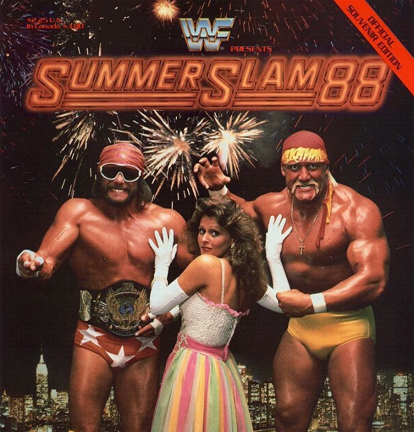

# SummerSlam 1988

The Heat, the Madness, and the Mullets

Ah, SummerSlam 1988—a simpler time, when men with face paint and wild haircuts
dominated the ring, and finishing moves were as subtle as a clothesline to the
face. This was the WWF in its glorious prime: bigger, louder, and overflowing
with muscles that defied anatomy. Welcome to SummerSlam’s debut, where the
action was hotter than Hulk Hogan’s tan, and the drama was thicker than André
the Giant’s headlock. Let’s dive into the madness.

{WATCH_ALONG_NOTE}

## The Build-Up: If You Thought the Outfits Were Bright, Wait Till You See the Drama

SummerSlam 1988 wasn’t just about matches—it was about alliances, betrayals, and
a few too many managers lurking ringside. The show’s main event pitted two giant
egos—Hulk Hogan and Randy Savage—against the colossal André the Giant and the
million-dollar man himself, Ted DiBiase. Throw in Miss Elizabeth’s strategically
short skirts, Virgil lurking like a forgotten sidekick, and Bobby Heenan
scheming away, and you had a perfect storm of melodrama.

### 1. **The British Bulldogs vs. The Fabulous Rougeaus: Time Flies When You’re Dropkicking**

The **British Bulldogs**, Davey Boy Smith and Dynamite Kid, showed up ready to
scrap with the dastardly **Fabulous Rougeaus**, Jacques and Raymond, who had
perfected the art of being insufferable. It was a solid back-and-forth match
with lots of action and even more mullets. Unfortunately, the match ended in
that most satisfying of wrestling conclusions—a _time limit draw_. Because
what’s more thrilling than watching a match for 20 minutes only to find out it
ends in a stalemate? But hey, at least the Bulldogs didn’t lose their hair along
with the match.

### 2. **Bad News Brown vs. Ken Patera: An Olympic Slam Dunk? Not Quite**

**Bad News Brown** wasn’t exactly known for his sunny disposition, and tonight
was no different. He faced off against **Ken Patera**, who, despite being a
former Olympian, was now just a guy trying to throw punches in spandex. Patera
gave it his best shot, but Bad News lived up to his name by knocking out Patera
and any hope he had of becoming relevant again. A real feel-good moment for
those of us who enjoy seeing Olympic athletes get schooled by guys with
questionable nicknames.

### 3. **Rick Rude vs. Junkyard Dog: Bobby Heenan Strikes Again**

**Rick Rude**, a man whose arrogance was only outmatched by his insistence on
flexing at every opportunity, took on **Junkyard Dog**, everyone’s favorite
chain-swinging, bark-imitating good guy. With **Bobby "The Brain" Heenan**
scheming ringside, you knew this wouldn’t be a fair fight. Sure enough, after
Rude tried (and failed) to seduce the crowd with his abs, JYD got disqualified
for hitting Heenan. Because in the world of WWF, protecting your manager from
getting slugged by a dog in a chain is apparently not allowed.

### 4. **The Powers of Pain vs. The Bolsheviks: The Real Cold War**

The **Powers of Pain**, Warlord and Barbarian—two guys who looked like they came
straight from an ‘80s action movie casting call—faced off against **The
Bolsheviks**, Nikolai Volkoff and Boris Zhukov, the WWF’s obligatory Russian
villains. Managed by the always-slick **Slick**, the Bolsheviks got a solid
beating from the Powers of Pain. Because if there’s one thing wrestling fans
love more than a powerful tag team, it’s a tag team with matching shoulder pads.
The Powers won the match, and the Bolsheviks probably spent the next few weeks
questioning their life choices.

### 5. **The Ultimate Warrior vs. The Honky Tonk Man: The Fastest Title Change in History**

What can we say about **The Ultimate Warrior** that hasn’t been screamed in a
barely-coherent promo already? The guy was a ball of energy, face paint, and
questionable life advice. When he stormed into the ring to take on **The Honky
Tonk Man**, the longest-reigning Intercontinental Champion (and part-time Elvis
impersonator), you just knew something was going to go down. Sure enough, the
Warrior destroyed Honky in about 30 seconds, because subtlety was never his
thing. Goodbye, Elvis jumpsuit—hello, Warrior madness.

### 6. **Dino Bravo vs. Don Muraco: A Clash of Meh**

**Dino Bravo**, Canada’s self-proclaimed strongest man (or was it most
forgettable?), squared off against **Don Muraco**, a guy who looked like he’d
been airlifted from the set of _Miami Vice_. There wasn’t much to say about this
match—except that it happened. Bravo picked up the win, and somewhere, someone
probably cared. But in a show filled with massive personalities, these two were
lucky they didn’t get forgotten in catering.

### 7. **Demolition vs. The Hart Foundation: Face Paint vs. Family Pride**

The tag team champions **Demolition**, known for their Mad Max-inspired face
paint and general disregard for human life, faced the **Hart Foundation**, Bret
"The Hitman" Hart and Jim "The Anvil" Neidhart. With **Mr. Fuji** and **Jimmy
Hart** causing all sorts of distractions, Demolition successfully defended their
titles, despite Bret Hart giving yet another wrestling clinic. The Hart
Foundation walked away without the gold, but with Bret’s technical wizardry on
full display, it was clear that bigger things were on the horizon for the
Hitman.

### 8. **Big Boss Man vs. Koko B. Ware: Who’s the Real Birdman?**

Look, **Big Boss Man** was basically your worst nightmare of a cop—overweight,
aggressive, and wielding a nightstick. But that didn’t stop **Koko B. Ware**,
the human version of a parrot, from giving it a shot. With his colorful tights
and his actual parrot, Frankie, cheering him on, Koko tried to take down the
Boss Man. Unfortunately for Koko, it was nightstick > bird, and the Boss Man
picked up the win, leaving Koko and Frankie to fly home in defeat.

### 9. **Jake Roberts vs. Hercules: Snakes and Chains, a Love Story**

**Jake "The Snake" Roberts**, the man who made reptiles part of his act, took on
**Hercules**, the guy whose primary personality trait was owning a giant chain.
It was a battle of the accessories: snake vs. chain. Jake, ever the master of
mind games (and the DDT), came out on top, sending Hercules and his chain back
to the gym for some reflection. Jake probably went backstage to whisper sweet
nothings to his snake, Damien, while we all wondered why we liked this guy so
much.

### 10. **The Mega Powers vs. The Mega Bucks: More Ego Than the Ring Could Handle**

And now, the main event—**The Mega Powers**, Hulk Hogan and Randy Savage, with
Miss Elizabeth standing awkwardly in the middle, versus **The Mega Bucks**, Ted
DiBiase and André the Giant, who collectively weighed more than most small
towns. This match had it all—Savage’s barely-restrained insanity, Hogan’s love
affair with flexing, and DiBiase throwing money around like he was trying to buy
a wrestling promotion. But let’s not forget André, whose primary move at this
stage of his career was “stand there and look intimidating.”

Miss Elizabeth, ever the wild card, played her role to perfection—by distracting
everyone with her _strategically removed skirt_ (a WWF first, and probably
last). This allowed Hogan and Savage to pick up the win, sealing their bromance
for the time being. But just like with Survivor Series, you knew there were
storm clouds brewing on the horizon—especially with Hogan’s habit of
overshadowing Savage at every opportunity. But for one night, the Mega Powers
ruled supreme, and Miss Elizabeth’s skirt was the real MVP.

## The Aftermath: Skirts, Betrayals, and Warrior Madness

SummerSlam 1988 set the stage for some of the biggest betrayals, rivalries, and,
of course, the **Ultimate Warrior's meteoric rise**. After obliterating the
Honky Tonk Man in under 30 seconds, Warrior catapulted himself into
superstardom, becoming the face-painted, neon warrior we all loved to imitate
(and probably pulled a muscle doing so). His reign as Intercontinental Champion
was just the beginning of a career filled with running, shaking ropes, and
speaking in riddles that only made sense to him—and maybe a few lucky fans.

As for the **Hart Foundation**, their near-miss with Demolition only solidified
Bret "The Hitman" Hart’s future as a singles star. While they didn’t win the
belts that night, Bret’s technical brilliance was undeniable. The seeds were
being planted for a future where Bret would become the best there is, the best
there was, and the best there ever will be. But, you know, he still had a few
years of getting hit by people in face paint to go through first.

The **Mega Powers**? Oh, we all know how that ended. Hogan couldn’t help but
outshine Randy Savage at every turn, and their seemingly unstoppable partnership
would implode in epic fashion by WrestleMania V. Savage’s growing jealousy over
Hogan’s endless flexing and Miss Elizabeth’s... uh, _attention_ would lead to
one of the greatest feuds in wrestling history. But on this night, they stood
united—two men with oversized egos and an insatiable hunger for the spotlight.
What could go wrong?

And let’s not forget the delightful **Rick Rude** and his constant posing. His
rivalry with Junkyard Dog may not have lasted, but it set the stage for his
future feuds with men like Ultimate Warrior and Jake Roberts. No one could wear
arrogance quite like Rick Rude, and his abs would continue to make appearances
in just about every match. They were practically a character of their own.

## The Legacy: Why SummerSlam 1988 Still Lives in Our Hearts (and VHS Collections)

There’s something about **SummerSlam 1988** that just hits differently. Maybe
it’s the unforgettable characters, the larger-than-life personalities, or the
sheer absurdity of the matchups. Or maybe it’s the way WWF perfectly balanced
drama, athleticism, and ridiculous outfits. From the Ultimate Warrior’s
explosive debut to the beginning of the end for the Mega Powers, this show set
the tone for what SummerSlam would become—_the biggest party of the summer_.

Sure, wrestling today has evolved—there’s more athleticism, fewer mullets, and
slightly less face paint (depending on the wrestler). But back in 1988, it was
all about the spectacle. You didn’t watch for five-star technical masterpieces;
you watched to see how many face-first stunners a man could take before he
started seeing double. You watched to see grown men in spandex settle their
differences the only way they knew how—by hitting each other with folding
chairs.

Looking back at **SummerSlam 1988**, you can’t help but smile. It was peak 1980s
wrestling, with all the melodrama, over-the-top characters, and neon tights that
came with it. And though we’ve moved on from some of the tropes (thankfully, no
more time-limit draws), the heart and soul of what made these events special
remain. SummerSlam ’88 wasn’t just a wrestling show; it was a wild ride through
the world of good guys, bad guys, and somewhere-in-the-middle guys with a
penchant for being sneaky.

So if you ever need a break from today’s polished, athletic-focused wrestling,
just throw on _SummerSlam 1988_. You’ll be treated to a time when wrestling was
simpler—when a well-timed elbow drop or a cheeky distraction from a manager was
all you needed to bring the house down. It was a beautiful mess, and we wouldn’t
have it any other way.

And remember—always watch out for Miss Elizabeth’s skirt. It could change the
course of history.
