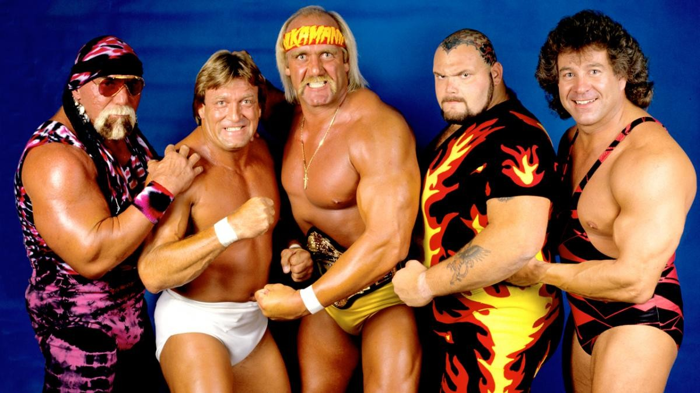

# Survivor Series 1987

When Giants, Glamour, and Glorious Mullets Collided

Ah, **Survivor Series 1987**—the event that introduced us to the wonder of a
pay-per-view filled entirely with elimination matches. If you’ve ever wondered
what it would be like to toss 50 wrestlers into a blender and hit "puree," then
you’ve come to the right place. This was the WWF’s first stab at the Survivor
Series format, and let’s just say: it was glorious chaos.

We had legends, up-and-comers, and a few characters who made you wonder if Vince
McMahon was just playing Mad Libs with jobber names. It was 1987, people, and
nothing made sense—especially the fashion. So, let’s dive into this spectacle of
oversized egos, questionable ring gear, and the purest form of melodrama
wrestling has ever known.

## Match 1: The Faces of Justice vs. The Honky Tonk Collective

_Brutus Beefcake, Jake Roberts, Jim Duggan, Randy Savage, and Ricky Steamboat
(with Miss Elizabeth) defeated Dangerous Danny Davis, Harley Race, Hercules, The
Honky Tonk Man, and Ron Bass (with Bobby Heenan and Jimmy Hart)_

This match felt like the ultimate collection of wrestling "good guys" who just
happened to be in town. **Brutus Beefcake** was still figuring out what a
“barber” actually does in a wrestling ring (besides holding comically large
scissors), **Jake "The Snake" Roberts** was the master of slow, methodical
menace, and **Randy Savage** was... well, "Macho Madness" personified, ranting,
pointing, and looking fabulous in neon fringe. And of course, there was **Ricky
"The Dragon" Steamboat**, the man whose arm drags could probably cure diseases.

But the real stars here are the **villains**: **The Honky Tonk Man**, the Elvis
impersonator who couldn’t quite grasp that his gimmick was a tad outdated, and
the dastardly **Harley Race**, with his regal posture and crown, just itching to
slam someone. Let’s not forget **Danny Davis**, the “heel ref” who moonlighted
as a wrestler—proving that in wrestling, you can have the same job security as a
mid-level office worker despite being terrible at your job.

The match ended when Honky Tonk Man, after being abandoned by his team (ouch),
realized he was in a ring full of angry good guys and did what any
self-respecting heel would do: hightailed it out of there. Honky’s strategic
retreat left Savage and company victorious. No one could be happier than Miss
Elizabeth, who dazzled us all by simply standing there looking confused but
supportive.

## Match 2: The Battle of the Bombshells

_The Fabulous Moolah, The Jumping Bomb Angels (Itsuki Yamazaki and Noriyo
Tateno), Rockin' Robin, and Velvet McIntyre defeated Dawn Marie, Donna
Christanello, The Glamour Girls (Leilani Kai and Judy Martin), and Sensational
Sherri (with Jimmy Hart)_

The women’s match at Survivor Series 1987 was a delightful surprise for the
uninitiated. The **Jumping Bomb Angels**, a high-flying team from Japan, were so
ahead of their time that most of the crowd probably thought they were performing
witchcraft. The rest of the teams were a who's-who of wrestling’s finest… or at
least those available for a decent rate. **The Fabulous Moolah** was still
holding court as the eternal queen of women’s wrestling, while **Sensational
Sherri** was proving that her in-ring ability was just as fierce as her
managerial skills.

In the end, the Jumping Bomb Angels put on a clinic, flying around the ring like
it was a trampoline park while the heels struggled to keep up. With some
high-flying moves that made the crowd collectively gasp, the Angels took home
the win. Sensational Sherri? Well, she was sensational, as always. The crowd was
left wondering how anyone could manage to wrestle in those outfits without
getting tangled up.

## Match 3: The Tag Team Marathon

_The British Bulldogs (Davey Boy Smith and Dynamite Kid), The Killer Bees (B.
Brian Blair and Jim Brunzell), The Fabulous Rougeaus (Jacques Rougeau and
Raymond Rougeau), Strike Force (Rick Martel and Tito Santana), and The Young
Stallions (Jim Powers and Paul Roma) defeated The Bolsheviks (Boris Zhukov and
Nikolai Volkoff), Demolition (Ax and Smash), The Dream Team (Dino Bravo and Greg
Valentine), The Hart Foundation (Bret Hart and Jim Neidhart), and The Islanders
(Haku and Tama) (with Bobby Heenan, Mr. Fuji, Jimmy Hart, Johnny Valiant and
Slick)_

Welcome to the biggest tag team cluster in wrestling history! In this match,
there were so many wrestlers that you had to squint to figure out who was on
whose side. We had **The British Bulldogs**, all stiff upper lips and power
moves; **The Killer Bees**, who thought matching tights would bring victory;
and, of course, **Strike Force**, who were both charismatic and talented (for
the 15 minutes they’d stay together).

Meanwhile, the bad guys were essentially a who’s who of foreign stereotypes and
rule-breakers. There was **Demolition**, the dollar-store version of Road
Warriors, **The Bolsheviks**, who couldn't seem to wrestle their way out of a
paper bag, and **The Hart Foundation**, led by Bret Hart, who was slowly
becoming everyone’s favorite technician. Poor Bret; always the hardest worker in
the room but never quite the main event… yet.

As bodies flew and eliminations stacked up, it came down to Bret Hart versus the
**Young Stallions**, a team whose only notable feature was that they were...
young? Despite Bret’s best efforts, the numbers game caught up, and the Young
Stallions and their unlikely partners, Strike Force, won the day. It wasn’t long
before Bret would find himself carrying the entire Hart family on his shoulders,
but for now, he took this loss like a champ.

## Match 4: The Main Event of Beef

_André the Giant, Butch Reed, King Kong Bundy, One Man Gang, and Rick Rude (with
Bobby Heenan and Slick) defeated Bam Bam Bigelow, Don Muraco, Hulk Hogan, Ken
Patera, and Paul Orndorff (with Oliver Humperdink)_

This was the match to end all matches. If you like your wrestling with
extra-large portions of human, this is where you got it. **André the Giant** led
a team of giant men, including **King Kong Bundy** and **One Man Gang**, both of
whom were competing to see who could take up the most real estate in the ring.
Team Hogan, on the other hand, featured the iconic **Hulk Hogan**, who naturally
took on all of André's team with nothing but a flex and a leg drop. Well, until
he got counted out and awkwardly jogged to the back, leaving his teammates high
and dry.

With Hogan gone, the heroes were left to fend for themselves. But don’t
worry—**Bam Bam Bigelow** put on a surprisingly gutsy performance, eliminating
two opponents before succumbing to the massive size and bad breath of André the
Giant. André's victory cemented him as the ultimate "bad guy" in WWF, though his
knees would soon disagree with that sentiment.

## The Aftermath: Alliances, Betrayals, and a Lot of Spandex

As the dust settled on Survivor Series 1987, we were left with some serious
questions. Like, "How much hairspray does it take to keep Brutus Beefcake’s
mullet intact?" Or, "Is there a support group for the guys who get left behind
when Hulk Hogan walks out of a match?"

This event cemented André’s role as the giant villain that Hogan would clash
with for the foreseeable future, while Randy Savage’s charisma and crowd support
only grew stronger, setting the stage for his eventual rise to world champion.
Meanwhile, the tag division continued to impress, and the Jumping Bomb Angels
made a strong case for why aerial wrestling is far more fun to watch than
slow-moving slams.

## The Legacy: Why Survivor Series 1987 is Still Legendary

**Survivor Series 1987** laid the groundwork for decades of over-the-top drama,
endless betrayals, and some of the most convoluted storylines ever seen in
wrestling. It gave us the format that WWE still uses to this day—team-based
elimination matches that force bitter enemies to “work together” for the sake of
survival (until someone gets betrayed, obviously).

But beyond the format, Survivor Series 1987 was the start of something bigger.
It was the first time we saw André the Giant fully embrace his heel status, with
Hogan playing the perennial hero. Their rivalry would dominate the wrestling
world for the next year and culminate in some of the most famous moments in WWE
history. Hulkamania was already running wild, but after this event, it hit
overdrive.

The tag team division also got a spotlight like never before. Teams like the
**Hart Foundation** and **British Bulldogs** set the standard for what tag team
wrestling could be—fast-paced, technical, and completely chaotic. And let’s not
forget the emergence of underdog teams like the **Young Stallions**, who somehow
pulled out a victory despite being a team that people often forgot existed.

But perhaps the biggest legacy of Survivor Series 1987 is the pure nostalgia it
evokes for fans who lived through it. This was an era where characters were
larger than life, where every promo was delivered with the intensity of a
Shakespearean soliloquy, and where even the most ridiculous gimmicks were
embraced with open arms. There was a purity to it all—before wrestling got too
self-aware, too polished, too scripted.

Sure, the landscape of wrestling has changed since 1987, but there’s something
special about this event that makes it live on in fans' memories. Watching
**Hogan**, **André**, and **Savage** duke it out with some of the most
outrageous characters ever to grace the squared circle is pure joy. It was an
era where fans believed in the drama, in the rivalries, and in the
larger-than-life personas.

So whether you were there to witness it live or discovered it years later on a
VHS tape (ask your parents, kids), Survivor Series 1987 remains a glorious time
capsule of wrestling’s golden era. It’s a testament to the power of spectacle,
the brilliance of simple storytelling, and the pure joy of watching a bunch of
sweaty men in spandex fight for… well, we’re still not sure what exactly. But
who cares? It was awesome.

Because when you look back at **Survivor Series 1987**, you remember the magic,
the drama, and the insanity. And deep down, you wish you could hop in a time
machine, grab a foam finger, and relive it all over again.
