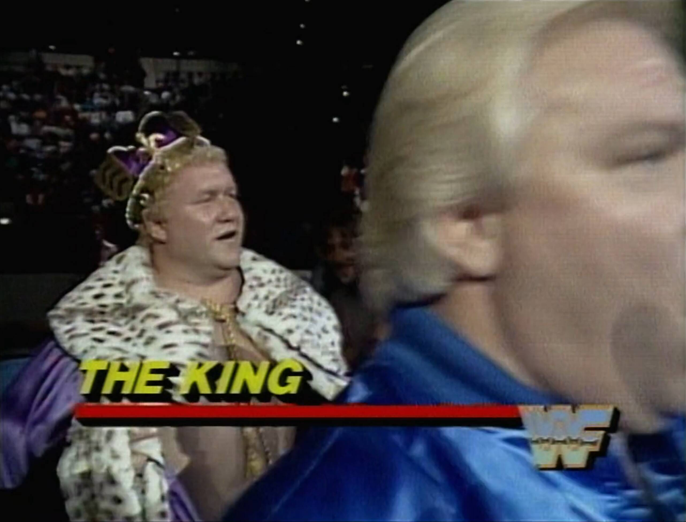
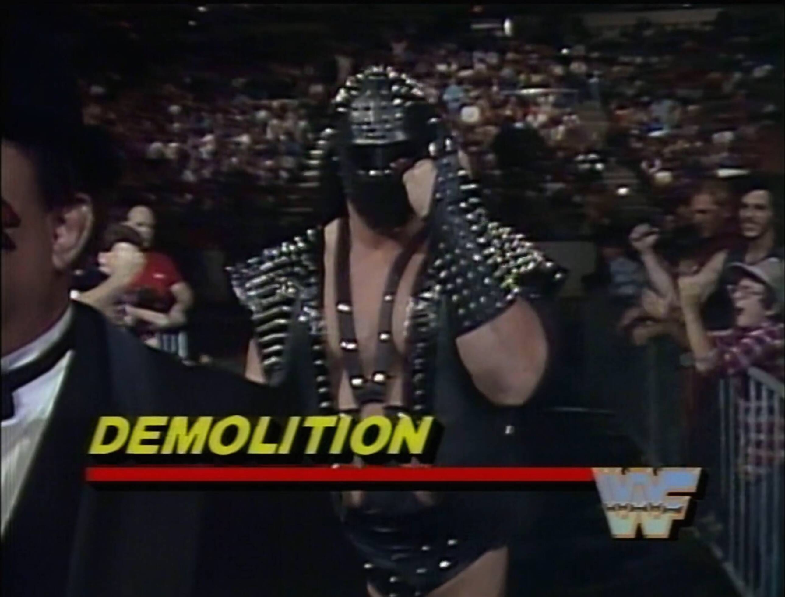

<!-- vim: set colorcolumn=57,80: -->

# Survivor Series 1987

When Giants, Glamour, and Glorious Mullets Collided

> 💡Find all my Survivor Series 1987 gifs [here on Giphy](https://giphy.com/channel/Integralist/wwf-survivor-series-1987).

Ah, **Survivor Series 1987**—the event that introduced us to the wonder of a
pay-per-view filled entirely with elimination matches. If you’ve ever wondered
what it would be like to toss 50 wrestlers into a blender and hit "puree," then
you’ve come to the right place. This was the WWF’s first stab at the Survivor
Series format, and let’s just say: it was glorious chaos.

We had legends, up-and-comers, and a few characters who made you wonder if Vince
McMahon was just playing Mad Libs with jobber names. It was 1987, people, and
nothing made sense—especially the fashion. So, let’s dive into this spectacle of
oversized egos, questionable ring gear, and the purest form of melodrama
wrestling has ever known.

{WATCH_ALONG_NOTE}

## The Opening

Wow this crowd is HYPED!\
They are so loud and visibly excited.\
Especially when Jesse and Gorilla are announced.

I love that they treat this as a special event.\
Back when it was on Thanksgiving Day.\
You and the family relaxing together around the TV.

Cool opening montage and logo animation.

Gorilla selling "it's a happening".\
Jesse starts hyping the Hogan/Andre rematch.\
We get a breakdown of the rules.\
I love seeing these vintage graphics.

## The Card

### Honky Tonk Man's Team vs The Macho Man's Team

We get an interview with Honky's team.\
Looks like chaos, but fun chaos.\
The entire team is excited.\
Honky is on fire at the moment.

We see Honky's team arrive to the ring.

Now it's time for Macho's team interview.\
Oddly looks pretty calm in comparison?\
What in the Hell is Steamboat doing?

Steamboat cuts the worst promo ever.\
Seriously, the drizzling shits of a promo.\
No one going to explain Macho and Steamboat?\
Didn't Macho nearly murder him back when he was heel.\
They seem like close pals now.

We go ringside to see Macho's team arrive.

Man this is exciting 🙂\
So many great characters here.\
It reminds me of my childhood even more thanks to the SilverVision videos.\
They would always use a lot of clips from the 87 Survivor Series in their intro.

Too much action to call here.\
I'll just mention a few and some high spots.\
Beefcake hip tossing EVERYONE.\
Macho forgets the spot and tries to tag Jake.\
Jake corrects him by pointing to Steamboat.

Whoa Harley nails a beautiful belly to belly suplex.\
Duggan and Race get a double count out.\
It's a classic "brawl to the back".

I love these early Survivor Series.\
You really felt like anything could happen.\
All sorts of interactions you otherwise never would see.

And the Barber gets a pin with a high knee!!!\
See, anything can happen.\
Honky gets the shake, rattle and roll on Beefcake!\
Beefcake outta here.

I've only just noticed the shrunk ring apron.

Wow Honky backed out of that DDT and got some serious air.

Jake starts hulking up in the corner!?\
Short clothesline and the crowd is popping like crazy for the DDT.\
Jake is getting battered.

Honky and Hercules both dragging out a reverse chin lock.\
Finally the Dragon gets the hot tag.\
What the Hell is this martial art nonsense.

Macho nails a beautiful elbow to pin Hercules.

Poor Honky is on his own!\
Honky's getting brutalized.\
Ah, of course, this is payback for hurting Elizabeth.\
I thought this was a poor showing on the baby faces.

Honky takes a walk and you can't blame him really.\
Nice shot of the Survivor Series logo.

> 🎤 We get a promo segment from Andre the Giant's team.\
> He, Bobby and Slick all cut promos with the rest of the team watching on.\
> Boy this team is some serious beef!\
> I'm looking forward to that match.

LOL Andre's facial expressions 🤣

**RATING: 7/10**\
So many great characters in this opener.\
I always love watching Honky and Macho in this era.

### Sherri Martel's Team vs Fabulous Moolah's Team

Great shot of Sherri wearing the title.

I couldn't care less for this match I'll be honest.\
But let's give it a chance and see how it goes.

Nice, the Jumping Bomb Angels are in this.\
That makes me feel a bit better about the match.

Jesse mentions his new movie The Running Man.\
Christ Moolah is OOOOOOOLD here.

OK first pin and I have to say this is good wrestling.\
The ladies are working hard and getting lots of spots in.\
Lots of fast tags here making it hard to keep up.\
Some solid mat wrestling being shown.

Crowd is quiet but not necessarily a bad thing.\
I think, like me, they're in awe of the work rate.\
The Bomb Angels keep pulling out all sorts of cool moves.\
Seriously, there are no wasted movements here.

Sherri eliminates Rockin Robin with a beautiful suplex.

We're quite a way into the match and it's just starting to drag a bit.\
The work rate is still high but I feel like the magic is wearing off.

Wow this Glamour Girl is vicious.

We eventually get down to the tag teams (Glamour Girls & Bomb Angels).\
Jimmy Hart takes a backwards bump off the apron\
The Jumping Bomb Angels take the win!

**RATING: 6/10**\
This was much better than I expected.\
An impressive work rate by all involved.\
If you have the time I'd suggest NOT skipping this one.

### Hart Foundation's Team vs Strike Force's Team

Bobby Heenan is about to blow a casket in his promo.\
This is going to be great. I'm into all these heel teams.

Here comes Demolition into the ring.\
The music instantly gets the crowd pumped.\
The ring is crammed! So many bodies.

Quick baby face promo.\
Other than the Bulldogs, I don't like any of the teams.\
Stallions, Killer Bees, Rougeaus, Strike Force. All meh.

Jesse clarifies that if one tag team member is pinned, their partner also has to go.\
The teams barely fit on the apron.\
Filming this must have been a nightmare.

Tito nails Zukov with the flying jalapeno for the pin.\
Lots of tags in and out. Everybody getting some time.\
Too difficult to call the action as some much in and out.

Ax eliminates the Rougeaus.

Then Demolition stupidly get themselves disqualified.\
Jesse points out the champs have yet to enter the ring.\
Then in comes Martel! The crowd goes wild.\
The baby face bouncing around is so cheesy.

Bret is so quick with the save of Anvil.\
Out goes Strike Force thanks to the Hart Foundation.\
Love how Jesse acknowledges the Harts will go up the rankings now.

The bookers are pushing The Young Stallions.\
Giving the stallions lots of baby face fight.

I love anytime the Bulldogs and the Harts are in the ring together.\
This match is going on too long. Too many teams.\
Wow Haku gets a clean win over Dynamite.

HUGE sunset flip pin by Roma on the Hammer.

They are pushing the Young Stallions HARD!\
Harts are out due to a roll up from the bees.\
I would have thought they'd be the last team.

What! The Killer Bees get the win!?\
They essentially cheat by wearing a mask.\
That gimmick doesn't work though as they never wore the mask consistently.\
Anyway, felt like a bit of a disappointing finish for what was an epic long match.

**RATING: 7/10**\
Classic survivor series elimination match.\
Well worth watching, albeit a bit long in the end.

> 🎤 Randomly long segment with Gorilla and Jesse.\
> They're just shooting the shit about all the matches.\
> This really feels like someone told them to kill time.\
> They must've been talking non stop for 10+ minutes.

### Hogan's Team Vs Andre's Team

I'm seriously up for this match.\
Rick Rude, Butch Reed, One Man Gang, Andre.\
You've got Hogan for the baby faces.\
This should be good fun.

We're in the ring waiting for Andre.\
Look at those tights on Rude. WTH 😂

Bobby does a great job introducing Andre.\
Andre slowly walks to the ring looking menacing.

We get a Hogan team promo.\
What is that bandana on Hogan!? He looks ridiculous.

As far as teams go, Hogan's is naff.\
Lol. Hogan randomly attacks Bam Bam on the way out.

The crowd is hyped as they know Hogan's coming.\
Jesus, Don Muraco is roided to the gills.\
Paul Orndorff really feels like an antique at this point.\
He should have been out of here 2 years prior.

My boy Butch Reed is in.\
No! My boy was eliminated by Hogan. 🤦‍♂️

Come on, the ref isn't allowing Hogan to be in the ring with Andre.\
Apparently Hogan tagged out when he was giving high fives.\
Why not just step out and then tag back in again?

Rude fighting Mr.Wonderful is like watching young vs old.\
Rude definitely is the odd one out here.\
Rude looks tiny compared to everyone else.

I'm surprised how big One Man Gang is here. Huge.\
I knew he was big, but here he looks simply massive.

No wrestling here. Just punching and kicking.\
At least with the tag match you had lots of wrestling.

Ken Patera gets eliminated by One Man Gang (OMG).\
We see Hogan sprinkling some Hulk dust on Bam Bam.\
Crowd is hot. They cheer for it all.

Rude sneaks a roll up on Orndorff.\
Hogan and Muraco tag team Rude for his elimination.\
Bundy looks comically small compared to OMG/Andre.\
Muraco gets an Andre headbutt + OMG splash and he's out.

Wow, commentary is on point for when Hogan gets the hot tag against Andre.\
Oh man, here we go... yup countout for Hogan.\
I guess this allows Andre to keep his heat.

Bam bam is not beating Bundy + OMG + Andre.\
Bam Bam Eliminates Bundy via a slingshot.\
But Bam Bam is sucking air right now. He's gassed.\
Beating OMG will be a miracle at best.\
OMG misses from the top and Bam Bam steals the pin.

Andre is going to win. I'm certain.\
Andre gets a suplex and the win over Bam Bam.

In runs Hogan (forever the heel) and blindsides Andre.\
Hogan steals the heat and starts posing like he won something lol.\
I'm 100% with Jesse here. Hogan is in the wrong.\
Gorilla is happy to justify Hogan's behaviour.

We finally cut to a Heenan/Andre interview.\
They keep saying how Andre survived.\
But be honest, Andre was hardly even IN the match.\
I know that is was to protect Andre who would've struggled, but still.

We get a montage of the matches to see us out.

**RATING: 6/10**\
This match was enjoyable but the wrestling was too basic.\
Not enough story behind it to bump up the rating.\
Also, I despise Hogan's behaviour at the end. Not cool.

## The Aftermath: Alliances, Betrayals, and a Lot of Spandex

As the dust settled on Survivor Series 1987, we were left with some serious
questions. Like, "How much hairspray does it take to keep Brutus Beefcake’s
mullet intact?" Or, "Is there a support group for the guys who get left behind
when Hulk Hogan walks out of a match?"

This event cemented André’s role as the giant villain that Hogan would clash
with for the foreseeable future, while Randy Savage’s charisma and crowd support
only grew stronger, setting the stage for his eventual rise to world champion.
Meanwhile, the tag division continued to impress, and the Jumping Bomb Angels
made a strong case for why aerial wrestling is far more fun to watch than
slow-moving slams.

## The Legacy: Why Survivor Series 1987 is Still Legendary

**Survivor Series 1987** laid the groundwork for decades of over-the-top drama,
endless betrayals, and some of the most convoluted storylines ever seen in
wrestling. It gave us the format that WWE still uses to this day—team-based
elimination matches that force bitter enemies to “work together” for the sake of
survival (until someone gets betrayed, obviously).

But beyond the format, Survivor Series 1987 was the start of something bigger.
It was the first time we saw André the Giant fully embrace his heel status, with
Hogan playing the perennial hero. Their rivalry would dominate the wrestling
world for the next year and culminate in some of the most famous moments in WWE
history. Hulkamania was already running wild, but after this event, it hit
overdrive.

The tag team division also got a spotlight like never before. Teams like the
**Hart Foundation** and **British Bulldogs** set the standard for what tag team
wrestling could be—fast-paced, technical, and completely chaotic. And let’s not
forget the emergence of underdog teams like the **Young Stallions**, who somehow
pulled out a victory despite being a team that people often forgot existed.

But perhaps the biggest legacy of Survivor Series 1987 is the pure nostalgia it
evokes for fans who lived through it. This was an era where characters were
larger than life, where every promo was delivered with the intensity of a
Shakespearean soliloquy, and where even the most ridiculous gimmicks were
embraced with open arms. There was a purity to it all—before wrestling got too
self-aware, too polished, too scripted.

Sure, the landscape of wrestling has changed since 1987, but there’s something
special about this event that makes it live on in fans' memories. Watching
**Hogan**, **André**, and **Savage** duke it out with some of the most
outrageous characters ever to grace the squared circle is pure joy. It was an
era where fans believed in the drama, in the rivalries, and in the
larger-than-life personas.

So whether you were there to witness it live or discovered it years later on a
VHS tape (ask your parents, kids), Survivor Series 1987 remains a glorious time
capsule of wrestling’s golden era. It’s a testament to the power of spectacle,
the brilliance of simple storytelling, and the pure joy of watching a bunch of
sweaty men in spandex fight for… well, we’re still not sure what exactly. But
who cares? It was awesome.

Because when you look back at **Survivor Series 1987**, you remember the magic,
the drama, and the insanity. And deep down, you wish you could hop in a time
machine, grab a foam finger, and relive it all over again.
