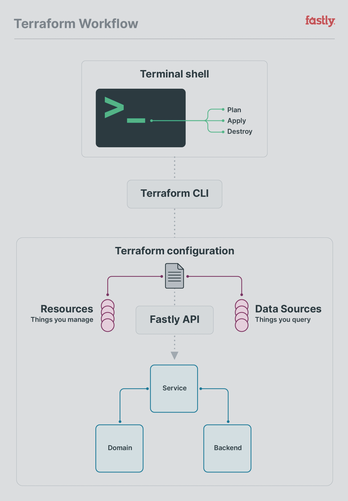

# Beginner's guide to creating a Terraform Provider

You have an API and you want your customers to be able to use that API via [Terraform](https://www.terraform.io). In this post I'm going to explain how you can write your own Terraform provider to enable your customers to integrate your API into their "infrastructure as code" pipeline.

You don't need an API to be able to follow along, nor am I going to make you write one as part of the learning process (that's just a waste of time). Instead I'm going to demonstrate how a Terraform provider works by talking through the code for an example provider I've written.

> **NOTE**: You can find my 'mock' provider [here on GitHub](https://github.com/integralist/terraform-provider-mock) if you'd prefer to read the code yourself. It's heavily commented to make it as easy as possible.

The idea is that once you finish reading this post, you should (in theory) be able to just copy my mock provider code base and start adding in your own _real_ API calls rather than using the stubbed data I've provided for the sake of keeping the example provider simple.

In case you're interested, I am the maintainer for the popular [Fastly Terraform provider](https://github.com/fastly/terraform-provider-fastly) (which demonstrates a much more _complex_ provider). If you want to know how to use the Fastly Terraform provider, then you're in luck as I've written about that subject on the Fastly blog [here](https://www.fastly.com/blog/how-to-configure-your-fastly-services-with-terraform) as well as written a Terraform 'best practices' guide on the Fastly Developer Hub [here](https://developer.fastly.com/learning/integrations/orchestration/terraform/) (which is definitely worth checking out).

I should also be clear and say that this isn't a 'complete' guide. There are many aspects to writing a Terraform provider I will gloss over or omit entirely.

That all said, let's get started...

## Prerequisite

I've presumed the reader:

1. Is familiar with the [Go](https://go.dev) programming language and how to write programs with it.
1. Is familiar with what [Terraform](https://www.terraform.io) is (and ideally has used it before).

## go.mod

Let's start with the _direct_ dependencies needed by my 'mock' provider:

```go.mod
go 1.19

require (
	github.com/google/uuid v1.3.0
	github.com/hashicorp/terraform-plugin-docs v0.13.0
	github.com/hashicorp/terraform-plugin-sdk/v2 v2.24.0
)
```

The first dependency [`google/uuid`](https://github.com/google/uuid) is only used because I needed a quick and convenient way to generate a unique ID (as we'll see later on), while the [`hashicorp/terraform-plugin-docs`](https://github.com/hashicorp/terraform-plugin-docs) dependency is only used for the sake of generating documentation from your provider code (a really useful tool actually so you should definitely check it out).

The last dependency, [`hashicorp/terraform-plugin-sdk`](https://github.com/hashicorp/terraform-plugin-sdk), is what fundamentally enables a Terraform provider to work like it does.

Hashicorp is working on a replacement to the terraform-plugin-sdk called the [Terraform Plugin Framework](https://github.com/hashicorp/terraform-plugin-framework). I've not yet played with the new SDK, so I may well write a follow-up post where I migrate my mock provider to this new framework and/or do so for the Fastly Terraform provider, from which I'll share any useful lessons learned.

> **NOTE**: It's worth clarifying that the terraform-plugin-sdk isn't going anywhere any time soon and in the meantime Hashicorp provides guidelines for [which SDK you should use](https://developer.hashicorp.com/terraform/plugin/which-sdk), so I recommend reading that if you're unsure of which route to take.

**UPDATE**: I have since discovered there is a 'scaffold' project that Hashicorp provides here https://github.com/hashicorp/terraform-provider-scaffolding that is similar to my mock provider! So I would recomend, once you finish reading this post, giving that a read to see how their hierarchy compares to my mock provider (there's also one for the new plugin framework, which I'll be checking out: https://github.com/hashicorp/terraform-provider-scaffolding-framework).

## main.go

Now let's take a look at our `main` package entry point, which is 'short and sweet'...

```go
package main

import (
	"github.com/hashicorp/terraform-plugin-sdk/v2/plugin"
	"github.com/integralist/terraform-provider-mock/mock"
)


func main() {
	plugin.Serve(&plugin.ServeOpts{
		ProviderFunc: mock.Provider,
	})
}
```

We import the SDK's [plugin](https://pkg.go.dev/github.com/hashicorp/terraform-plugin-sdk/v2@v2.24.0/plugin) package and call the [`Serve`](https://pkg.go.dev/github.com/hashicorp/terraform-plugin-sdk/v2@v2.24.0/plugin#Serve) function, telling it where to find our provider (i.e. `mock.Provider`) which is where we define the structure of our Terraform provider.

The following implementation of my mock provider is small because, well, my mock provider is small (by design), where as you'll find real-world providers to be a lot larger than this:

```go
func Provider() *schema.Provider {
	return &schema.Provider{
		Schema: map[string]*schema.Schema{
			"foo": {
				Type:        schema.TypeString,
				Optional:    true,
				DefaultFunc: schema.EnvDefaultFunc("MOCK_FOO", nil),
			},
		},
		ResourcesMap: map[string]*schema.Resource{
			"mock_example": resourceExample(),
		},
		DataSourcesMap: map[string]*schema.Resource{
			"mock_example": dataSourceExample(),
		},
	}
}
```

So there two parts to a Terraform provider, which will help to explain the above chunk of code:

1. **Resources**: A resource is a 'thing' you create, and then manage its life cycle via Terraform.
1. **Data Sources**: A data source is data you can query and reference within your resources.

The following diagram is one I designed for the [Fastly blog post](https://www.fastly.com/blog/how-to-configure-your-fastly-services-with-terraform) I mentioned earlier, and it does a good job visualising the overall Terraform workflow coordination between your terminal shell, the Terraform CLI and the Terraform provider itself.


<p></p>

> **NOTE**: A data source is actually a _subset_ of a resource. This will become apparent shortly when we discuss CRUD (Create, Read, Update, Delete) operations.

Looking at the above code, the first thing we do is define a provider (`schema.Provider`) and its 'schema' (`schema.Schema`). In the case of our mock provider we actually have a super simple provider schema, it's just a single 'attribute' called `foo`.

Here is an example of what that would look like in a consumer's Terraform configuration:

```terraform
provider "mock" {
  foo = "example_value"
}
```

Because of the `DefaultFunc` field in our schema, if `foo` wasn't set in the above example configuration, then the value would default to the value assigned to the environment variable `MOCK_FOO` (or `nil` if the environment variable wasn't set).

Typically the provider's schema is for defining top-level attributes such as an API key or API endpoint. Take a look at the Fastly Terraform provider for an example:

```go
func Provider() *schema.Provider {
	provider := &schema.Provider{
		Schema: map[string]*schema.Schema{
			"api_key": {
				Type:        schema.TypeString,
				Optional:    true,
				DefaultFunc: schema.EnvDefaultFunc("FASTLY_API_KEY", nil),
				Description: "Fastly API Key from https://app.fastly.com/#account",
			},
			"base_url": {
				Type:        schema.TypeString,
				Optional:    true,
				DefaultFunc: schema.EnvDefaultFunc("FASTLY_API_URL", gofastly.DefaultEndpoint),
				Description: "Fastly API URL",
			},
			"force_http2": {
				Type:        schema.TypeBool,
				Optional:    true,
				Default:     false,
				Description: "Set this to `true` to disable HTTP/1.x fallback mechanism"
			},
			"no_auth": {
				Type:        schema.TypeBool,
				Optional:    true,
				Default:     false,
				Description: "Set to `true` if your configuration only consumes data sources that do not require authentication",
			},
		},

    ...
  }

  ...
}
```

Now there's one aspect to our provider that I've omitted and that's the `ConfigureFunc` field. Because my mock provider doesn't have a real API to use I've not defined that field in my mock provider but here is an example from the Fastly Terraform provider to give you an idea of what it could look like:

```go
func Provider() *schema.Provider {
	provider := &schema.Provider{
		Schema: map[string]*schema.Schema{
      // ...
		},
		DataSourcesMap: map[string]*schema.Resource{
			// ...
		},
		ResourcesMap: map[string]*schema.Resource{
			// ...
		},
	}

	provider.ConfigureContextFunc = func(_ context.Context, d *schema.ResourceData) (any, diag.Diagnostics) {
		config := Config{
			APIKey:     d.Get("api_key").(string),
			BaseURL:    d.Get("base_url").(string),
			NoAuth:     d.Get("no_auth").(bool),
			ForceHTTP2: d.Get("force_http2").(bool),
			UserAgent:  provider.UserAgent(TerraformProviderProductUserAgent, version.ProviderVersion),
		}
		return config.Client()
	}

	return provider
}
```

In the Fastly Terraform provider you can see the `ConfigureContextFunc` (there are 'context' aware versions of most functions) we return a `config.Client()` which is effectively the Fastly API client. I'll come back to this later when we look at the CREATE function of a resource to show you how you can get access to this API client.

For now, let's jump back to our mock provider to remind ourselves of what was configured after the `Schema` field...

```go
ResourcesMap: map[string]*schema.Resource{
	"mock_example": resourceExample(),
},
DataSourcesMap: map[string]*schema.Resource{
	"mock_example": dataSourceExample(),
},
```

So now we have a basic understanding of what a 'resource' is and what a 'data source' is, we can clearly see that a Terraform provider can be setup with _multiple_ of each type.

The interesting part here is that there is a 'convention over configuration' style pattern at play here. Specifically, the map key has to be of the format `<provider_name>_<resource|data_source>`, and in my mock provider I only have one resource and one data source and I name them the same `mock_example` (as 'mock' is the name of my provider, and 'example' is the resource/data-source name).

In the case of the resource, the provider will attempt to resolve the function assigned to the map key by looking up the file `resource_<provider_name>_<resource_name>.go`, i.e. `resource_mock_example.go` while it will attempt to resolve the data source using `data_source_<provider_name>_<data_source_name>`, i.e. `data_source_mock_example.go`.

If we look at the tree structure of my mock provider we'll see that's exactly what it contains:

```txt
.
├── main.go
├── mock
│   ├── data_source_mock_example.go
│   ├── provider.go
│   └── resource_mock_example.go
```

OK, all good so far. Now let's get into the meat of these two files, what exactly do they do?

Well, firstly the 'example' resource defines its own schema (e.g. the attributes it contains) and it also specifies CRUD operation functions (i.e. Create, Read, Update, Delete) for managing the life cycle of the resource. In our mock provider it looks like this:

```go
func resourceExample() *schema.Resource {
	return &schema.Resource{
		Create: resourceCreate,
		Read:   resourceRead,
		Update: resourceUpdate,
		Delete: resourceDelete,

		Schema: map[string]*schema.Schema{
			"last_updated": {
				Type:     schema.TypeString,
				Computed: true,
			},
			"not_computed_optional": {
				Type:     schema.TypeString,
				Optional: true,
			},
			"not_computed_required": {
				Type:     schema.TypeString,
				Required: true,
			},
			"foo": {
				Type:     schema.TypeList,
				Optional: true,
				Elem: &schema.Resource{
					Schema: map[string]*schema.Schema{
						"bar": {
							Type:     schema.TypeList,
							MaxItems: 1,
							Required: true,
							Elem: &schema.Resource{
								Schema: map[string]*schema.Schema{
									"number": {
										Type:     schema.TypeInt,
										Optional: true,
									},
									"version": {
										Type:     schema.TypeString,
										Computed: true,
									},
								},
							},
						},
					},
				},
			},
			"baz": {
				Type:     schema.TypeList,
				Required: true,
				Elem: &schema.Resource{
					Schema: map[string]*schema.Schema{
						"qux": {
							Type:     schema.TypeString,
							Required: true,
						},
					},
				},
			},
			"some_list": {
				Type:     schema.TypeList,
				Optional: true,
				Elem: &schema.Schema{
					Type: schema.TypeString,
				},
			},
		},
	}
}
```

There are a few things to pay attention to in this schema:

- `last_updated` is a 'computed' attribute, meaning the user shouldn't attempt to set that in their configuration but instead leave it to the Terraform provider to set it dynamically. A user would then use [output variables](https://developer.hashicorp.com/terraform/language/values/outputs) to access the value set by the provider.

- `not_computed_required`: is marked as 'required' and so a user of our provider _must_ set this attribute, while other attributes are marked as 'optional'.

- `foo` has a type of `TypeList`, meaning we need to define what schema its 'elements' should have. We use `Elem` to specify there should be a nested `bar` block, which itself contains `number` and `version` attributes (the latter being a 'computed' attribute).

In terms of a consumer of our Terraform provider, someone might write their configuration like so:

```terraform
resource "mock_example" "testing" {
  not_computed_required = "some value"

  foo {
    bar {
      number = 1
    }
  }
  foo {
    bar {
      number = 2
    }
  }
  foo {
    bar {
      number = 3
    }
  }

  baz {
    qux = "x"
  }
  baz {
    qux = "y"
  }
  baz {
    qux = "z"
  }

  some_list = ["a", "b", "c"]
}
```

In the above example the user has set the attribute `not_computed_required` because it was marked as 'required' in our provider schema, while providing multiple instances of the optional `foo` block, and multiple instances of the required `bar` blocks. The `some_list` attribute is also provided, although it's marked as 'optional'.

It's worth noting the above configuration can, through clever use of the Terraform Configuration Language (TCL), be made more concise/dynamic...

```terraform
resource "mock_example" "testing" {
  not_computed_required = "some value"

  dynamic "foo" {
    for_each = [{ number = 1 }, { number = 2 }, { number = 3 }]
    content {
      bar {
        number = foo.value.number
      }
    }
  }

  dynamic "baz" {
    for_each = [{ something = "x" }, { something = "y" }, { something = "z" }]
    content {
      qux = baz.value.something
    }
  }

  some_list = ["a", "b", "c"]
}
```

...but this blog post isn't about TCL so I'd recommend reading the official Terraform documentation.

Let's now look back at the CRUD functions for our resource:

```txt
Create: resourceCreate,
Read:   resourceRead,
Update: resourceUpdate,
Delete: resourceDelete,
```

These functions are called at specific times depending on what `terraform` CLI command was executed by a user, and also depending on what state their project is in at the time the command is executed.

For example, running `terraform apply` for the first time will cause the 'Create' function to be called (so all the relevant resources defined in the user's configuration will be created), followed (typically) by the 'Read' function (so that the user's local project state will be updated with the new resources created via the 'Create' function).

The next time the user runs `terraform apply` they'll find Terraform will trigger the 'Read' function to execute first (so that Terraform can update the project state and know if anything has changed), before then determining if the 'Update' function needs to be called, because let's say the user has modified their configuration in such a way as to require one of the resources defined to be updated (e.g. to make API calls on our behalf).

Let's now look at each CRUD function individually...

## Create

The CREATE operation typically will make API calls to create resources. It won't set anything in the terraform state, with the exception of setting a unique ID that will be used by all the other functions to access the resource data from state.

Let's look at the code in our 'mock' provider to see what we're doing...

```go
func resourceCreate(d *schema.ResourceData, m any) error {
	foo := d.Get("foo").([]any)
	d.SetId("123")
	return resourceRead(d, m)
}
```

So we can see the function is passed a `schema.ResourceData` type. This is essentially the user's local configuration data, and we can see that the first thing we do is try to get the value of the `foo` attribute. It also has a second argument which is effectively additional 'metadata' and is what we would reference in order to get access to our API client.

Now if this was a real provider, then we'd have an API client that would be creating an actual resource for the user. Remember earlier we talked about the `ConfigureFunc` function of the provider, which was responsible for defining an instance of an API client? Well, the way we get access to the API client would look something like this (where `APIClient` is some type that represents your API client):

```go
client := m.(*APIClient).conn
```

Because `foo` is a `TypeList` you can see we type assert it to `[]any`. Now as I said at the start, we don't have an API to make calls to and so we don't actually _do_ anything here with the `foo` value defined in the user's configuration.

Let's pretend we made an API call, and in the response we got back an ID that we wanted to use as a unique key to track this resource in our terraform state file. To set the unique ID we call `d.SetId("123")`, where `123` is the unique ID we got back from the API response.

The mere existence of the ID, and lack of error returned, means Terraform will presume the CREATE operation was successful and store the user's "foo" data in the local state file.

Finally, we call the READ function (`resourceRead()`) and pass through the `d` and `m` arguments. In this case, the way we've setup our CREATE function means that if the READ operation fails, then the error it returns will be returned through our CREATE function and will cause the create operation to fail as well.

It's up to you whether that's something you want to do, as a READ could fail due to a network issue and not necessarily mean there was an error with the CREATE operation.

## Read

The READ operation must handle three things:

1. Calling out to the API to get the latest data for our resource.
1. Flatten the API response (or at least extract the values we need) and marshal the data into a format that Terraform understands (i.e. `map[string]any`).
1. Set the latest data into Terraform's state file so it can identify if there were any differences between what the user has defined in their configuration and what actually exists on the remote data side.

Let's look at the code in our 'mock' provider to see what we're doing...

```go
func resourceRead(d *schema.ResourceData, m any) error {
  resourceID := d.Id()
  foo := d.Get("foo")

  for _, f := range foo.([]any) {
    f := f.(map[string]any)

    for _, b := range f["bar"].([]any) {
      b := b.(map[string]any)
      b["version"] = uuid.New().String()
    }
  }

  if err := d.Set("foo", foo); err != nil {
    return err
  }

  d.Set("last_updated", time.Now().Format(time.RFC850))

  return nil
}
```

OK, so there's a little more going on here, but nothing too complicated. First thing we do is get the ID we set into the Terraform state after we had initially created the resource (`d.Id()`).

Next, because we don't have a real API to get live data from, I'm going to hardcode data to be set into terraform state. To do that I'm going to get the data out from the Terraform state using `d.Get("foo")` and I'm going to dynamically update the nested `version` attribute, which if you remember was defined as a 'computed' value (meaning its an attribute the Terraform provider must set).

But as this is a nested attribute I have to iterate over each parent structure until I reach the relevant level of the data structure where I can then set a value on the `version` attribute. That's effectively what the two `for` loops are doing, and you'll see this is where the `github.com/google/uuid` dependency comes in.

Once that's done we're able to set the updated data structure into the local state file using `d.Set()` and be aware that we can't just set the `version` attribute directly, we must set the root `foo` attribute and this means constructing its complete data structure.

Remember that the `last_updated` attribute was also marked as 'computed' as so we need to set that dynamically too (and for that I just set the value using the current timestamp, and to be fair I could of done the same for the `version` attribute rather than use an external uuid package).

## Update

The UPDATE operation is similar to the READ but we typically use additional SDK methods to help us know if there's been a change that would require a modification to the data.

Let's look at the code in our 'mock' provider to see what we're doing...

```go
func resourceUpdate(d *schema.ResourceData, m any) error {
  resourceID := d.Id()

  if d.HasChange("foo") {
    foo := d.Get("foo").([]any)
    d.Set("last_updated", time.Now().Format(time.RFC850))
  }

  return resourceRead(d, m)
}
```

So some similar stuff here. First we get the resource's ID with `d.Id()` but now we're using `d.HasChange()` to see if the `foo` attribute has changed, and if it has, then we modify the local state. Of course the mock provider is just setting a value for `last_updated` as if there was a change but in reality your real provider would be making an 'update' API call to update the resource.

Lastly, we do a READ operation to be sure we get the updated API changes stored into our local state.

## Delete

The DELETE operation is very simple. In order to delete a resource from the local Terraform state we simply need to set the ID for the resource to an empty string...

```go
func resourceDelete(d *schema.ResourceData, m any) error {
  resourceID := d.Id()
  d.SetId("")
  return nil
}
```

Now in our mock provider you'll see we get the resource ID and although that looks pointless, in a real provider, you would want to get the resource ID because remember you'd need to make an API call to delete the resource first before deleting it from the Terraform state.

## Data Sources

OK, before we wrap up, let's look at our example data source to see the schema structure:

```go
func dataSourceExample() *schema.Resource {
	return &schema.Resource{
		Read: dataSourceRead,
		Schema: map[string]*schema.Schema{
			"things": {
				Type:     schema.TypeList,
				Computed: true,
				Elem: &schema.Resource{
					Schema: map[string]*schema.Schema{
						"id": {
							Type:     schema.TypeInt,
							Computed: true,
						},
						"version": {
							Type:     schema.TypeString,
							Computed: true,
						},
					},
				},
			},
		},
	}
}
```

So there's a lot of similarities between a 'resource' and a 'data source', and that's because a data source is a _subset_ of a resource. So the main difference is we have a READ operation/function but none of the other CRUD functions (e.g. Create, Update, Delete) because a data source is only used for _querying_ data and not something you create/update/delete.

As far as the schema is concerned we've defined a `things` attribute, which is 'computed' along with all its nested attributes, and that makes sense as this isn't something a user defines in their configuration.

Now let's take a look at the READ function to see what that's doing:

```go
func dataSourceRead(d *schema.ResourceData, m any) error {
	const jsonStream = `
		[
			{"id": 1, "version": "a"},
			{"id": 2, "version": "b"},
			{"id": 3, "version": "c"},
		]`

	things := make([]map[string]any, 0)
	err := json.NewDecoder(strings.NewReader(jsonStream)).Decode(&things)
	if err != nil {
		return err
	}

	if err := d.Set("things", things); err != nil {
		return err
	}

	d.SetId(strconv.FormatInt(time.Now().Unix(), 10))

	return nil
}
```

The `jsonStream` variable is creating stubbed data. This is as if we had made an actual API call and received back a bunch of data from the API.

In order for us to store the returned data into Terraform we need to marshal the data into a format that matches what the schema expects (e.g. `[]map[string]any`) and in this case we're imagining our API returned JSON formatted data and so we use `json.NewDecoder` to decode the API response into the `things` variable.

We then set the `things` data back into the local state using `d.Set()`.

Now we've reached the final interesting part, which is the `d.SetId()` call. So to explain, we don't have a unique ID for this data resource so we create one using a timestamp format. I typically see people use a hash of the returned API data as a unique key, so pick your poison.

## How to use this provider

Now if my mock provider was published to the Terraform registry it would be very simple to consume, but I've not done that because I wanted an opportunity to explain how to test your own provider locally to be sure it's working first.

So, to consume this mock provider without it being published to the Terraform registry, follow these steps:

- Clone the repo and build the `terraform-provider-mock` binary:
  ```bash
  make build
  ```
- Create a separate directory for your own Terraform project.
  - e.g. `cd ../ && mkdir example-tf`
- Create a `dev.tfrc` file in your own Terraform project's directory:
  ```tf
  provider_installation {
    dev_overrides {
      "integralist/mock" = "../terraform-provider-mock" // the directory where the binary was built.
    }
    direct {}
  }
  ```
- In that shell instance set the `TF_CLI_CONFIG_FILE` environment variable.
  - e.g. `export TF_CLI_CONFIG_FILE=/example-tf/dev.tfrc`
- Create Terraform project files.
  - e.g. see the [Example Terraform Consumer Code](https://github.com/Integralist/terraform-provider-mock/blob/main/README.md#example-terraform-consumer-code) in my mock provider's README.
- Initialize your Terraform project and then execute a plan.
  - e.g. `terraform init && terraform plan`

> **NOTE**: every time you make a change to the Terraform provider code, you'll need to rebuild the binary and then go to your consuming Terraform project and reinitialize (i.e. `terraform init`) so it picks up the latest version of the `terraform-provider-mock` binary.

## Local Development

When running:

```bash
$ TF_LOG=TRACE terraform init
```

You should notice a couple of things different from what you'd normally see when initializing a new Terraform project.

The first is a message highlighting the fact that a provider 'override' is in place:

```txt
Warning: Provider development overrides are in effect

The following provider development overrides are set in the CLI configuration:
 - integralist/mock in /Users/integralist/Code/terraform/terraform-provider-mock

The behavior may therefore not match any released version of the provider and
applying changes may cause the state to become incompatible with published
releases.
```

That is expected in this case we've followed the instructions above, which tells us how to implement an override for the sake of local testing of the provider code.

The other thing you'll notice is an error:

```txt
Error: Failed to query available provider packages

Could not retrieve the list of available versions for provider
integralist/mock: provider registry registry.terraform.io does not have a
provider named registry.terraform.io/integralist/mock

If you have just upgraded directly from Terraform v0.12 to Terraform v0.14
then please upgrade to Terraform v0.13 first and follow the upgrade guide for
that release, which might help you address this problem.
```

This error is expected because we've not actually published this provider to the Terraform registry, so indeed it cannot be found. But the error doesn't prevent you from consuming the local provider binary still.

> **NOTE**: don't use `Print` functions from the `fmt` package in the Terraform provider as, depending on the execution flow, Terraform can treat it as input to its internal program and treat it as an error. So use `Print` functions from the `log` package instead.

**UPDATE**: I've since discovered https://pkg.go.dev/github.com/hashicorp/terraform-plugin-log/tflog

## Debugging a Terraform Provider

There are essentially two approaches:

1. Log-Based Debugging
1. Debugger-Based Debugging.

Refer to the [official Hashicorp plugin documentation](https://www.terraform.io/plugin/sdkv2/debugging) and also the [Fastly Terraform provider](https://github.com/fastly/terraform-provider-fastly#debugging-the-provider) documents, which demonstrates the latter approach.

## Conclusion

There we have it! A simple Terraform provider broken down as simply as I could manage.

Hopefully you can now mentally model your own API into a provider for your users.
