# WrestleMania 3

Where Legends Were Born, Hair Was Lost, and The Universe Almost Imploded

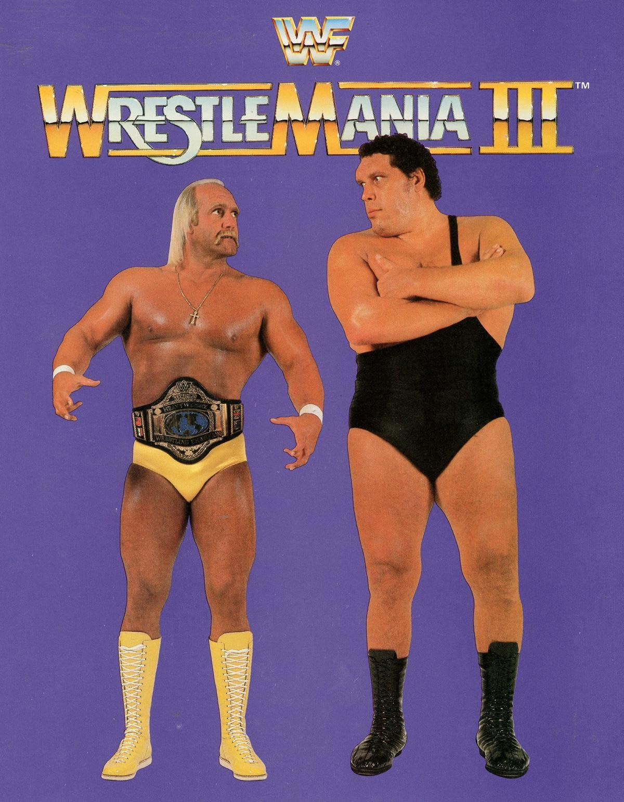

> 💡Find all my WrestleMania 3 gifs [here on Giphy](https://giphy.com/channel/Integralist/wwf-wrestlemania-3).

Ah, WrestleMania 3. March 29, 1987. A day where 93,173 fans packed into the
Pontiac Silverdome to see more sequins, spandex, and improbable hairdos than a
‘70s glam rock concert. It was an event that made you believe in the impossible:
that a man could bodyslam a giant, a referee could actually wrestle, and the WWF
wasn’t just sports entertainment, but a Shakespearean tragedy… if Shakespeare
had written exclusively in flexed biceps and grunts. Let’s dive into this
masterpiece of melodrama and chaos, because if you didn’t love it then, you’re
going to love it now.

## The Build-Up: Drama That Could Make Soap Operas Blush

Months of preposterous storylines, questionable betrayals, and glorious costumes
led to this event. These weren't just wrestlers—they were living, breathing
cartoons, and we loved every ridiculous second.

### 1. **Hulk Hogan vs. Andre the Giant: The Bromance Turned Soap Opera**

Once upon a time, Hulk Hogan and Andre the Giant were the best of pals. But as
any daytime drama will tell you, no friendship lasts when you throw in a title
belt and an egotistical manager like Bobby "The Brain" Heenan. Andre, clearly
tired of playing second fiddle to Hogan's endless supply of "brother" speeches,
decided it was time to challenge Hulk for the WWF Championship. Of course,
nothing says "I’m done with you, friend" like ripping someone’s shirt off on
national TV and glaring at them as if they stole your lunch money. Hogan, in his
usual wide-eyed, overly dramatic fashion, agreed to the match, and the rest is
wrestling history.

### 2. **Macho Man vs. Ricky Steamboat: A Throat-Smashing, Epic Saga**

Macho Man Randy Savage—intense, paranoid, and fueled by Slim Jims. He was the
kind of guy who could make ordering a sandwich sound like a life-or-death
decision. Ricky Steamboat, on the other hand, was all about honor and respect.
Naturally, these two opposites clashed. The drama kicked off when Savage, in one
of his most "Macho" moments, decided to crush Steamboat’s larynx with a ring
bell. Because, sure, that's how adults handle conflict. Steamboat spent months
recovering, probably cursing Savage with every raspy breath, until finally, at
WrestleMania, he sought his revenge. It wasn’t just a match—it was a telenovela,
minus the bad dubbing.

### 3. **Rowdy Roddy Piper vs. Adrian Adonis: Fashion Crimes and Haircuts**

Rowdy Roddy Piper, the man whose mouth was faster than his punches, decided he’d
had enough and wanted to "retire" (spoiler alert: he'd retire about as
successfully as a pop star on a comeback tour). But first, he had to deal with
Adrian Adonis, a man who, for reasons unknown, decided to embrace the look of a
couch cushion with an attitude. The stakes? Hair. Yes, because clearly nothing
says "settling a feud" like taking a razor to someone’s scalp. Piper, as always,
gave it his all, leaving Adonis bald, bruised, and probably rethinking his life
choices.

## Watch along notes

As with all my reviews (sarcasm aside) I always start with a _positive_ mindset
(i.e. "this is going to be awesome, I'm going to love watching this"). I think a
lot of reviewers have a preconception of whether something is going to be good
or not (based on their _memory_ of the event or just the more internet-recent
comments on these old events) and they let that affect their review. When really
they should watch the event back like they were kids and try to recall the
things they loved about wrestling. I try the best I can to suspend disbelief,
although I'm guilty of being a smart mark at times.

> ⚠️  **NOTE:**
> I don't bother looking at the card while watching the event back. Yes, I know
> from memory what some of the matches are, but most I don't remember so some of
> my comments are based on genuine reactions.

## The Opening

- Cheesy saxophone music to begin with. We're off to a good start 😀
- Wow! That opening shot of the arena and the 93k people.
- I think the real attendance was something like 78k, which is still pretty awesome.

Now I've never been to any kind of show like this but I would imagine that
unless you're near the ring, it must suck to watch? Surely watching from home
would be better!? You're so far away even the large projector screens aren't
going to help you.

Vince introduces the event and Eureka Franklin to sing America The Beauty. To
be honest it was quite a bland rendition and didn't really do much for me but
then again I'm not American so YMMV. That said, the crowd looked very
disinterested too. They know to cheer at certain moments, like the ending, so
it's a country duty they all accept.

On commentary we've got Gorilla and Jesse. Winning!!!\
These guys are just brilliant.

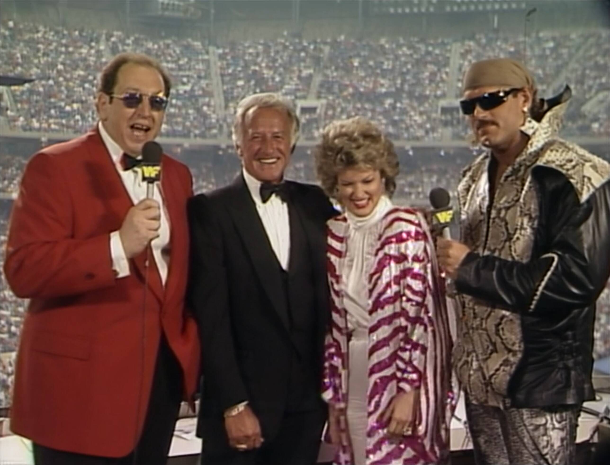

## The Matches

### The Can-Am Connection vs The Magnificent Muraco and Cowboy Bob Orton

OK, so first match is The Can-Am Connection vs The Magnificent Muraco and
Cowboy Bob Orton.

Neither of these teams do I care a lot about so we'll see how I get on. I'm
staying positive 😉

Whoa, Muraco at this point wasn't the trim roid monster he would be around a
year from now (SummerSlam 88).

Here he looks like a massive fat lump of meat.

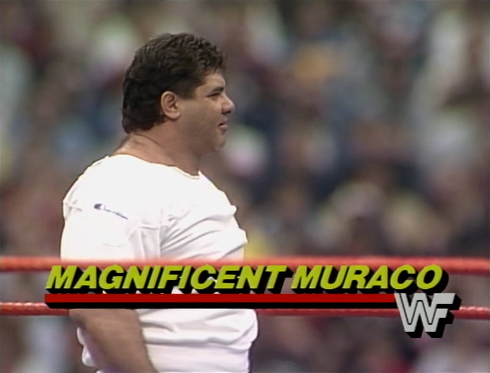

First serious move here is Martel running the ropes and bumping into Muraco
and knocking him to the ground. Sort of unexpected considering the size
difference between Martel and Muraco, but more importantly the ground pop like
crazy! So clearly, although this sounds bland on paper, these people are here to
have a good time!

The constant baby face posturing that Martel does like clapping his hands and
shaking his fists and bouncing back and forth on his feet is so cliche, tedious
and annoying to me. Like quit it already. I know you're the good guy but this
charade isn't making me like you more but DISLIKE you more.

Now his partner is at it too!\
Did they read The Baby Face Guide Book to Wrestling?\
Cause they seem all in on this cheesy nonsense.

This is a classic "wrestling" match.\
By that I mean: neither team contains any big "characters".\
Like a Hulk Hogan or a Macho Man are _big_ characters.\
It's a solid _traditional_ wrestling style match.\
Less WWF and a bit more NWA style.\
In the territories they like matches to be more mat based.

Whoa!\
Muraco pulls out a Flair/Shawn Michaels corner upside down bump.\
That was impressive for someone his size.

Nice bit of controlled chaos at the end.
This gives The Can-Am Connection the win.\
I'm not sure how long this match was but it was shorter than I expected.

**RATING: 5/10**\
This match was better than I expected.\
A solid wrestling match.\
I'd rate it a little higher if it wasn't for the annoying baby face dramatics.

### Hercules vs Billy Jack Haynes

Flashback promo for the Hercules vs Billy Jack Haynes match.\
Boy, Billy's hat gimmick was stupid.\
But _physically_ he was built like a brick s\*\*\*house.\
Damn did he have a nice physique.

This match is about who is the king of the full nelson finisher.\
Well, it's a good a reason as any to start up a feud 😄\
We go backstage for a Hercules promo.\
Damn Hercules was huge and also chiseled.

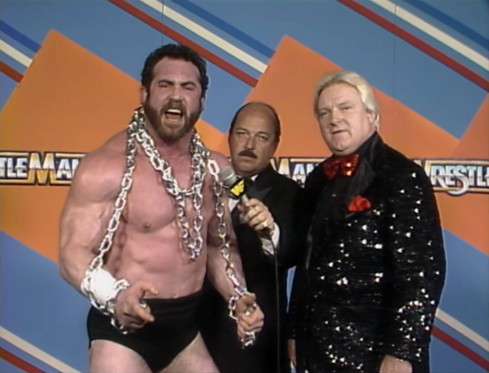

He actually cuts a decent promo (I'm surprised).\
So much so that Bobby the Brain Heenan didn't really need to be there.\
Of course Bobby does say stuff and adds a nice insult at the end.\
Because Bobby's a legend of course.

Out comes Billy to no music looking like a giant gold disco ball.

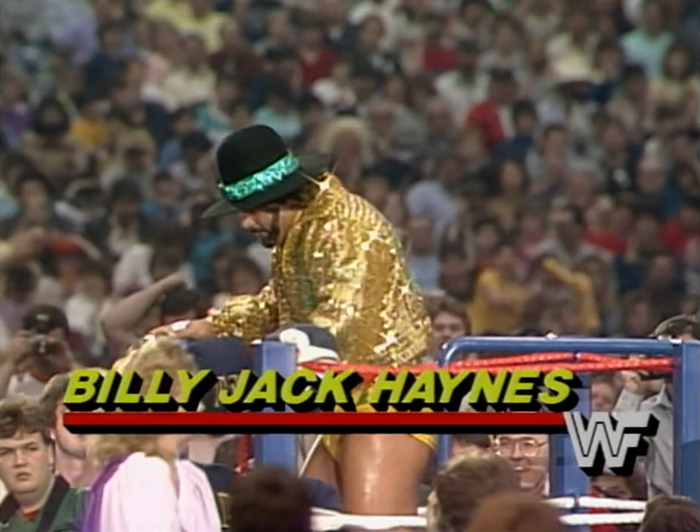

Hercules also has no music either.\
Wowza, those carts are _booting_ along at a good speed!\
Those things are faster than I expected.\
I remember them being really slow?\
I might be getting mixed up with WrestleMania 6 where the carts were dog slow.

They're butting heads to get us started.\
Nice. A grudge match of sorts here, so hopefully should be good.

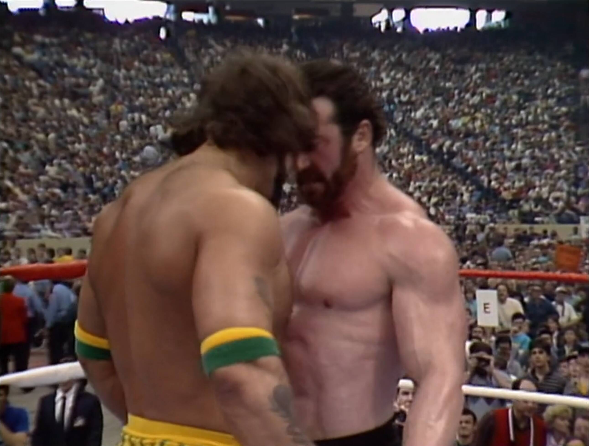

These guys are working hard and fast.\
I get the feeling they're excited (nervous even).\
Understandable, as this is one of the biggest events of all time.\
Definitely at that time it was.\
But this pace isn't a bad thing by any means.\
I quite like it. Not slow and plodding.\
They're working up a sweat alright.

Oh my, Hercules damn near ripped Billy's head off with a clothesline out of the corner!

Jesse is so clever with his commentary.\
He makes sure people understand why Hercules doesn't immediately go for the full nelson.

Billy doing a good job selling a hurt back.\
That's just what you _don't_ want in this type of match.\
When you're both battling to be the king of the full nelson submission move.

Billy starts making his comeback.\
Jesse makes a humorous comment about how overused the clothesline is in this match.\
There's not a whole lot of _wrestling_ here, just brawling.\
But Gorilla saves it by stating that of course the clothesline is used a lot,\
because they're softening up the neck for the full nelson.

Billy Jack gets the full nelson on but Hercules drags them both outside.\
Billy keeps the move on and both men get counted out.

Then Bobby nails Billy from behind.\
Billy's stalking Bobby around the outside of the ring.\
Billy better watch out for Hercules.

Back in the ring Hercules nails Billy with the chain.\
You can actually see Billy blade himself to get some colour.\
Boy, Billy is bleeding big time.\
Crowd is booing massively when they see the blood on the baby face.

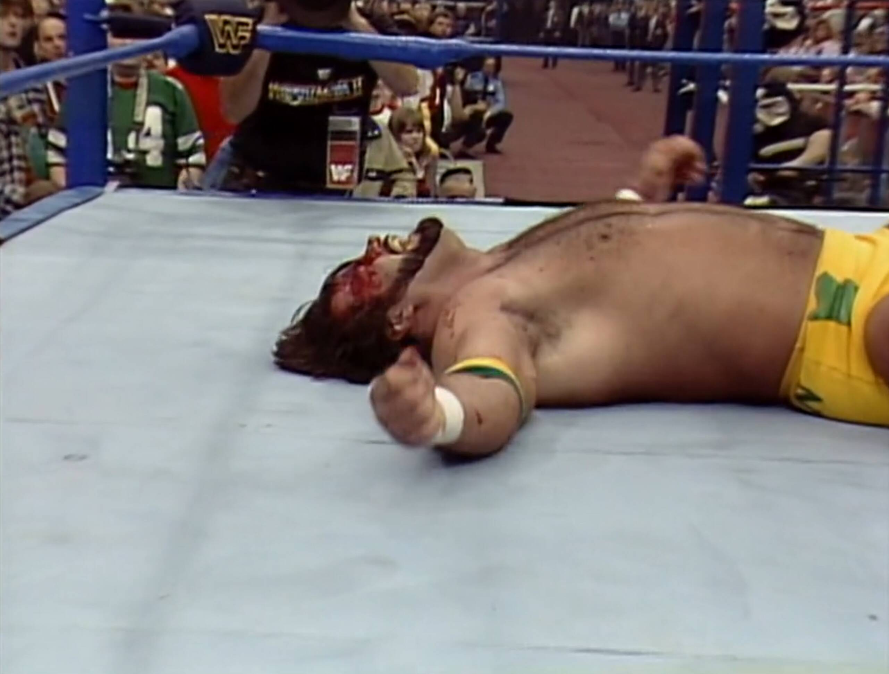

Hercules heads out with his hand raised although no one won.\
I can't get over how ripped he is.

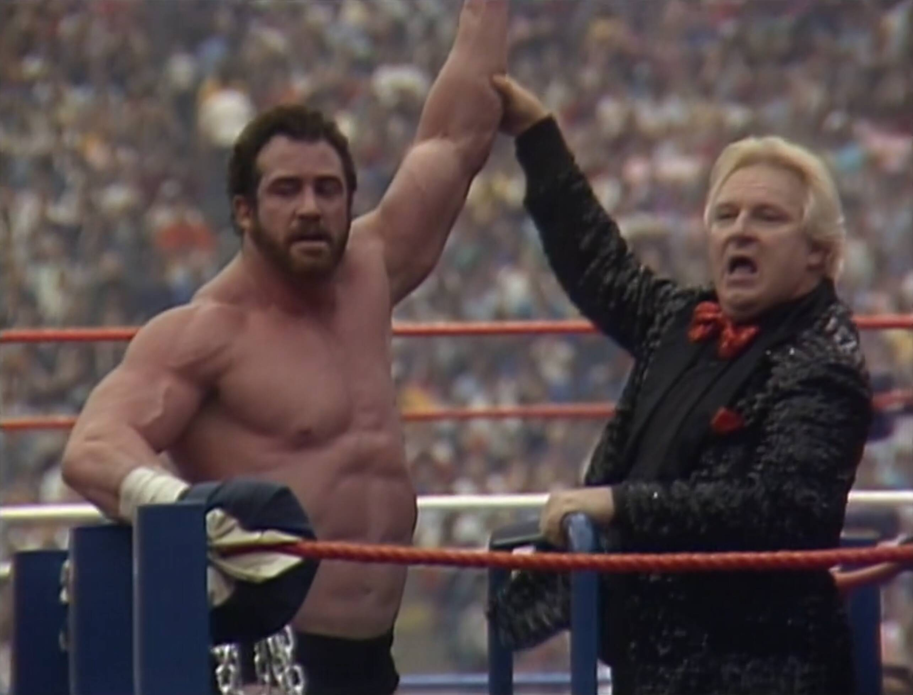

**RATING: 6/10**\
I enjoyed this match more than I thought I would.\
Good aggression between the two made this entertaining.\
You really felt like there was a blood rivalry.

### King Kong Bundy vs Hill Billy Jim

Promo time with King Kong Bundy. This match is going to be awful (him and a few small people going against Hill Billy Jim and some other small people). I don't care. This is a match I don't want to watch. I'm still going to try my hardest to get into it but damn this is gonna be a challenge.

One thing this makes me think is how far Bundy has fallen since WM2 in the main event against Hogan. This has got to be embarrassing.

The little guys start off and soon we have a 4 way crisscross. But it looks so stupid because the kayfabe thinking is that you're THROWN into the ropes by your opponent, so you don't necessarily want to be bouncing off the ropes, but here the little guys have to literally run at the ropes off their own motivation and when they get to the ropes they aren't big enough to bounce back off the ropes so they're clearly just running about for no reason. Stupid yes.

The big guys make their way into the ring and do some work, and we get a spot where Jim covers Bundy for the pin and the baby face little guys jump on top to try and keep Bundy down.

Inevitably we see Bundy take it to one of the little guys with a big body slam. The commentators sell it like it's death itself. The crowd loves it and the bell rings and we have a disqualification.

Even Bundy's own team turn on him. Honour amongst small people.

**RATING: 1/10**\
Awful. Thankfully short.

### Macho Man Promo

Promo time with Miss Elizabeth. Wow, looking gorgeous.\
Damn the size of her necklace!

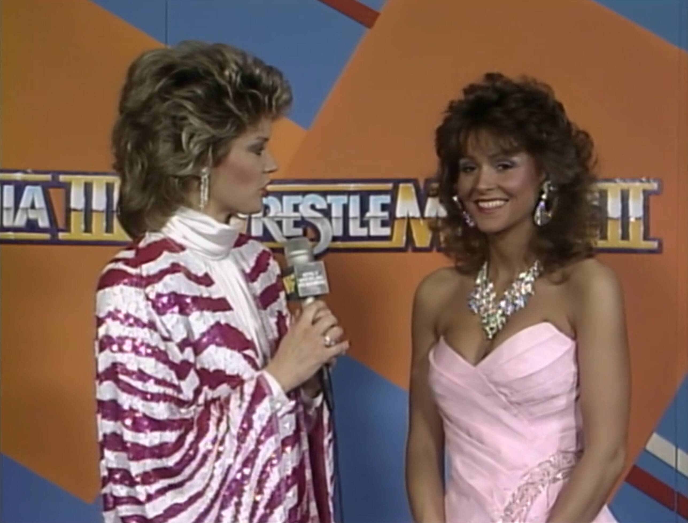

In comes Macho Man to take over the conversation. Remember he's a heel at this point in time. The host is Mary Hart and she's not interested in Macho at all. She's seen his type before and just wants his ego to shut up and leave.

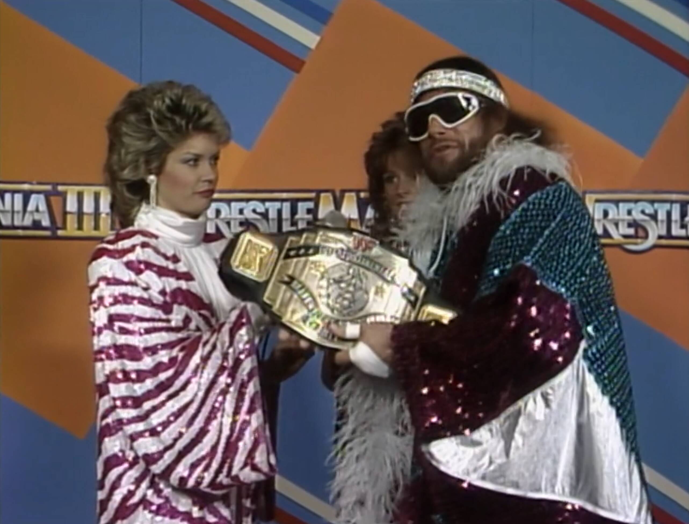

Before she gets to talk to Elizabeth, the Macho Man sends her on her way.

### The King Harley Race vs The Junkyard Dog

We get a lookback at interviews with The King Harley Race and Junkyard Dog.\
We see footage where Race tries to make the Dog bow but he fights them off.

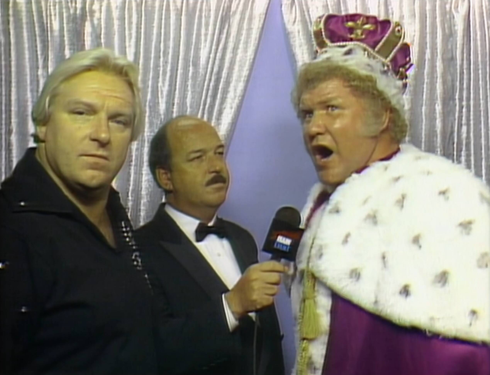

Now we have "The Queen of Wrestling" Mullah in an interview with The King and Bobby Heenan.\
The gimmick for this match is that the loser MUST bow to the winner.

We jump to Mean Gene interviewing the Dog and he asks him "are you sure you'll win?"\
The JYD says something unexpected "_I'm sure as I'm black and the day is sunny_"...well, ok then.

The crowd is cheering for JYD.\
I never liked him but no matter where he worked he was over like crazy.

I've only just noticed how small the WM ring apron cover is.\
What happened, did it shrink in the wash!?

Immediately Bobby gets involved causing JYD to chase him around the ring.\
When following Bobby back into the ring Harley is waiting to take advantage.

JYD quickly gets back in control and dominants the king.\
Harley pulls the Ric Flair/Shawn Michaels corner bump to the outside.

JYD is crawling around with headbutts?\
But a distraction lets Harley get a suplex on JYD and the win.\
OK, I didn't expect this outcome.

Surely with JYD being the baby face he _can't_ be the one to bow?\
So I guess this is where the face gets to act like a heel by not bowing.\
But it's all OK as really everyone wants the actual heel (Harley) to lose.\
That's kayfabe logic for yer.

JYD gives him a silly curtsey followed by a standing bow.\
Not a proper kneeling bow like we expected.\
But then to get his heat back, JYD grabs the chair and nails Harley.\
JYD sticks on the crown and cloak and the crowd cheer super loud.\
They wanted to see this.

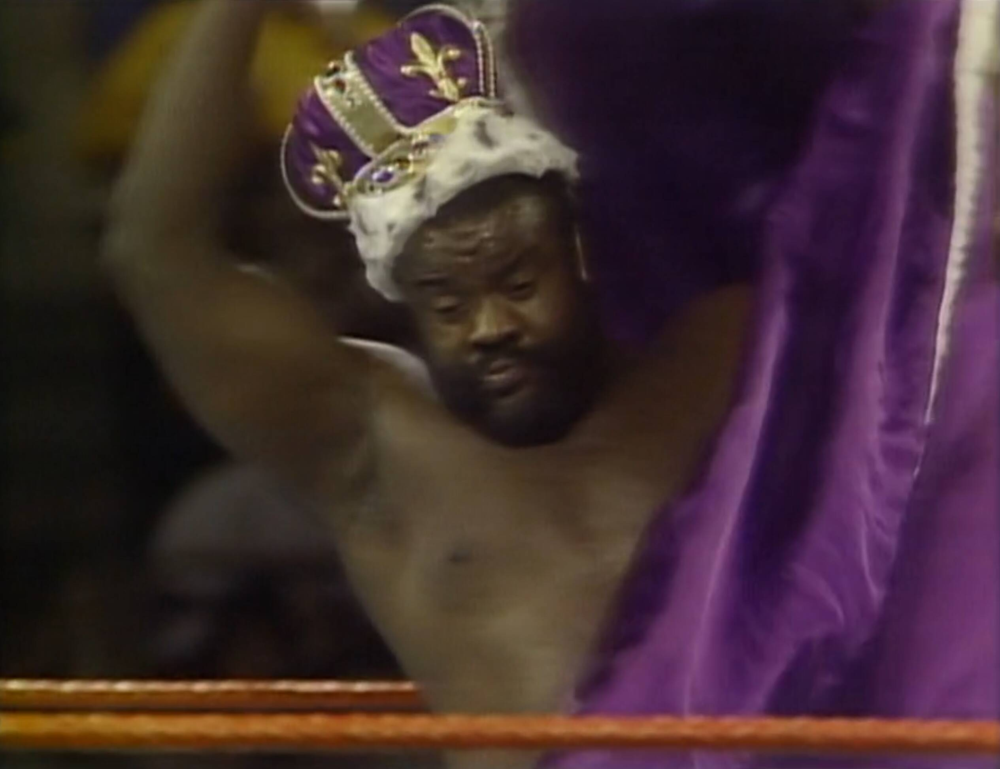

**RATING: 5/10**\
Yeah not great. There are fun elements in the match.\
Because I'm not a huge fan of either character, that hurts my enjoyment.\
Feel free to skip this match if you're short on time.

### Hulk Hogan Promo

We move to an interview with Hulk Hogan, who is looking jacked AF.\
Classic Vince McMahon here too (he loves him some muscles).

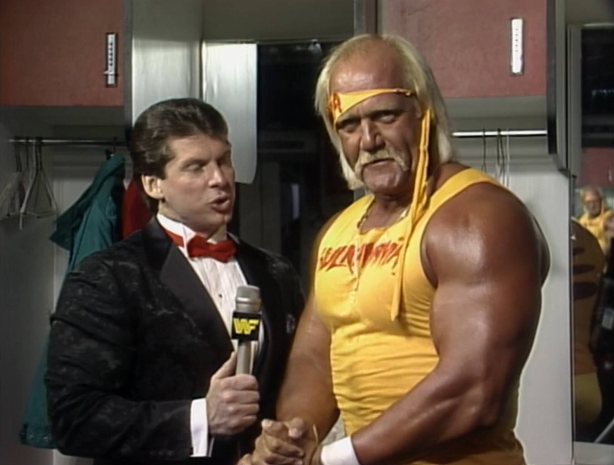

There's not much to say other than it's a classic Hogan promo.\
Lots of intensity, muscle flexing and heavy breathing.\
Good stuff 😄

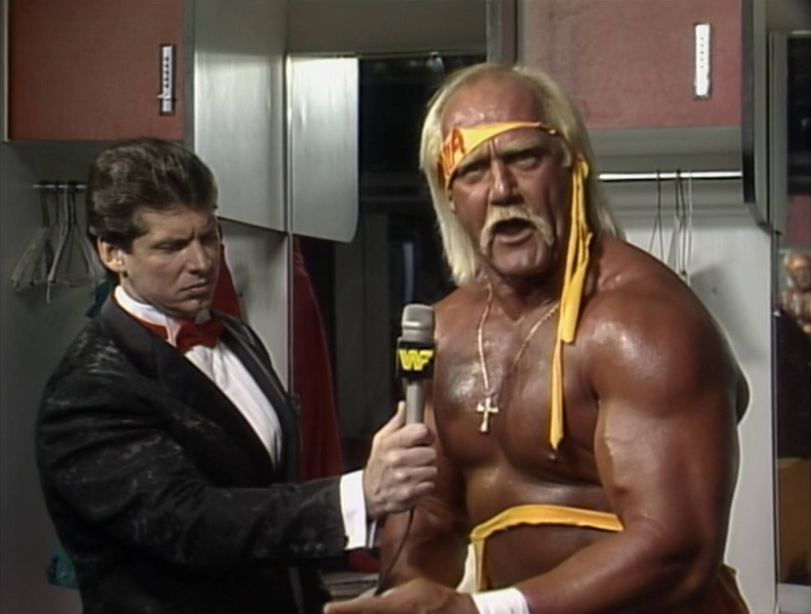

### The Rougeaus Brothers vs The Dream Team

Hmm, this is The Rougeaus Brothers as baby faces.\
They're at their best as heels for sure.\
That said I'm into the idea of watching The Dream Team!\
Especially as they have Dino Bravo in their corner.

To explain, in the last few years I've grown to love watching certain
wrestlers.\
Specifically certain wrestlers/teams I used to hate!\
Like... Hacksaw Jim Duggan, Dino Bravo, Greg the Hammer Valentine, Butch Reed etc.

I don't know why this is, but that's the situation I find myself.

We now get an interview with The Dream Team.\
Dino gets the _real_ heat by only talking in French 😂

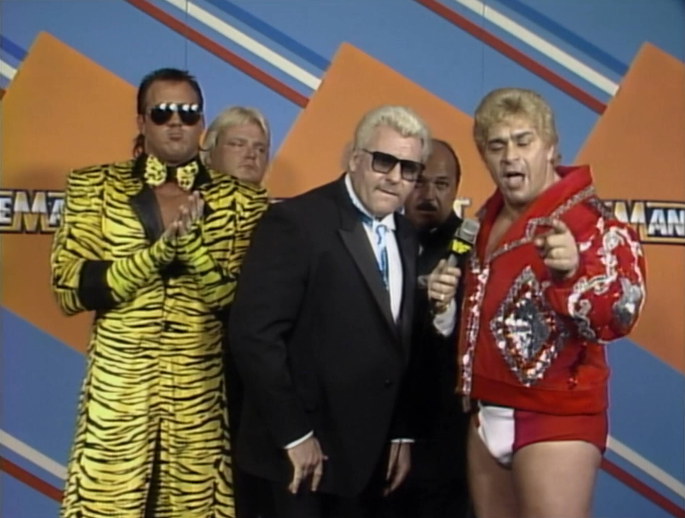

Fun to be watching Brutus Beefcake _before_ he became the barber gimmick.\
This match (or at least this event) will be the turning point for Brutus!

Nice solid wrestling to start with between Raymond and Brutus.\
That's good to see. With a nice double dropkick from The Rougeaus.

The Dream Team get back in control thanks to The Hammer\
and we get a nice double team move from the top rope\
that I don't think I've seen before.

To explain, Brutus does an overhead press while Greg jumps off the top rope.\
The shot from the top rope is to behind Jacques head,\
and then Brutus drops him straight into a back breaker.\
That was pretty darn cool actually.

Oh, here comes Bobby The Brain Heenan into the commentary booth.\
This is awesome. Bobby is on fire.

In the background Raymond gets a sleeper on Greg.\
Brutus accidentally nails Greg from behind trying to save him.\
Then straight into the Rougeaus' finisher!\
And it's over! Nope! Dino comes to the rescue...\
and Greg gets rolled over to steal the win.

Greg and Dino leaving Beefcake behind in the ring\
and we go to another segment so we don't see what happens next?

**RATING: 5/10**\
I found myself quite enjoying this match.\
Especially the cluster f\*\*\* ending.\
Lots of back and forth there which made it exciting.\
But it definitely felt too short.

## The Aftermath: Nostalgia, Legacies, and True Love for the Madness

Looking back, WrestleMania 3 wasn’t just a wrestling event—it was a moment in
time that captured everything glorious and bizarre about the WWF in the late
'80s. The over-the-top characters, the absurd storylines, and the sheer
spectacle made it unforgettable. Hogan slamming Andre? That’s the kind of thing
that got replayed so often, even kids who weren’t born yet know about it. Savage
vs. Steamboat? It’s the gold standard for what wrestling could be—two athletes
putting on a show that was as much art as it was sport. And Piper? Well, the guy
could retire a dozen times, and we’d still welcome him back with open arms and
bagpipes.

For those of us who were there (or wish we were), WrestleMania 3 isn’t just a
nostalgia trip. It’s a reminder of the magic of pro wrestling at its most
theatrical and ridiculous. It was when giants roamed the earth, heroes and
villains played out their drama in the ring, and every match felt like the
stakes couldn’t be higher. Sure, it was silly. Sure, it was exaggerated. But
that’s why we loved it. And 37 years later, that love hasn’t faded one bit.

To this day, WrestleMania 3 stands as a testament to why we watch wrestling in
the first place. It’s not just about the moves or the belts. It’s about the
larger-than-life characters, the unforgettable moments, and the shared
experience of being part of something grand, ridiculous, and wonderful. Whether
you cheered for Hogan, laughed at Piper, or cringed as Bundy squashed Little
Beaver, WrestleMania 3 gave you something to remember. And isn't that the point
of it all?
