# WrestleMania 3

Where Legends Were Born, Hair Was Lost, and The Universe Almost Imploded

> üí°Find all my WrestleMania 3 gifs [here on Giphy](https://giphy.com/channel/Integralist/wwf-wrestlemania-3).

Ah, WrestleMania 3. March 29, 1987. A day where 93,173 fans packed into the
Pontiac Silverdome to see more sequins, spandex, and improbable hairdos than a
‘70s glam rock concert. It was an event that made you believe in the impossible:
that a man could bodyslam a giant, a referee could actually wrestle, and the WWF
wasn’t just sports entertainment, but a Shakespearean tragedy… if Shakespeare
had written exclusively in flexed biceps and grunts. Let’s dive into this
masterpiece of melodrama and chaos, because if you didn’t love it then, you’re
going to love it now.

## The Build-Up: Drama That Could Make Soap Operas Blush

Months of preposterous storylines, questionable betrayals, and glorious costumes
led to this event. These weren't just wrestlers—they were living, breathing
cartoons, and we loved every ridiculous second.

### 1. **Hulk Hogan vs. Andre the Giant: The Bromance Turned Soap Opera**

Once upon a time, Hulk Hogan and Andre the Giant were the best of pals. But as
any daytime drama will tell you, no friendship lasts when you throw in a title
belt and an egotistical manager like Bobby "The Brain" Heenan. Andre, clearly
tired of playing second fiddle to Hogan's endless supply of "brother" speeches,
decided it was time to challenge Hulk for the WWF Championship. Of course,
nothing says "I’m done with you, friend" like ripping someone’s shirt off on
national TV and glaring at them as if they stole your lunch money. Hogan, in his
usual wide-eyed, overly dramatic fashion, agreed to the match, and the rest is
wrestling history.

### 2. **Macho Man vs. Ricky Steamboat: A Throat-Smashing, Epic Saga**

Macho Man Randy Savage—intense, paranoid, and fueled by Slim Jims. He was the
kind of guy who could make ordering a sandwich sound like a life-or-death
decision. Ricky Steamboat, on the other hand, was all about honor and respect.
Naturally, these two opposites clashed. The drama kicked off when Savage, in one
of his most "Macho" moments, decided to crush Steamboat’s larynx with a ring
bell. Because, sure, that's how adults handle conflict. Steamboat spent months
recovering, probably cursing Savage with every raspy breath, until finally, at
WrestleMania, he sought his revenge. It wasn’t just a match—it was a telenovela,
minus the bad dubbing.

### 3. **Rowdy Roddy Piper vs. Adrian Adonis: Fashion Crimes and Haircuts**

Rowdy Roddy Piper, the man whose mouth was faster than his punches, decided he’d
had enough and wanted to "retire" (spoiler alert: he'd retire about as
successfully as a pop star on a comeback tour). But first, he had to deal with
Adrian Adonis, a man who, for reasons unknown, decided to embrace the look of a
couch cushion with an attitude. The stakes? Hair. Yes, because clearly nothing
says "settling a feud" like taking a razor to someone’s scalp. Piper, as always,
gave it his all, leaving Adonis bald, bruised, and probably rethinking his life
choices.

{WATCH_ALONG_NOTE}

## The Opening

- Cheesy saxophone music to begin with. We're off to a good start üòÄ
- Wow! That opening shot of the arena and the 93k people.
- I think the real attendance was something like 78k, which is still pretty awesome.

Now I've never been to any kind of show like this but I would imagine that
unless you're near the ring, it must suck to watch? Surely watching from home
would be better!? You're so far away even the large projector screens aren't
going to help you.

Vince introduces the event and Eureka Franklin to sing America The Beauty. To
be honest it was quite a bland rendition and didn't really do much for me but
then again I'm not American so YMMV. That said, the crowd looked very
disinterested too. They know to cheer at certain moments, like the ending, so
it's a country duty they all accept.

On commentary we've got Gorilla and Jesse. Winning!!!\
These guys are just brilliant.

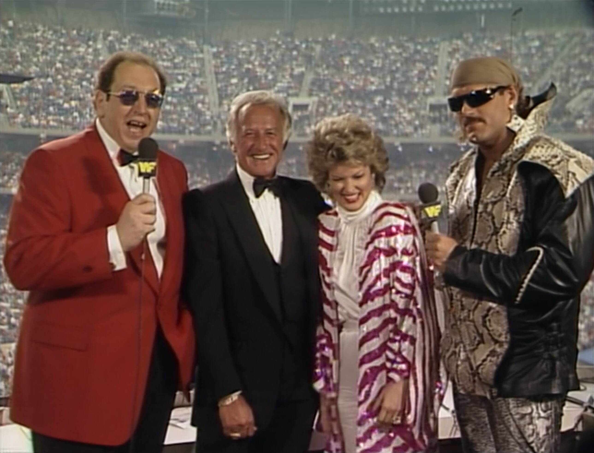

## The Card

### The Can-Am Connection vs The Magnificent Muraco and Cowboy Bob Orton

OK, so first match is The Can-Am Connection vs The Magnificent Muraco and
Cowboy Bob Orton.

Neither of these teams do I care a lot about so we'll see how I get on. I'm
staying positive üòâ

Whoa, Muraco at this point wasn't the trim roid monster he would be around a
year from now (SummerSlam 88).

Here he looks like a massive fat lump of meat.

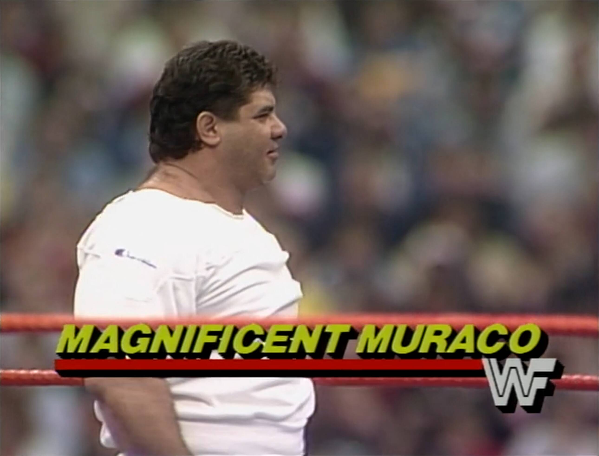

First serious move here is Martel running the ropes and bumping into Muraco
and knocking him to the ground. Sort of unexpected considering the size
difference between Martel and Muraco, but more importantly the ground pop like
crazy! So clearly, although this sounds bland on paper, these people are here to
have a good time!

The constant baby face posturing that Martel does like clapping his hands and
shaking his fists and bouncing back and forth on his feet is so cliche, tedious
and annoying to me. Like quit it already. I know you're the good guy but this
charade isn't making me like you more but DISLIKE you more.

Now his partner is at it too!\
Did they read The Baby Face Guide Book to Wrestling?\
Cause they seem all in on this cheesy nonsense.

This is a classic "wrestling" match.\
By that I mean: neither team contains any big "characters".\
Like a Hulk Hogan or a Macho Man are _big_ characters.\
It's a solid _traditional_ wrestling style match.\
Less WWF and a bit more NWA style.\
In the territories they like matches to be more mat based.

Whoa!\
Muraco pulls out a Flair/Shawn Michaels corner upside down bump.\
That was impressive for someone his size.

Nice bit of controlled chaos at the end.
This gives The Can-Am Connection the win.\
I'm not sure how long this match was but it was shorter than I expected.

**RATING: 5/10**\
This match was better than I expected.\
A solid wrestling match.\
I'd rate it a little higher if it wasn't for the annoying baby face dramatics.

### Hercules vs Billy Jack Haynes

Flashback promo for the Hercules vs Billy Jack Haynes match.\
Boy, Billy's hat gimmick was stupid.\
But _physically_ he was built like a brick s\*\*\*house.\
Damn did he have a nice physique.

This match is about who is the king of the full nelson finisher.\
Well, it's a good a reason as any to start up a feud üòÑ\
We go backstage for a Hercules promo.\
Damn Hercules was huge and also chiseled.

He actually cuts a decent promo (I'm surprised).\
So much so that Bobby the Brain Heenan didn't really need to be there.\
Of course Bobby does say stuff and adds a nice insult at the end.\
Because Bobby's a legend of course.

Out comes Billy to no music looking like a giant gold disco ball.

Hercules also has no music either.\
Wowza, those carts are _booting_ along at a good speed!\
Those things are faster than I expected.\
I remember them being really slow?\
I might be getting mixed up with WrestleMania 6 where the carts were dog slow.

They're butting heads to get us started.\
Nice. A grudge match of sorts here, so hopefully should be good.

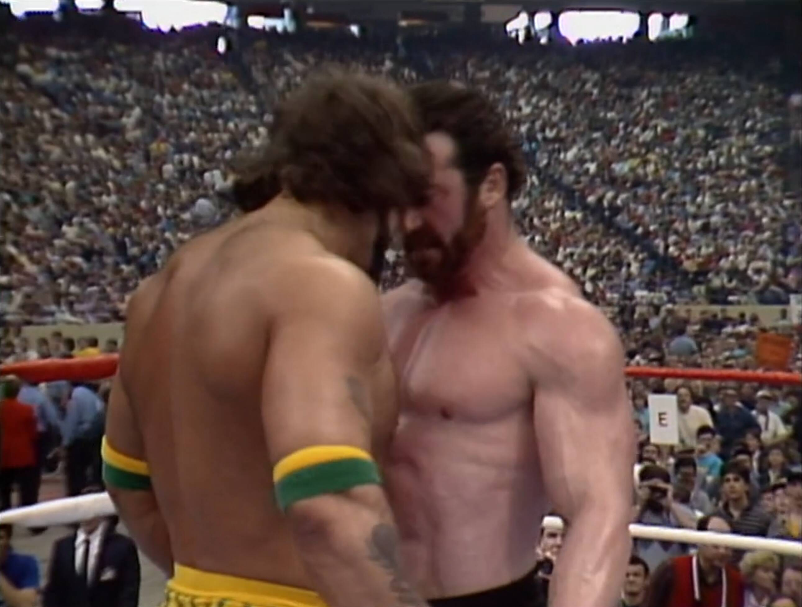

These guys are working hard and fast.\
I get the feeling they're excited (nervous even).\
Understandable, as this is one of the biggest events of all time.\
Definitely at that time it was.\
But this pace isn't a bad thing by any means.\
I quite like it. Not slow and plodding.\
They're working up a sweat alright.

Oh my, Hercules damn near ripped Billy's head off with a clothesline out of the corner!

Jesse is so clever with his commentary.\
He makes sure people understand why Hercules doesn't immediately go for the full nelson.

Billy doing a good job selling a hurt back.\
That's just what you _don't_ want in this type of match.\
When you're both battling to be the king of the full nelson submission move.

Billy starts making his comeback.\
Jesse makes a humorous comment about how overused the clothesline is in this match.\
There's not a whole lot of _wrestling_ here, just brawling.\
But Gorilla saves it by stating that of course the clothesline is used a lot,\
because they're softening up the neck for the full nelson.

Billy Jack gets the full nelson on but Hercules drags them both outside.\
Billy keeps the move on and both men get counted out.

Then Bobby nails Billy from behind.\
Billy's stalking Bobby around the outside of the ring.\
Billy better watch out for Hercules.

Back in the ring Hercules nails Billy with the chain.\
You can actually see Billy blade himself to get some colour.\
Boy, Billy is bleeding big time.\
Crowd is booing massively when they see the blood on the baby face.

Hercules heads out with his hand raised although no one won.\
I can't get over how ripped he is.

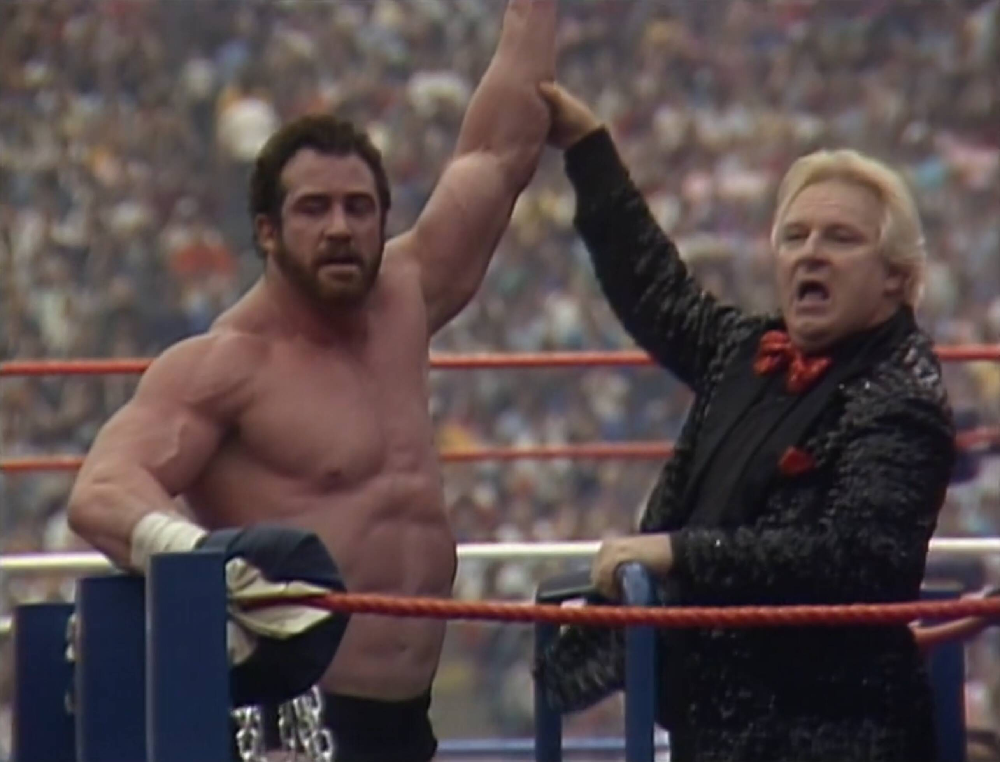

**RATING: 6/10**\
I enjoyed this match more than I thought I would.\
Good aggression between the two made this entertaining.\
You really felt like there was a blood rivalry.

### King Kong Bundy vs Hill Billy Jim

Promo time with King Kong Bundy. This match is going to be awful (him and a few small people going against Hill Billy Jim and some other small people). I don't care. This is a match I don't want to watch. I'm still going to try my hardest to get into it but damn this is gonna be a challenge.

One thing this makes me think is how far Bundy has fallen since WM2 in the main event against Hogan. This has got to be embarrassing.

The little guys start off and soon we have a 4 way crisscross. But it looks so stupid because the kayfabe thinking is that you're THROWN into the ropes by your opponent, so you don't necessarily want to be bouncing off the ropes, but here the little guys have to literally run at the ropes off their own motivation and when they get to the ropes they aren't big enough to bounce back off the ropes so they're clearly just running about for no reason. Stupid yes.

The big guys make their way into the ring and do some work, and we get a spot where Jim covers Bundy for the pin and the baby face little guys jump on top to try and keep Bundy down.

Inevitably we see Bundy take it to one of the little guys with a big body slam. The commentators sell it like it's death itself. The crowd loves it and the bell rings and we have a disqualification.

Even Bundy's own team turn on him. Honour amongst small people.

**RATING: 1/10**\
Awful. Thankfully short.

### Macho Man Promo

Promo time with Miss Elizabeth. Wow, looking gorgeous.\
Damn the size of her necklace!

In comes Macho Man to take over the conversation. Remember he's a heel at this point in time. The host is Mary Hart and she's not interested in Macho at all. She's seen his type before and just wants his ego to shut up and leave.

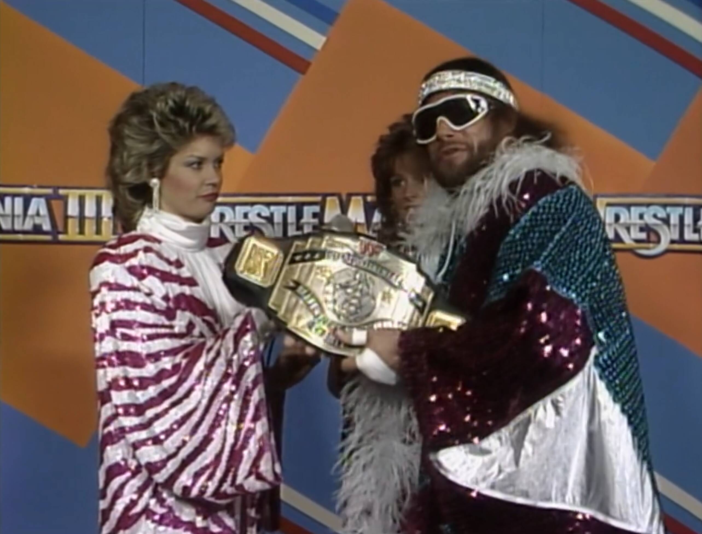

Before she gets to talk to Elizabeth, the Macho Man sends her on her way.

### The King Harley Race vs The Junkyard Dog

We get a lookback at interviews with The King Harley Race and Junkyard Dog.\
We see footage where Race tries to make the Dog bow but he fights them off.

Now we have "The Queen of Wrestling" Mullah in an interview with The King and Bobby Heenan.\
The gimmick for this match is that the loser MUST bow to the winner.

We jump to Mean Gene interviewing the Dog and he asks him "are you sure you'll win?"\
The JYD says something unexpected "_I'm sure as I'm black and the day is sunny_"...well, ok then.

The crowd is cheering for JYD.\
I never liked him but no matter where he worked he was over like crazy.

I've only just noticed how small the WM ring apron cover is.\
What happened, did it shrink in the wash!?

Immediately Bobby gets involved causing JYD to chase him around the ring.\
When following Bobby back into the ring Harley is waiting to take advantage.

JYD quickly gets back in control and dominants the king.\
Harley pulls the Ric Flair/Shawn Michaels corner bump to the outside.

JYD is crawling around with headbutts?\
But a distraction lets Harley get a suplex on JYD and the win.\
OK, I didn't expect this outcome.

Surely with JYD being the baby face he _can't_ be the one to bow?\
So I guess this is where the face gets to act like a heel by not bowing.\
But it's all OK as really everyone wants the actual heel (Harley) to lose.\
That's kayfabe logic for yer.

JYD gives him a silly curtsey followed by a standing bow.\
Not a proper kneeling bow like we expected.\
But then to get his heat back, JYD grabs the chair and nails Harley.\
JYD sticks on the crown and cloak and the crowd cheer super loud.\
They wanted to see this.

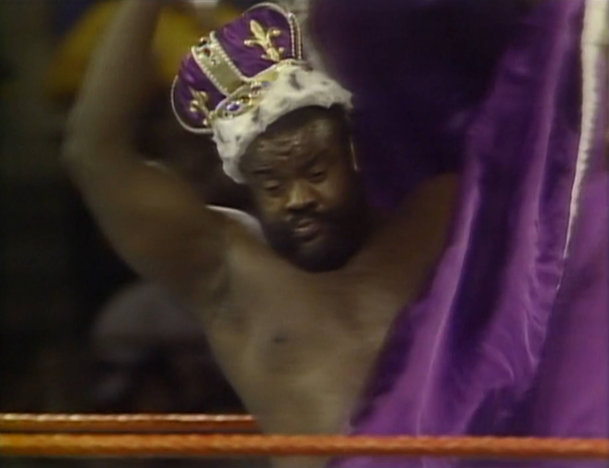

**RATING: 5/10**\
Yeah not great. There are fun elements in the match.\
Because I'm not a huge fan of either character, that hurts my enjoyment.\
Feel free to skip this match if you're short on time.

### Hulk Hogan Promo

We move to an interview with Hulk Hogan, who is looking jacked AF.\
Classic Vince McMahon here too (he loves him some muscles).

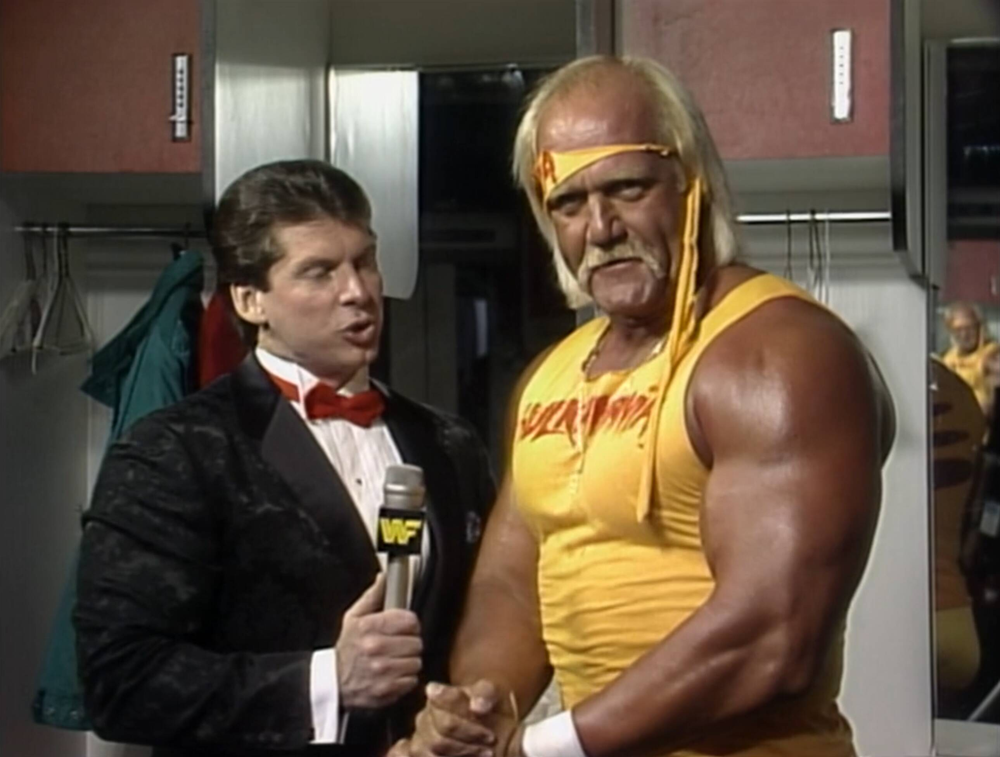

There's not much to say other than it's a classic Hogan promo.\
Lots of intensity, muscle flexing and heavy breathing.\
Good stuff üòÑ

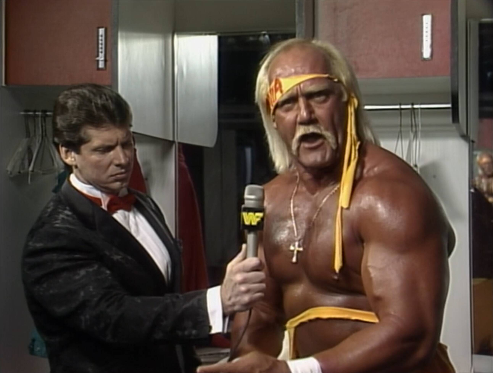

### The Rougeaus Brothers vs The Dream Team

Hmm, this is The Rougeaus Brothers as baby faces.\
They're at their best as heels for sure.\
That said I'm into the idea of watching The Dream Team!\
Especially as they have Dino Bravo in their corner.

To explain, in the last few years I've grown to love watching certain
wrestlers.\
Specifically certain wrestlers/teams I used to hate!\
Like... Hacksaw Jim Duggan, Dino Bravo, Greg the Hammer Valentine, Butch Reed etc.

I don't know why this is, but that's the situation I find myself.

We now get an interview with The Dream Team.\
Dino gets the _real_ heat by only talking in French üòÇ

Fun to be watching Brutus Beefcake _before_ he became the barber gimmick.\
This match (or at least this event) will be the turning point for Brutus!

Nice solid wrestling to start with between Raymond and Brutus.\
That's good to see. With a nice double dropkick from The Rougeaus.

The Dream Team get back in control thanks to The Hammer\
and we get a nice double team move from the top rope\
that I don't think I've seen before.

To explain, Brutus does an overhead press while Greg jumps off the top rope.\
The shot from the top rope is to behind Jacques head,\
and then Brutus drops him straight into a back breaker.\
That was pretty darn cool actually.

Oh, here comes Bobby The Brain Heenan into the commentary booth.\
This is awesome. Bobby is on fire.

In the background Raymond gets a sleeper on Greg.\
Brutus accidentally nails Greg from behind trying to save him.\
Then straight into the Rougeaus' finisher!\
And it's over! Nope! Dino comes to the rescue...\
and Greg gets rolled over to steal the win.

Greg and Dino leaving Beefcake behind in the ring\
and we go to another segment so we don't see what happens next?

**RATING: 5/10**\
I found myself quite enjoying this match.\
Especially the cluster f\*\*\* ending.\
Lots of back and forth there which made it exciting.\
But it definitely felt too short.

### Adrian Adonis vs Roddy Piper

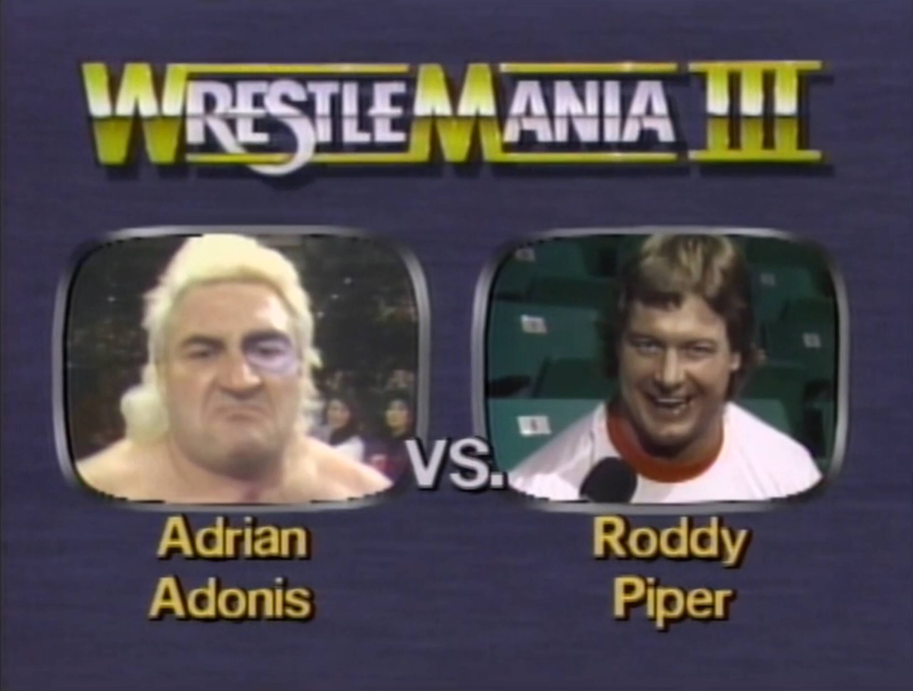

We're shown the backstory to this "loser gets a haircut" match.\
AKA Piper's retirement match (lol from the future).

We get a quick promo from Roddy.\
Being "a real man" means he isn't going to lose to a guy wearing a dress üòí

Adrian is so obese it's quite uncomfortable to look at.\
He's also brought hedge clippers with him.\
Which is great foreshadowing to Brutus' transition to a baby face.

Here comes Piper but he's walking, then running.\
Not sure why he didn't want to take the little tram thing.\
Crowd is standing and cheering him on.

What the hell, Roddy pulls out a belt and starts beating Adrian with it!?\
Immediate disqualification, no?

The crowd is HOT üî• for this!

Classic shot of Piper throwing Jimmy Hart off the top rope onto Adrian\
I recall the SilverVision videos always showed that clip.

Jimmy trips up Roddy, giving Adrian the advantage.

Piper fighting hard but then Jimmy sprays Piper in the eyes.\
Then Adrian gets the sleeper on!\
Roddy's trying hard but he's down on the floor.\
Adrian would've had the win if he kept the hold on.\
But he let's it go after the arm only dropped twice?\
What an idiot!?

All of sudden Brutus is in the ring helping to wake up Piper.\
This has solidified Brutus' baby face turn.

Piper gets the sleeper on Adrian\
and the crowd is going absolutely NUTS!!

Brutus helps cut Adrian's hair.\
This was supposed to set-up an angle between these two.\
But after Piper's retirement Adrian left the WWF.\
So nothing came of it.

Beautiful shot of Roddy kissing The Fink on the head.\
What a way to go out.\
Then a fan runs into the ring to shake Roddy's hand before security nail him.

The admiration he got on the way out,\
man it makes me wish this _would_ be his last match.\
But unfortunately that wasn't the case\
and so the legacy would eventually be ruined.\
But that's a story for another time.

**RATING: 6/10**\
The crowd made this match.\
If it wasn't for the crowd I don't know if I'd be into it as much.\
They gave this match so much more emotion than I had invested initially.

### The Hart Foundation vs The Bulldogs

Straight into the three man tag match.\
The Hart Foundation (tag champs) have Dangerous Danny Davis.\
While The British Bulldogs are with Tito Santana.

Jump to a pre-recorded interview/promo with The Hart Foundation.\
They look so cool here with the titles around their waists.

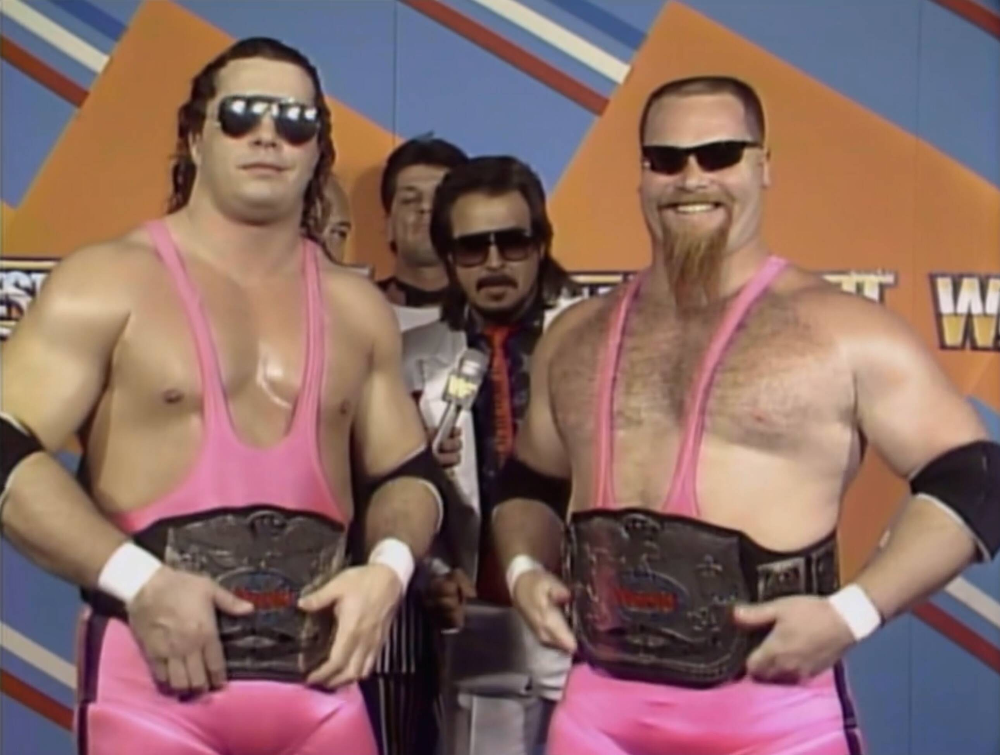

This _should_ be a great match, depending on what state Dynamite Kid is in.\
I can't recall if his back was giving him trouble at this point.

Matilda goes straight after Jimmy Hart. Love it.

Back in the ring the good guys are tagging in and out and in control.\
Nothing special or overly exciting happening yet.

Bret Hart nailing Dynamite square in the face.\
Beautiful forearm upper cuts.

Danny getting some good heat by only tagging in when someone is down,\
then getting some kicks in and then tags out immediately.

This match feels sluggish and not that exciting?

Finally, Dynamite gets some retaliation on Danny\
and makes the hot tag to Tito.\
Tito cleans house on everyone\
but before he gets a submission,\
Anvil makes the save.

Danny gets pounded with a pile driver from Davey Boy.\
Followed with a big suplex.\
Then a running power slam.\
But Anvil again in for the save!\
Tito jumps in to take care of him.\
Dynamite jumps in on Bret, and it's pandemonium.

Bizarrely Danny gets up and starts putting the boot into Davey Boy!?\
As if he hasn't just taken three devastating finishes!?\
Erm, seriously? Sell mate, sell!!!

Danny gets the win!\
Well, the match definitely picked up in the end I guess.

**RATING: 5/10**\
This match was average.\
It had a good finish but it didn't excite me at all.\
Felt pretty basic throughout until the last half.\
But you gotta do better than that for a WrestleMania match.

### Andre the Giant Promo

We're onto an interview with Andre.\
Although really it's just Bobby doing the talking.\
Andre just stands there looking scary.\
While Bobby sells the hell out of this upcoming match.\
Bobby has his special white suit on.

### The Natural Butch Reed vs Koko B Ware

We head to the ring and we see Slick.\
So already I'm excited for whatever this match is.

Next up I see The Natural Butch Reed.\
Yup I'm definitely all in on this match now. I love this dude.

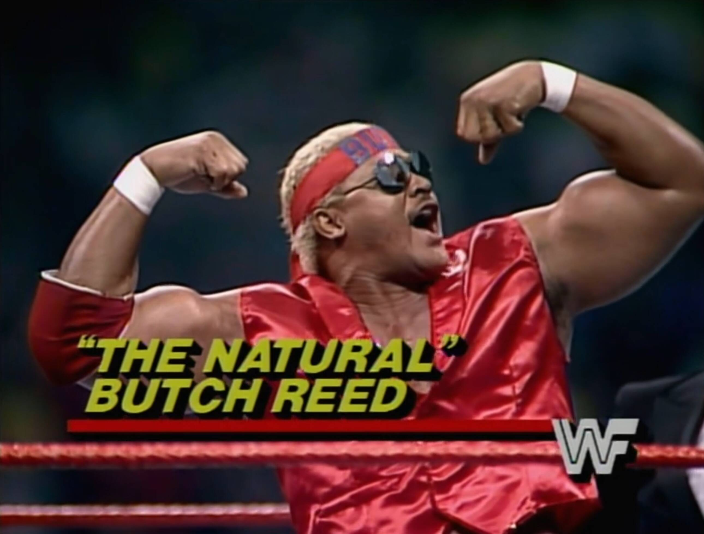

Let's see who he's facing...

OK! We've got Koko B Ware!\
I'm cool with this.\
Should be a fun (and good) match.

Let's do this...

That's some seriously silver sparkly suit.\
Franky enjoying himself too.

Although Koko's short he can really move in that ring.\
He's both stocky AND agile.

The crowd is quiet until Koko makes some offence for which they explode.\
Their hearts aren't into this match\
but they are willing to show support when the time comes.

Hmm, the win (cheating by pulling the tights) by Butch came out of nowhere.\
It was a bit of a meh finish to a bit of a mediocre match.\
So an unfortunate letdown really,\
as I was hoping for more from these two.

Slick jumps in and nails Koko with his cane.\
But out of nowhere comes Tito Santana!?\
What the hell is this about?\
Apparently, Slick has hit Tito a few times with the cane.

**RATING: 5/10**\
I enjoyed the match as I like both competitors.\
But this felt slow and mediocre.\
The crowd, which has been mostly hot and on point,\
reflected what I was feeling here.

### Macho Man vs Ricky Steamboat

Flashback for the Steamboat vs Macho Man match.\
This is a classic rivalry and a great match.\
I know this match is one of the best in WM history so let's get into it.

Lol at these fake doctors üòÇ

Macho Man as a heel at this time\
But it didn't really work when he had Elizabeth at his side.\
Because she was such a goody two shoes you couldn't hate her\
and so you kinda was overly forgiving to Macho Man.

We jump to an interview with Steamboat\
and he's pulling fake karate moves like he knows any martial arts 🤦‍♂️

Steamboat pulls off a pretty decent promo.\
He's usually garbage at talking but he did good here.\
The overdubbing of his original music is very distracting though.

Good wrestling to start us off,\
then we get a false start as Macho has to move Elizabeth around\
to avoid George the Animal Steele.

Macho let's Steamboat chase him around so he can get the upper hand.

The commentators are giving plenty of props to Macho and his abilities.\
They also keep selling that this is Steamboat's final chance to win the title.\
Not sure why they think that though.

These guys are working so fast with LOTS of cover attempts.\
No one knows what's going to happen.

Jesse doing a great job of calling out the poor job\
(kayfabe) the ref is doing and how he should have\
counted out Steamboat multiple times.

Reversal into a reversal into a reversal and we get a ref bump.\
Now we get Macho's finisher and he gets the cover for 3 but the ref is down.\
This plot line basically tells the crowd Macho is better than Steamboat\
but we get a quick small package from Steamboat for the win!

That's a bad way for Steamboat to win.\
Ricky should have won without Macho being screwed out of the win.\
If it wasn't for the ref being down and out Macho would have won.\
That sort of thing only happens to the baby face not a heel.

**RATING: 8/10**\
Great match. A classic.\
Bit of a strange win for Steamboat.\
It kinda loses Steamboat his heat.\
But if you've not seen it, go out of your way to watch this.

### Jake the Snake vs The Honky Tonk Man

Interview with Jake the Snake Roberts.\
We get a look back at that horrific chair shot from Honky and boy was it brutal.

Alice Cooper has zero personality.\
Man, make an effort will yer.

Now we get to the Honky Tonk Man.\
He can sell ice to an Eskimo.\
Love love love this gimmick.

Jake wastes no time nailing Honky from behind.\
Jake rips the suit off him and off we go.

Honky running around outside the ring in those classic baby blue outfit.\
Finally, Honky turns it around but not for long\
as Jake gets the short clothesline and then fails to seal the DDT.

We're back outside the ring again but this time\
Jake hits the ring post and is struggling to get back in.

Honky doing pretty well for himself.\
Taking it to Jake. But he needs to get his finisher on.\
Nope, Jake reverses it.

It's a good back and forth\
but we get a cheap win for Honky by pulling the top rope.\
Honky makes a run for it\
but poor Jimmy Hart is left in the ring at the mercy of Jake.

Alice Cooper is just a bag of bones.\
The snake looks massive on him.\
The crowd is loving it.

**RATING: 4/10**\
This match was a bit meh.\
I love Honky and he definitely was the highlight\
but even he couldn't save this match from begin mediocre.

### Mean Gene Announcement

The Fink introduces Mean Gene to make a special announcement.\
Everyone _loves_ Mean Gene (rightfully so).

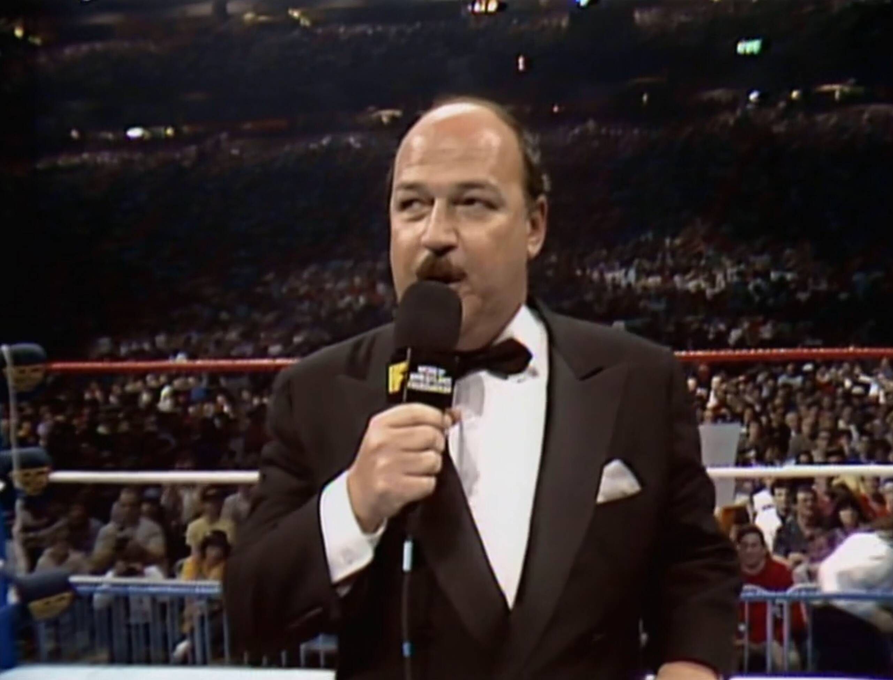

Mean Gene announces that there has been a new record set.\
A new indoor attendance record! (which totally was kayfabe).

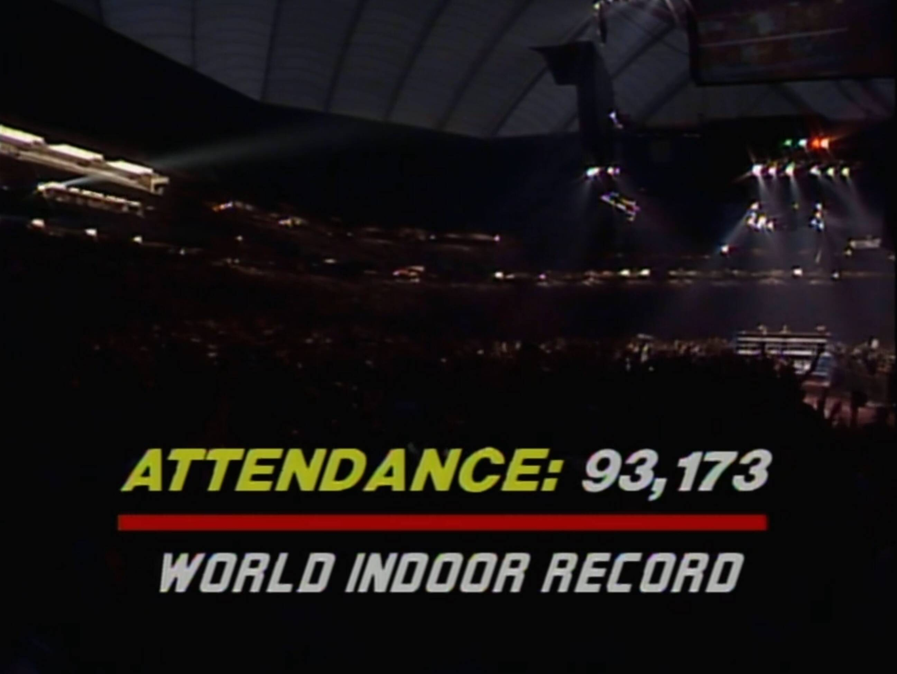

### The Killer Bees vs Nikolai Volkoff and The Iron Shiek

Here comes Nikolai Volkoff and The Iron Shiek with Slick.\
These are a prime example of a team I hated as a kid\
and just found so boring\
but now I love watching them.

Love that Slick is still all ripped up from his earlier beating from Tito.

In comes running Hacksaw and the crowd goes crazy!!\
They love Hacksaw. He cuts a quick promo and leaves.

Oh man, The Killer Bees are the opponents. Damn.\
That has killed my vibe üòû\
Although the crowd pops like mad for them (so they must be over)?

Oh Hacksaw is still at ringside\
so we know he'll be involved at the end, lol

Thee Bees have the advantage at the start\
and doing a lot of quick double teaming and tagging in and out.

The heels turn things around with slow and plodding attacks.

Whoa, Brunsell is selling this bearhug like it's death.\
Going for that Oscar.

Ref didn't see the tag so he doesn't allow it.\
Annoying, yes. Inconsistent, definitely.

Iron Sheik slaps on the Camel Clutch\
but in runs Duggan and loses the Bees the match\
by smashing the Sheik with the 2x4. Stupid.

### Hulk Hogan vs Andre the Giant

One more Bobby and Andre interview but this time Andre speaks!\
Then we get a flashback promo package.

They really are selling this as the biggest match up of all time.\
Love the epic vibes it's giving.

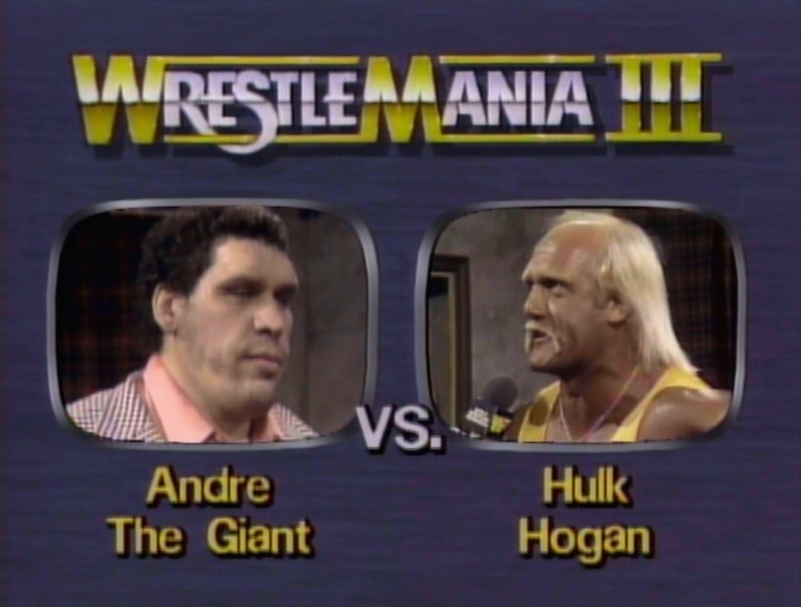

Hogan interview time and boy is he on fire.

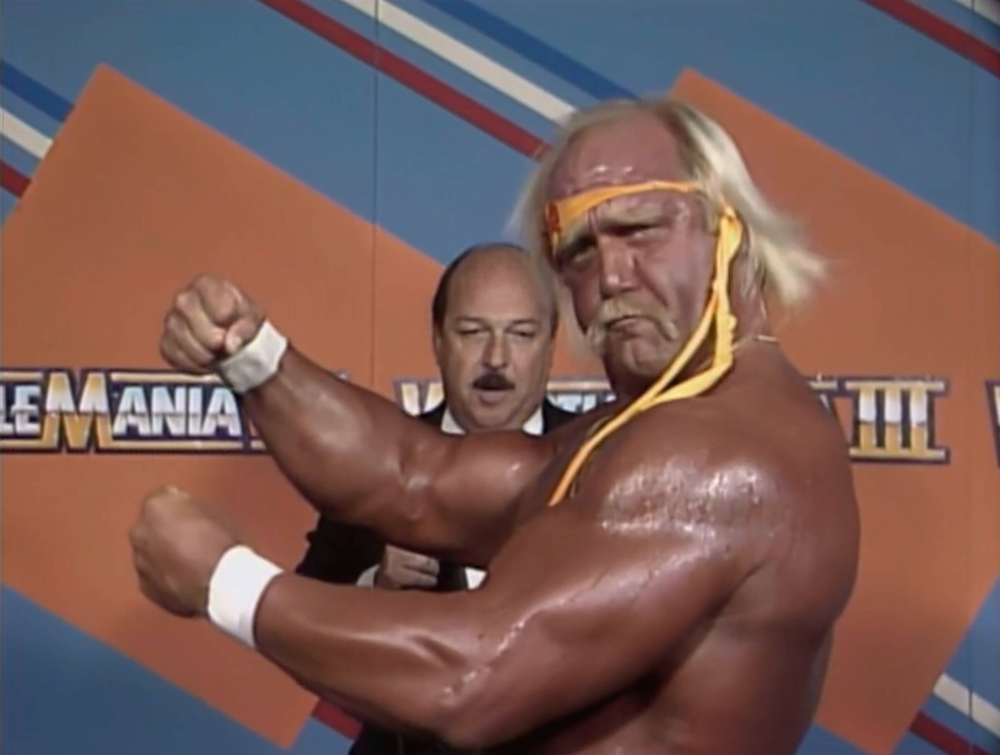

Love hearing the Tale of the Tape for Andre from Jesse\
just before Hogan makes his entrance (makes it all feel more _real_).\
Hogan doesn't use the cart either.\
He walks down to the ring, and this lets him psyche up the crowd.\
Jesse then runs through Hogan's Tape of the Tape.

Hogan and Andre square off in the middle of the ring.\
This truly feels epic.\
Hogan talking trash to Andre and off they go exchanging punches\
and Hogan's getting the upper hand!!

Hogan goes for the slam but he can't lift Andre\
and do he gets squished underneath him\
as the ref counts a very close 2.5 count!

Andre batters Hogan's back and then you get a great shot of Andre\
standing tall over a downed Hogan and he's shouting at him "UP!".

HUGE body slam from Andre and Hogan sells like death.\
There's an almost quiet rumble amongst the crowd.

Ooh, Andre walks slowly over Hogan's lower back. Ouch.\
Andre picks Hogan up by his tights like a little baby.

Big butt squish followed by some nasty looking headbutts.\
Oh but Hogan sneaks out from under Andre after he misses a headbutt.\
Looks like Hogan's getting his wind back!\
Oooh, Hogan runs face first into Andre's boot.

Bearhug from Andre.\
Although a slow move, the crowd is genuinely not sure what's going to happen,\
but also the commentary is helping carry the story through.

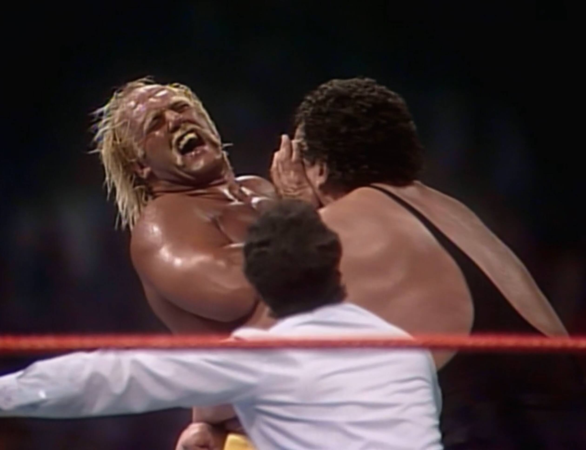

Hogan manages to get the hand up at the third try.\
Crowd goes wild and Hogan punches his way out.\
Hogan tries twice to knock Andre down\
and on the third go Andre clotheslines him down\
and then big boots Hogan out.

The fight continues outside.\
Andre then headbutts the post!\
Hogan starts pulling heel moves...\
How the hell did he think he would piledrive Andre!?

There's so much back and forth (in a good way).

Back in the ring and Hogan runs the ropes\
and he ducks under Andre and knocks him down!\
Crowd going nuts as Hulk does his Hulk up.\
Then we get the body slam heard from around the world.

Leg drop, 3 count, it's over!!\
Crowd is on its feet cheering.\
Hogan crying and shaking as he's announced as the winner.

Jesse does the decent thing and gives genuine credit to Hogan,\
which was a good thing as it really helped sell (even more)\
the realness of the battle.

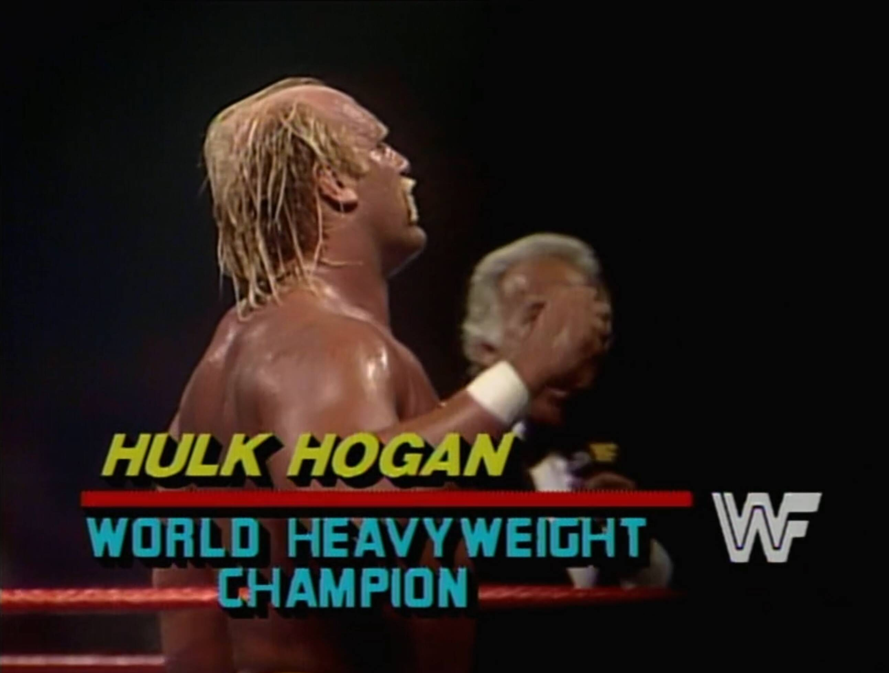

The music hits and it's time for Hogan must pose.

**RATING: 10/10**\
Was this a wrestling clinic? No, definitely not.\
But this WAS story telling at its finest.\
This match is still held in high regard as the biggest match OF ALL TIME.\
The history and story behind the characters,\
and how they progressed that story with their in-ring work is just unmatched.

### Outro

Aretha Franklin sings us out to a flashback of WrestleMania 3.

## The Aftermath: Nostalgia, Legacies, and True Love for the Madness

Looking back, WrestleMania 3 wasn’t just a wrestling event—it was a moment in
time that captured everything glorious and bizarre about the WWF in the late
'80s. The over-the-top characters, the absurd storylines, and the sheer
spectacle made it unforgettable. Hogan slamming Andre? That’s the kind of thing
that got replayed so often, even kids who weren’t born yet know about it. Savage
vs. Steamboat? It’s the gold standard for what wrestling could be—two athletes
putting on a show that was as much art as it was sport. And Piper? Well, the guy
could retire a dozen times, and we’d still welcome him back with open arms and
bagpipes.

For those of us who were there (or wish we were), WrestleMania 3 isn’t just a
nostalgia trip. It’s a reminder of the magic of pro wrestling at its most
theatrical and ridiculous. It was when giants roamed the earth, heroes and
villains played out their drama in the ring, and every match felt like the
stakes couldn’t be higher. Sure, it was silly. Sure, it was exaggerated. But
that’s why we loved it. And 37 years later, that love hasn’t faded one bit.

To this day, WrestleMania 3 stands as a testament to why we watch wrestling in
the first place. It’s not just about the moves or the belts. It’s about the
larger-than-life characters, the unforgettable moments, and the shared
experience of being part of something grand, ridiculous, and wonderful. Whether
you cheered for Hogan, laughed at Piper, or cringed as Bundy squashed Little
Beaver, WrestleMania 3 gave you something to remember. And isn't that the point
of it all?
